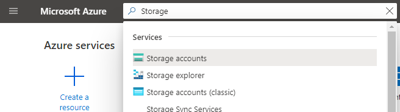

* [Azure Portal assets](#azure-portal-assets)
    * [Defining an asset](#azure-portal-assets-defining-an-asset)
        * [An asset that opens browse for ARM resources](#azure-portal-assets-defining-an-asset-an-asset-that-opens-browse-for-arm-resources)
        * [An asset that opens a custom view](#azure-portal-assets-defining-an-asset-an-asset-that-opens-a-custom-view)
        * [Important components of AssetType definition](#azure-portal-assets-defining-an-asset-important-components-of-assettype-definition)
    * [Configuring browse](#azure-portal-assets-configuring-browse)
        * [Crafting the ARG query](#azure-portal-assets-configuring-browse-crafting-the-arg-query)
        * [JSON AssetType Definition](#azure-portal-assets-configuring-browse-json-assettype-definition)
        * [Bulk commanding](#azure-portal-assets-configuring-browse-bulk-commanding)
    * [Configuring the resource menu](#azure-portal-assets-configuring-the-resource-menu)
        * [Resource menu](#azure-portal-assets-configuring-the-resource-menu-resource-menu)
    * [Browse as a resource menu item](#azure-portal-assets-browse-as-a-resource-menu-item)
    * [How to hide or show your asset in different environments](#azure-portal-assets-how-to-hide-or-show-your-asset-in-different-environments)
        * [Testing your hidden asset](#azure-portal-assets-how-to-hide-or-show-your-asset-in-different-environments-testing-your-hidden-asset)
        * [How the options are applied from JSON, from the config JSON file and from the URL](#azure-portal-assets-how-to-hide-or-show-your-asset-in-different-environments-how-the-options-are-applied-from-json-from-the-config-json-file-and-from-the-url)


<a name="azure-portal-assets"></a>
# Azure Portal assets

To have a presence in the Azure Portal [All Services menu](https://portal.azure.com/?feature.customportal=false#allservices) and other entry points such as the global search bar in the Portal, an asset has be to defined. Each entry you see in the Portal's all services list is an asset. This doc talks about creating and customizing your asset. An asset represents a service in Azure and most assets map to an ARM resource type.

Example of the storage account asset showing up in the Portal's global search -



Example of the storage account asset showing up in the Portal's All Services Menu -


<a name="azure-portal-assets-defining-an-asset"></a>
## Defining an asset

Assets are defined as JSON objects in your extension. To add a new asset, you need to add a JSON file in your extension that defines the asset type. There are primarily two types of assets -

1. An asset that opens a browse for ARM resources
1. An asset that opens a custom view

<a name="azure-portal-assets-defining-an-asset-an-asset-that-opens-browse-for-arm-resources"></a>
### An asset that opens browse for ARM resources

In this category, when a customer clicks on the asset, they are taken to a browse view. The browse view is a list of all resources of the given ARM resource type. This information of all resources for a given resource type comes from [Azure Resource Graph](https://docs.microsoft.com/azure/governance/resource-graph/). Most assets in the Azure Portal belong to this category such as VMs, Storage accounts etc.

Below is a sample JSON definition for an asset that opens a browse for ARM resources. When the value of `assetType.browse.type` is set to `ResourceType`, this results in an asset that opens browse for ARM resources. In this case, the ARM resource is `Providers.Test/statefulIbizaEngines` and the API version that will be used is `2014-04-01`.

```json
{
  "$schema": "../../Definitions/dx.schema.json",
  "stringSource": "Resources/MyAssetStrings.resjson",
  "assetType": {
    "name": "ExtensionResource",
    "keywords":"keywords",
    "displayNames": {
      "singular": "singular",
      "plural": "plural",
      "lowerSingular": "lowerSingular",
      "lowerPlural": "lowerPlural"
    },
    "icon": "MsPortalFx.Base.Images.Logos.MicrosoftSquares",
    "browse": {
      "type": "ResourceType",
      "query"
    },
    "resourceType": {
      "name": "Providers.Test/statefulIbizaEngines",
      "apiVersion": "2014-04-01"
    }
  }
}
```

<a name="azure-portal-assets-defining-an-asset-an-asset-that-opens-a-custom-view"></a>
### An asset that opens a custom view

In some scenarios, when you asset does not represent an ARM resource, you may want the customer to see a a custom view when they click on the asset. Such assets usually represent  a single instance and not a list of resources. Example of such assets in the portal are Azure Monitor, Lighthouse and quickstart center.

Below is a sample JSON definition for an asset that opens a custom view. When the value of `assetType.browse.type` is set to `AssetTypeBlade`, this results in an asset that opens a custom view. In this case, the custom view that is opened is `HubGetStartedView_Dx`. The custom view can be a declarative view or a react view.

```json
{
  "$schema": "../../Definitions/dx.schema.json",
  "stringSource": "Resources/MyAssetStrings.resjson",
  "assetType": {
    "name": "Hub",
    "keywords":"keywords",
    "displayNames":{
      "singular": "HubSingular",
      "plural": "HubPlural",
      "lowerSingular": "HubLowerSingular",
      "lowerPlural" :"HubLowerPlural"
    },
    "icon": {
      "file": "../../Content/svg/engine.svg"
    },
    "browse": {
      "type": "AssetTypeBlade"
    },
    "blade":{
      "name": "HubGetStartedView_Dx"
    }
  }
}
```

<a name="azure-portal-assets-defining-an-asset-important-components-of-assettype-definition"></a>
### Important components of AssetType definition

1. The `name` can be anything, since it's scoped to your extension. You'll be typing this a lot, so keep it succinct, yet clear. It will also be used to identify asset types in telemetry.

2. In order to provide a modern voice and tone within the portal, asset types have 4 different display names. The portal will use the most appropriate display name given the context. If your asset type display name includes an acronym or product name that is always capitalized, use the same values for upper and lower display name properties (e.g. `plural` and `lowerPlural` may both use `SQL databases`). Do not share strings between singular and plural display name properties.
    - The All Resources blade uses the `singular` in the Type column, when visible.
    - Browse uses the `lowerPlural` when there are no resources (e.g. "No web apps to display")
    - Browse uses the `lowerPlural` as the text filter placeholder.

1. Filtering functionality within the 'All services' (browse) menu searches over `Keywords`. `Keywords` is a comma-separated set of words or phrases which allow users to search for your asset by identifiers other than than the set display names.

1. If you are defining a custom overview react view, your react view should have a single `id` input parameter, which is the resource id and this id must be the string resource id.

1. If your asset type is in preview, set the `IsPreview="true"` property. If the asset type is GA, simply remove the property (the default is `false`).

<a name="azure-portal-assets-configuring-browse"></a>
## Configuring browse

If your asset is of type `ResourceType` for an ARM resource, you can customize and configure browse. Browse is powered by Azure Resource Graph. If you aren’t familiar Azure Resource Graph, it’s a service which provides a query-able caching layer over ARM. This gives us the capability to sort, filter, and search server side.

Here is a summary on how to customize browse -

- Define the columns which you wish to expose
- Craft the query to power your data set
  - To craft the query you can use the in portal advanced query editor [Azure Resource Graph Explorer](https://rc.portal.azure.com#blade/hubsextension/argqueryblade)
  - Ensure the query projects all the framework and extension expected columns
- Onboard your given asset
  - If you haven't created an Asset follow the previous documentation on how to do that

**Note:** the below contains the JSON, Columns definitions, and Query required to match to an existing AppServices browse experience.

<a name="azure-portal-assets-configuring-browse-crafting-the-arg-query"></a>
### Crafting the ARG query

Firstly you'll need to craft a KQL query which represents all possible data for your desired browse view, this includes the required framework columns.

<a name="azure-portal-assets-configuring-browse-crafting-the-arg-query-expected-framework-columns"></a>
#### Expected Framework columns

| Display name | Expected Column Name | PDL Reference |
| ------------ | -------------------- | ------------- |
| Name | name | N/A - Injected as the first column |
| Resource Id | id | FxColumns.ResourceId |
| Subscription | N/A | FxColumns.Subscription |
| SubscriptionId | subscriptionId | FxColumns.SubscriptionId |
| Resource Group | resourceGroup | FxColumns.ResourceGroup |
| Resource Group Id | N/A | FxColumns.ResourceGroupId |
| Location | location | FxColumns.Location |
| Location Id | N/A | FxColumns.LocationId |
| Resource Type | N/A | FxColumns.ResourceType |
| Type | type | FxColumns.AssetType |
| Kind | kind | FxColumns.Kind |
| Tags | tags | FxColumns.Tags |

<a name="azure-portal-assets-configuring-browse-crafting-the-arg-query-kql-query"></a>
#### KQL Query

For those who are not familiar with KQL you can use the public documentation as reference. https://docs.microsoft.com/azure/kusto/query/

Given the framework columns are required we can use the below as a starting point.

1. Go to the [Azure Resource Graph explorer](https://rc.portal.azure.com#blade/hubsextension/argqueryblade)
1. Copy and paste the below query
1. Update the `where` filter to your desire type

```kql
where type =~ 'microsoft.web/sites'
| project name,resourceGroup,kind,location,id,type,subscriptionId,tags
```

That query is the bare minimum required to populate ARG browse.

As you decide to expose more columns you can do so by using the logic available via the KQL language to `extend` and then `project` them in the query. One common ask is to convert ARM property values to user friendly display strings, the best practice to do that is to use the `case` statement in combination with extending the resulting property to a given column name.

In the below example we're using a `case` statement to rename the `state` property to a user friendly display string under the column `status`.
We're then including that column in our final project statement. We can then replace those display strings with client references once we migrate it over to JSON in our extension providing localized display strings.

```kql
where type =~ 'microsoft.web/sites'
| extend state = tolower(properties.state)
| extend status = case(
state == 'stopped',
'Stopped',
state == 'running',
'Running',
'Other')
| project name,resourceGroup,kind,location,id,type,subscriptionId,tags
, status
```

As an example the below query can be used to replicate the 'App Services' ARM based browse experience in ARG.

```kql
where type =~ 'microsoft.web/sites'
| extend appServicePlan = extract('serverfarms/([^/]+)', 1, tostring(properties.serverFarmId))
| extend appServicePlanId = properties.serverFarmId
| extend state = tolower(properties.state)
| extend sku = tolower(properties.sku)
| extend pricingTier = case(
sku == 'free',
'Free',
sku == 'shared',
'Shared',
sku == 'dynamic',
'Dynamic',
sku == 'isolated',
'Isolated',
sku == 'premiumv2',
'PremiumV2',
sku == 'premium',
'Premium',
'Standard')
| extend status = case(
state == 'stopped',
'Stopped',
state == 'running',
'Running',
'Other')
| extend appType = case(
kind contains 'botapp',
'Bot Service',
kind contains 'api',
'Api App',
kind contains 'functionapp',
'Function App',
'Web App')
| project name,resourceGroup,kind,location,id,type,subscriptionId,tags
, appServicePlanId, pricingTier, status, appType
```

<a name="azure-portal-assets-configuring-browse-json-assettype-definition"></a>
### JSON AssetType Definition

In your extension, you'll have a `assetType` JSON object which represents your ARM resource. In order to customize browse for that asset we'll need to update the `assetType.browse` object to include a reference to the `query`, `defaultColumns`, `excludeColumns` and custom column meta data - if you have any.

<a name="azure-portal-assets-configuring-browse-json-assettype-definition-query-for-assettype-definition"></a>
#### Query for assetType Definition

Create a new file, we'll use `AppServiceQuery.kml`, and save your query in it.
You can update any display strings with references to resource files using following syntax `'{{Resource name, Module=ClientResources}}'`.

The following is an example using the resource reference syntax.

```kql
where type == 'microsoft.web/sites'
| extend appServicePlanId = properties.serverFarmId
| extend state = tolower(properties.state)
| extend sku = tolower(properties.sku)
| extend pricingTier = case(
    sku == 'free',
    '{{Resource pricingTier.free, Module=BrowseResources}}',
    sku == 'shared',
    '{{Resource pricingTier.shared, Module=BrowseResources}}',
    sku == 'dynamic',
    '{{Resource pricingTier.dynamic, Module=BrowseResources}}',
    sku == 'isolated',
    '{{Resource pricingTier.isolated, Module=BrowseResources}}',
    sku == 'premiumv2',
    '{{Resource pricingTier.premiumv2, Module=BrowseResources}}',
    sku == 'premium',
    '{{Resource pricingTier.premium, Module=BrowseResources}}',
    '{{Resource pricingTier.standard, Module=BrowseResources}}')
| extend status = case(
    state == 'stopped',
    '{{Resource status.stopped, Module=BrowseResources}}',
    state == 'running',
    '{{Resource status.running, Module=BrowseResources}}',
    '{{Resource status.other, Module=BrowseResources}}')
| extend appType = case(
    kind contains 'botapp',
    '{{Resource appType.botapp, Module=BrowseResources}}',
    kind contains 'api',
    '{{Resource appType.api, Module=BrowseResources}}',
    kind contains 'functionapp',
    '{{Resource appType.functionapp, Module=BrowseResources}}',
    '{{Resource appType.webapp, Module=BrowseResources}}')
| project name,resourceGroup,kind,location,id,type,subscriptionId,tags
, appServicePlanId, pricingTier, status, appType
```

<a name="azure-portal-assets-configuring-browse-json-assettype-definition-custom-columns"></a>
#### Custom columns

To define a custom column you will need to create a `column` collection in JSON within your `browse` object.


```json
"columns": [
        {
          "name": "status",
          "displayName": "Status",
          "description": "Displays the status of the resource",
          "format":"String",
          "width": "120fr"

        }
      ]
```

Here are the properties a column supports -

| Property | Description |
| -- | -- |
| Name | The identifier which is used to uniquely refer to your column |
| DisplayName | A display string, __this has to be a reference to a resource__ |
| LowerDisplayName | A lowercase display string, __this has to be a reference to a resource__ |
| Description | A description string, __this has to be a reference to a resource__ |
| Format | See below table for [`possible formats`](###Column%20Formats) |
| Width | String, which represents the default width of the column (e.g. "120fr" - fractional units or "100px" - pixels) |
| SortColumn | Optional name of a separate column returned by the query for sorting. If the column returned as `Name` is formatted, the `SortColumn` can be used to return a sortable format of the value (possibly original value) for sorting in the grid |
| SourceUnits | Optional source units for a `Number` format column used to render the best appropriate units for the value (ie, bytes, KB, MB, etc.). See below table for [`possible units`](###Source%20Units) |
| MaximumFractionDigits | Optional precision for a `Number` format column if the column might show fraction digits - often useful when using SourceUnits |
| Blade | Optional blade reference for a `BladeLink` format column to specify the blade to launch when the link is clicked. Required for `BladeLink` format columns |
| BladeParameterColumn | Optional parameter column for a `BladeLink` format column to specify the parameters for the blade. Required for `BladeLink` format columns.  See note below * |
| OpenBladeAsContextPane | Optional boolean to open a `BladeLink` format column blade in the context pane. Default is to open as a blade, use `true` to open in context pane |
| IconColumn | Optional name of separate column returned by the query for the icon for a `Status` format column. [`See notes about icons below`](###Column%20Icons). Required for `Status` format columns |
| PreventSummary | Optional flag when summary (visualization) of the column should be prevented |
| ColumnQueryForSummary | Optional column query for the summarization for this column used for the summary query drilldown |
| SummaryQuery | Optional summarization query for this column if normal count() summarization is not appropriate. When the `ColumnQueryForSummary` property is set, that is prepended to the summary query |
| SummaryColumn | Optional column name to be used for the summary for this column. This is only valid with there is a summary query. The value column should have this name and the count column should have this name with the 'Column' suffix. For example, if the SummaryColumn is 'mySummary', the query value column should be 'mySummary' and the count column should be 'mySummaryCount' |
| SummaryVisualizations | Optional summary visualizations for the column. If not set, standard bar and donut charts along with grid (list) are used. See below table for [`possible summary visualizations`](###Possible%20Summary%20Visualizations). Comma-delimited list of possible values |

Note for `BladeParameterColumn`:
- If this is set and the result is a string, the column name will be the parameter name with that value.
- If this is set and the result is an object, that object will be the entire parameters for the blade.

Here are the format options for a column -

| Format option | Description |
| -- | -- |
| String | String rendering of your column |
| Resource | If the returned column is a ARM resource id, this column format will render the cell as the resources name and a link to the respective blade |
| Date | Date rendering of your column |
| Number | Number rendering of your column, can use the `SourceUnits` to help formatting (ie, bytes, kilobytes, megabytes) and `MaximumFractionDigits` to format a maximum precision for numbers with a fraction portion |
| Location | String representation of an ARM location code localized for the user's locale (column should return location ID) |
| BladeLink | A blade link column which allows the user to launch a blade represented by `Blade` using parameters returned by the `BladeParameterColumn` |
| Tenant | String representation of an ARM tenant ID from the display name for the tenant (column should return tenant ID) |
| Status | String rendering of your column with an icon which is return by `IconColumn`.  Currently only StatusBadge icons are supported (see list below) |

Here are the source units a column supports -

The delineated sections below show possible appropriate units in groups (ie, 20,000 metric bytes will show as 20 KB and 1,363,148 SI bytes will show as 1.3 GB).

| Unit | Description |
| -- | -- |
| None | No units - same as not including units |
|-|-|
| Percentage | Source is in percentage |
|-|-|
| Bytes | Source is in metric bytes (divisor of 1000) |
| Kilobytes | Source is in metric kilobytes (divisor of 1000) |
| Megabytes | Source is in metric megabytes (divisor of 1000) |
| Gigabytes | Source is in metric gigabytes (divisor of 1000) |
| Terabytes | Source is in metric terabytes (divisor of 1000) |
| Petabytes | Source is in metric petabytes (divisor of 1000) |
|-|-|
| BytesPerDay | Source is in metric bytes per day (divisor of 1000) |
| BytesPerHour | Source is in metric bytes per hour (divisor of 1000) |
| BytesPerMinute | Source is in metric bytes per minute (divisor of 1000) |
| BytesPerSecond | Source is in metric bytes per second (divisor of 1000) |
| KilobytesPerSecond | Source is in metric kilobytes per second (divisor of 1000) |
| MegabytesPerSecond | Source is in metric megabytes per second (divisor of 1000) |
| GigabytesPerSecond | Source is in metric gigabytes per second (divisor of 1000) |
| TerabytesPerSecond | Source is in metric terabytes per second (divisor of 1000) |
| PetabytesPerSecond | Source is in metric petabytes per second (divisor of 1000) |
|-|-|
| Count | Source is a count |
| Thousand | Source is a count in thousands |
| Million | Source is a count in millions |
| Billion | Source is a count in billions |
| Trillion | Source is a count in trillions |
|-|-|
| MicroSeconds | Source is in microseconds |
| MilliSeconds | Source is in milliseconds |
| Seconds | Source is in seconds |
| Minutes | Source is in minutes |
| Hours | Source is in hours |
| Days | Source is in days |
|-|-|
| CountPerDay | Source is a count per day |
| CountPerHour | Source is a count per hour |
| CountPerMinute | Source is a count per minute |
| CountPerSecond | Source is a count per second |
| ThousandPerSecond | Source is a count in thousands per second |
| MillionPerSecond | Source is a count in millions per second |
| BillionPerSecond | Source is a count in billions per second |
| TrillionPerSecond | Source is a count in trillions per second |
|-|-|
| Bytes_SI | Source is in SI bytes (divisor of 1024) |
| Kilobytes_SI | Source is in SI kilobytes (divisor of 1024) |
| Megabytes_SI | Source is in SI megabytes (divisor of 1024) |
| Gigabytes_SI | Source is in SI gigabytes (divisor of 1024) |
| Terabytes_SI | Source is in SI terabytes (divisor of 1024) |
| Petabytes_SI | Source is in SI petabytes (divisor of 1024) |
|-|-|
| BytesPerDay_SI | Source is in SI bytes per day (divisor of 1024) |
| BytesPerHour_SI | Source is in SI bytes per hour (divisor of 1024) |
| BytesPerMinute_SI | Source is in SI bytes per minute (divisor of 1024) |
| BytesPerSecond_SI | Source is in SI bytes per second (divisor of 1024) |
| KilobytesPerSecond_SI | Source is in SI kilobytes per second (divisor of 1024) |
| MegabytesPerSecond_SI | Source is in SI megabytes per second (divisor of 1024) |
| GigabytesPerSecond_SI | Source is in SI gigabytes per second (divisor of 1024) |
| TerabytesPerSecond_SI | Source is in SI terabytes per second (divisor of 1024) |
| PetabytesPerSecond_SI | Source is in SI petabytes per second (divisor of 1024) |

<a name="azure-portal-assets-configuring-browse-json-assettype-definition-column-icons"></a>
#### Column Icons

Some columns require icons to be returned by the `IconColumn` column of the query. Possible values
are outlined below.

When an icon is returned by the query, the query should use the `{{Icon icon-name-here}}` escape sequence with no wrapping quotes as shown here:

```kql
where type == 'microsoft.web/sites'
| extend status = case(
    state == 'stopped', '{{Resource status.stopped, Module=BrowseResources}}',
    state == 'running', '{{Resource status.running, Module=BrowseResources}}',
    '{{Resource status.other, Module=BrowseResources}}')
| extend statusIcon = case(
    state == 'stopped', {{Icon StatusBadge.Stopped}},
    state == 'running', {{Icon StatusBadge.Success}},
    {{Icon StatusBadge.None}})
| project name,resourceGroup,kind,location,id,type,subscriptionId,tags,status,statusIcon
```

Here are valid column icons -

| Icon | Description |
| -- | -- |
| StatusBadge.Canceled | The canceled icon |
| StatusBadge.Critical | The critical icon |
| StatusBadge.Disabled | The disabled icon |
| StatusBadge.Error | The error icon |
| StatusBadge.Failed | The failed error icon |
| <span>StatusBadge</span>.Info | The info alert icon |
| StatusBadge.None | No icon |
| StatusBadge.Pending | The pending icon |
| StatusBadge.Stopped | The stopped icon |
| StatusBadge.Success | The success or running icon |
| StatusBadge.Unknown | The icon for unknown state |
| StatusBadge.Update | The icon to update |
| StatusBadge.Upsell | The icon for upsell |
| StatusBadge.Warning | The warning icon |

<a name="azure-portal-assets-configuring-browse-json-assettype-definition-default-columns"></a>
#### Default columns

To specify default columns you need to declare a property `DefaultColumns` on your `browse` JSON object.
Default columns is a comma separated list of column names, a mix of custom columns and framework defined columns from the earlier table. All framework columns are prefixed with `FxColumns.`.

For example `DefaultColumns="status, appType, appServicePlanId, FxColumns.Location"`.

<a name="azure-portal-assets-configuring-browse-json-assettype-definition-exclude-columns"></a>
#### Exclude columns

You can specify `excludeColumns` property on your `browse` JSON object to indicate which default columns should be excluded from the browse experience. It can be used for example for tenant-level resources.
Exclude columns is an array of column names, where values can come from the set `["FxColumns.SubscriptionId", "FxColumns.ResourceGroup", "FxColumns.Location", "FxColumns.Tags"]`.
Excluded columns won't appear in the grid, Kusto query, filter pills, groupBy dropdown, visualizations and column chooser.

For example `"excludeColumns": ["FxColumns.SubscriptionId", "FxColumns.ResourceGroup", "FxColumns.Location"],`.

<a name="azure-portal-assets-configuring-browse-bulk-commanding"></a>
### Bulk commanding

Coming soon

<a name="azure-portal-assets-configuring-the-resource-menu"></a>
## Configuring the resource menu

<a name="azure-portal-assets-configuring-the-resource-menu-resource-menu"></a>
### Resource menu

When a customer clicks on a particular resource in browse, they are taken to a page specific to that particular resource. A resource menu serves as a table of content for the resource and is present on the left side of the page. The resource menu is a list  of different options available to manage the resource. Authors can add new menu sections and menu items based on the necessary functionality for their resources. Additionally, a few menu items are available to all resources for free such as Activity log, Tags etc.

Example of the resource menu for storage accounts -


This resource menu can be configured by editing the `menu` object in the `assetType` JSON object. Here is an example -

```json
{
  "$schema": "../../Definitions/dx.schema.json",
  "stringSource": "Resources/MyAssetStrings.resjson",
  "assetType": {
    "name": "DxExtensionResource",
    "keywords":"keywords",
    "displayNames": {
      "singular": "singular",
      "plural": "plural",
      "lowerSingular": "lowerSingular",
      "lowerPlural": "lowerPlural"
    },
    "icon": "MsPortalFx.Base.Images.Logos.MicrosoftSquares",
    "browse": {
      "type": "ResourceType"
    },
    "menu": {
      "overview": {
        "displayName": "dxResourceDisplayName",
        "icon": "MsPortalFx.Base.Images.Logos.MicrosoftSquares",
        "id": "dxresourceid",
        "blade": {
          "name": "ResourceOverviewWithEssentials_Dx",
          "parameters": {
            "id": "{resourceId}"
          }
        }
      },
      "groups": [
        {
          "displayName": {
            "property": "learnMoreDisplayName"
          },
          "id": "learnmore",
          "items": [
            {
              "id": "pleaseread",
              "displayName": {
                "property": "pleasereadDisplayName"
              },
              "blade": {
                "name": "MarkdownView_Dx"
              },
              "icon": "MsPortalFx.Base.Images.Polychromatic.Learn"
            },
            {
              "id": "pleaseread2",
              "displayName": {
                "property": "pleaseread2DisplayName"
              },
              "blade": {
                "name": "GetStartedView_Dx"
              },
              "icon": "MsPortalFx.Base.Images.ArrowUp"
            }
          ]
        }
      ],
      "options": {
        "enableMetrics": true,
        "enableRbac": true,
        "enableProperties": true
      }
    },
    "resourceType": {
      "name": "Providers.Test/statefulIbizaEngines",
      "apiVersion": "2014-04-01"
    }
  }
}
```

<a name="azure-portal-assets-browse-as-a-resource-menu-item"></a>
## Browse as a resource menu item

Coming soon

<a name="azure-portal-assets-how-to-hide-or-show-your-asset-in-different-environments"></a>
## How to hide or show your asset in different environments

You can hide or show your asset in different environments by setting the assettypeoptions extension feature flag in your environment specific config named domainname.json (eg - `portal.azure.com.json` for Public cloud) which is a rich object structure which allows changing not only asset types, but also hiding and showing asset instances in browse and global search as well as hiding and showing asset instances with a specific resource kind.

```json
    {
        "assettypeoptions": {
          "YOUR_ASSET_NAME": { "options": "HideAssetType" },
          "YOUR_OTHER_ASSET_NAME": { "options": "HideAssetType,HideInstances" },
          "YOUR_THIRD_ASSET_NAME": { "options": "" }
        }
    }
```

The "options" value is a comma-separated list of options which will be applied to the asset type:

Options| Result
--- | ---
HideAssetType | Hides the asset type from the All services left navigation
HideInstances | Hides any instances of the asset type in browse and global search
HideAssetType,HideInstances | Hide the asset type from left navigation AND hides any instances in browse and global search
*empty string* | This will show the asset type in left navigation AND shows instances in browse and global search

The case of empty string strips off any visibility options provided in the JSON asset definition. The options are applied to the asset type, essentially replacing the options in JSON.

Visibility of instances with a specific resource kind can also be controlled if kinds are specified in the JSON:

```json
    {
        "assettypeoptions": {
          "YOUR_ASSET_NAME": { "options": "HideAssetType" },
          "YOUR_OTHER_ASSET_NAME": { "options": "HideAssetType,HideInstances" },
          "YOUR_THIRD_ASSET_NAME": { "options": "" },
          "YOUR_ASSET_WITH_KINDS_NAME": { "kinds": { "KIND_NAME": { "options": "HideInstances" } } }
        }
    }
```

In this example, the instances of the asset type 'YOUR_ASSET_WITH_KINDS_NAME' which have the kind of 'KIND_NAME' will be hidden. Note that the 'HideAssetType' option does
not apply to kind, only the 'HideInstances' option.

```json
    {
        "assettypeoptions": {
          "YOUR_ASSET_NAME": { "options": "HideAssetType" },
          "YOUR_OTHER_ASSET_NAME": { "options": "HideAssetType,HideInstances" },
          "YOUR_THIRD_ASSET_NAME": { "options": "" },
          "YOUR_ASSET_WITH_KINDS_NAME": { "kinds": { "KIND_NAME": { "options": "HideInstances" } } }
        }
    }
```

**IMPORTANT** These flags cannot be mixed with the legacy 'hideassettypes' flag. If the config provides an 'assettypeoptions' flag, 'hideassettypes' flag will be ignored. This is one reason that using 'assettypeoptions' is preferred and use of 'hideassettypes' should be deprecated.

<a name="azure-portal-assets-how-to-hide-or-show-your-asset-in-different-environments-testing-your-hidden-asset"></a>
### Testing your hidden asset

To test enable your hidden asset for testing purposes, you will need to update the `assettypeoptions` feature flag to exclude the asset you want to show and ensure you have feature.canmodifyextensions set.

For example, if you want to test showing all hidden assets, you can specify all the assets as a comma separated list to the 'assettypeoptions' extension feature flag.

```txt
    ?microsoft_azure_mynewextension_assettypeoptions={"MyNewAsset":{"options":""},"MySecondNewAsset":{"options":""}}
```

For example:
https://rc.portal.azure.com/?microsoft_azure_compute_assettypeoptions={"VirtualMachine":{"options":""}}&microsoft_azure_compute=true&feature.canmodifyextensions=true

or testing the hiding of an asset can be achieved with:
https://rc.portal.azure.com/?microsoft_azure_compute_assettypeoptions={"VirtualMachine":{"options":"HideAssetType"}}&microsoft_azure_compute=true&feature.canmodifyextensions=true

<a name="azure-portal-assets-how-to-hide-or-show-your-asset-in-different-environments-how-the-options-are-applied-from-json-from-the-config-json-file-and-from-the-url"></a>
### How the options are applied from JSON, from the config JSON file and from the URL

There is a definitive recipe for how visibility options are applied to asset types and kinds from the various sources of JSON, config JSON files and via
overrides on the URL. The JSON has the lowest priority and should be considered the defaults. Whatever options you apply in JSON will be already applied to the asset type. Once the portal loads, the config JSON file for the appropriate domain is loaded and overrides are applied from there. The options flags are replaced by the flags from config. The 'assettypeoptions' are applied if present. After that, the URL extension feature flag will have the highest priority and will be applied
last. Note that the only asset types affected are those in the config or feature flag. Other asset types will not be affected:

1. JSON flags are baked into the asset type definition at compile time.
2. Config is applied:
3. If the 'assettypeoptions' is present, apply any changes, jump to step 5
4. If the 'hideassettypes' is present, apply any changes, jump to step 5 - this is considered legacy and should be replaced with assettypeoptions.
5. URL overrides are applied:
6. If the 'MyExtensionName_assettypeoptions' feature flag is present, apply any changes, jump to end
7. If the 'MyExtensionName_showassettypes' feature flag is present, apply any changes, jump to end - this is considered legacy and should be replaced with assettypeoptions.
8. If the 'MyExtensionName_hideassettypes' feature flag is present, apply any changes, jump to end - this is considered legacy and should be replaced with assettypeoptions.

As shown, if 'assettypeoptions' and 'hideassettypes' are all present in the config, the 'hideassettypes' will be ignored. The 'hideassettypes' flag is considered legacy and should be replaced with 'assettypeoptions'.

Also, if 'assettypeoptions', 'showassettypes' and 'hideassettypes' are all present in the URL, the 'showassettypes' and 'hideassettypes' will be ignored
and if only 'showassettypes' and 'hideassettypes' are specified, 'hideassettypes' will be ignored. Both 'showassettypes' and 'hideassettypes' are both considered to be legacy and should be replaced with 'assettypeoptions'.
