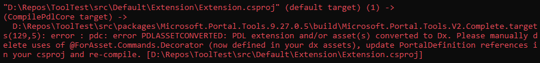
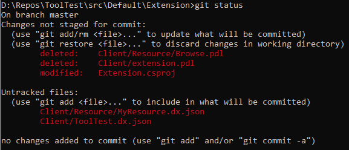
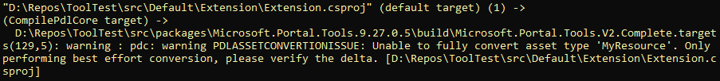
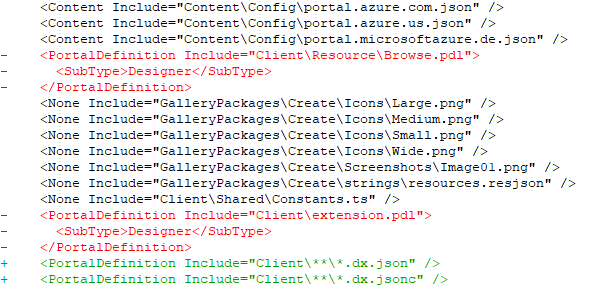

<a name="migration-of-pdl-assets-and-forasset-commands-decorator-to-json"></a>
# Migration of PDL assets and <code>@ForAsset.Commands.Decorator</code> to JSON

A part of portal's push towards a modern development and tooling experience for extensions is removing PDC from Portal's build tooling. To be able to do that, PDL assets and the no-PDL `@ForAsset.Commands.Decorator` in extensions are being replaced by JSON asset and command definitions instead.

Moving to the JSON based asset definitions gives you better Intellisense. Additionally, all new features built for assets will only be supported in the JSON format.

Extensions that currently have PDL assets do not need to manually re-write in JSON. The portal SDK has an in-built tool that converts PDL assets and `@ForAsset.Commands.Decorator` to JSON. SDK versions 8.230.0.5 and later have this tool. This doc will walk you through running the tool.


<a name="migration-of-pdl-assets-and-forasset-commands-decorator-to-json-before-running-the-tool"></a>
## Before running the tool

Before you use the tool, you will most likely find the following PDL artifacts in your extension - 

1. An extension definition. While the extension definition can exist in any PDL file,it most likely lives in a separate file named `extension.pdl` and has the content below.  
```xml
<?xml version="1.0" encoding="utf-8" ?>
<Definition xmlns="http://schemas.microsoft.com/aux/2013/pdl">
  <Extension Name="ToolTest" EntryPointModulePath="Program" />
</Definition>
```

2. Assets. Most extensions have at least one asset. Assets can be defined in any PDL file with the `<AssetType>` tag.

3. `@ForAsset.Commands.Decorator`. This typescript decorator is used to define commands in browse for an asset and can live in an .ts file.

<a name="migration-of-pdl-assets-and-forasset-commands-decorator-to-json-using-the-tool"></a>
## Using the tool

**Step 1** : Update the SDK to version 8.230.0.5 or higher and ensure you have a successful build.

**Step 2** : Add the following to the csproj - 

```xml
<ConvertAssetsToDx>true</ConvertAssetsToDx>
```
**Step 3** : Build the extension. If everything goes well, you will see a single error that looks like this - 



You will observe that the tool has removed extension and asset definition PDL from the source code, deleted empty `.pdl` files and added corresponding JSON in the same locations in files with a `.dx.json` file type.



In the above example, `ToolTest.dx.json` contains the extension definition and `MyResource.dx.json` contains the asset definition. The extension definition in JSON looks like this  - 

```json
{
  "$schema": "../Definitions/dx.schema.json",
  "extension": {
    "name": "ToolTest"
  }
}
```
There is a good reason for the tool to throw an error even when it successfully converts the PDL to JSON. When you build your extension, the tooling compiles the PDL, converts it to JSON, re-compiles the converted JSON, compares the compiled PDL to the compiled JSON and then subsequently errors out. The reason it errors out is because this multi-compile flow shouldn't be part of the build process and should be a one-time step at dev time only.

If the tool is unable to convert some PDL to JSON, you will see a warning like the one below. Please report such issues to dxportalteam@microsoft.com.



**Step 4** : If you had any `@ForAsset.Commands.Decorator`, you will have to manually remove them. The tool is not capable of making any changes to ts files.

**Step 5** : You now need to add `PortalDefinition` references for the newly added `*.dx.json` files in your csproj. You should replace the existing `PortalDefinitions` for the deleted PDL files with the corresponding JSON. Now, re-compile your extension.



**Step 6** : While not strictly required, it is recommended that you clean-up your csproj by deleting the `<ConvertAssetsToDx>true</ConvertAssetsToDx>` tag.

Congratulations, you have now successfully migrated your PDL extension definition, asset definition and `@ForAsset.Commands.Decorator` to JSON!
