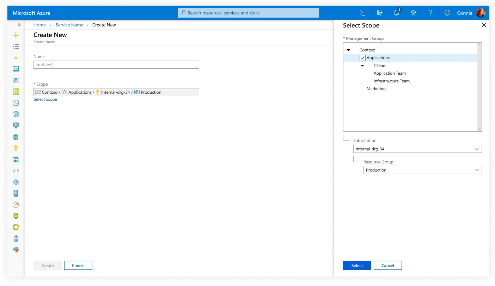
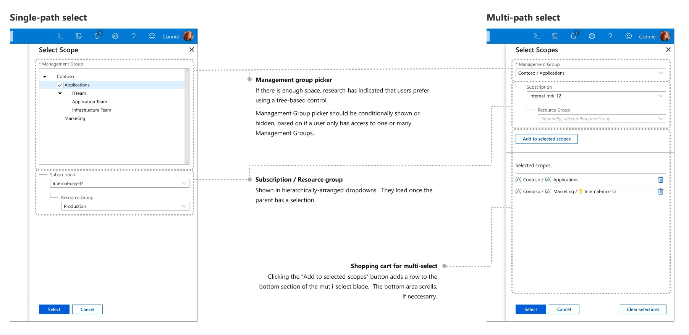
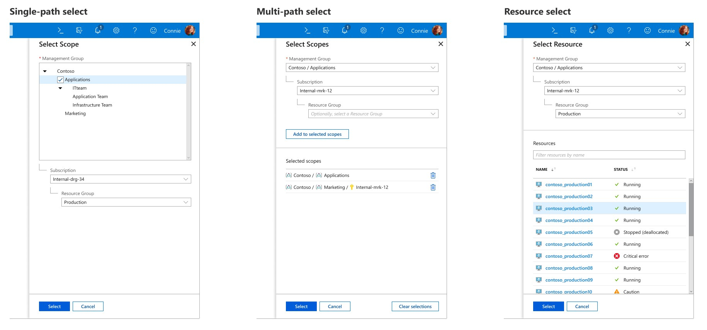
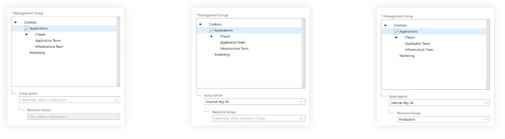
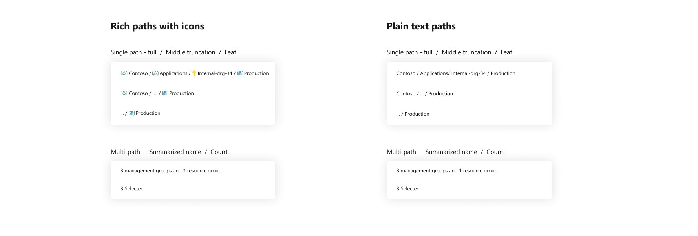
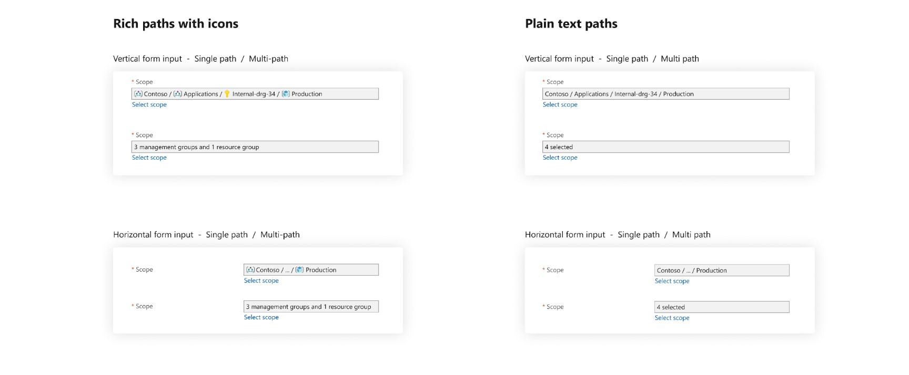
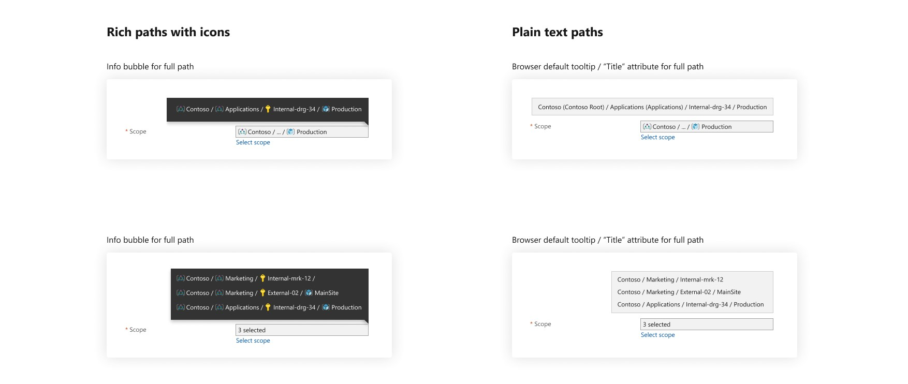
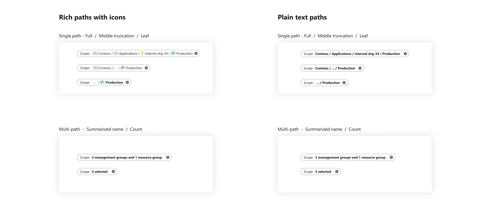

# ScopePicker
All resources in Azure have a unique hierarchical path that flows through the following groupings:
Management group / subscription / resource group / resource
Where the management group could itself be a hierarchy up to 6 levels deep. Many view filtering scenarios, and resource create scenarios require that a “Scope” path be specified, or possibly many paths. The scope picker pattern is a context panel that allows for selecting one or more of these scope paths.
Many Azure users only ever experience subscriptions and resource rroups. Management groups, and directories, are visible to “Central IT” users who deal with large-scale enterprise management scenarios.

## Example

## Anatomy

## Best Practices

<!-- Table as HTML to control width and any style we decide -->
<table>
<tr>
<th width=50%>What to do </th>
<th>When to use </th>
</tr>
<tr>
<td>Use a tree-based control for management groups - either as a scrolling area on the context panel, or as a tree inside a dropdown.</td>
<td>When a user needs to specify a management group selection along with subscription and resource group - for example, when creating a new resource.</td>
</tr>
<tr>
<td>Display MG > Sub > RG inputs hierarchically, with a small ‘L’ graphic (as in the VM Create experience)</td>
<td>“Scope” can also be used to replace three separate pill filters above list views or dashboard views.</td>
</tr>
<tr>
<td>Hide the management group picker if a user only has access to a single management group.  A single Scope Picker context panel may be used for both Central IT scenarios (where an all-up enterprise view is needed) and for more DevOps scenarios, where only subscription and resource group are needed.  The picker should support both, and not show management groups to users who don’t have a choice between many.</td>
<td>Don’t mix scope path with other resource metadata - like location or resource type.</td>
</tr></table>

## Variants

## Behaviors

### Progressive disclosure - enabling selection at any level of hierarchy
For the three dropdowns or selections (Management group, subscription, resource group) The user could, in some instances, not select a full path all the way down to a resource group.  If they stop at a subscription, or some level of management group, the scope picker can support selection of a path at any level of the overall hierarchy. 

### Displaying paths
Scopes are represented as paths. Node names are separated with two spaces and a forward slash.

### Displaying paths: Form inputs

### Displaying paths: Overflow

### Displaying paths: Filter

# Related documentation and resources

## Figma toolkit link

https://www.figma.com/file/PASyBiBq72G54ckrtgs86uE7/Azure-Design-Guidelines?node-id=307%3A269

## Documentation
Management groups: https://docs.microsoft.com/en-us/azure/governance/management-groups/