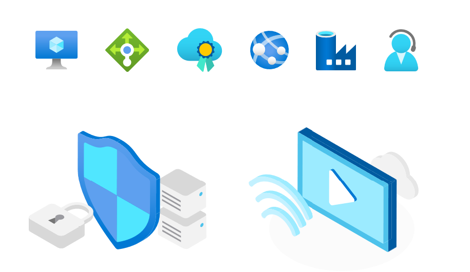
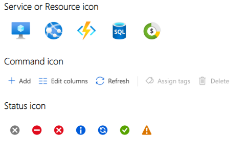
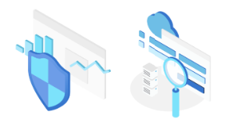

# Icons and illustrations
To ensure the cohesiveness of icons and illustrations throughout the portal we ship a large number of icons in the SDK and provide a way for you to request icons and illustrations that are not part of the SDK.

## Icons
Icons are used in commands, resource menus, blades, titles and portal navigation. The portal places some special requirements on the types of icons you can use. All icons are required to be SVG files so that icons will scale on high resolution devices, and for automatic theming.

The SDK framework includes a large library of icons for common uses so you should ensure your needs are unique before using a different icon.

* Service icons are polychromatic and represent Azure services and resources
* Command icons use a flat style and represent actions in the portal
* Status icons are a special set of icons to convey common status states 

### Browsing existing icons
The portal provides many <a href="https://ms.portal.azure.com/?Microsoft_Azure_Playground=true#blade/Microsoft_Azure_Playground/PlaygroundBlade/IconsSearchBlade" target="_blank">icons built-in to the SDK</a>, use the SDK icon and do not download and include an SDK icon in your extension.

You can browse the comprehensive Azure icon repository -  http://aka.ms/AzureIconRepository to see whether your icon has already been delivered and whether it is included in the SDK.

### How to request an icon
Check the repository before requesting an icon since new icons are added over time.

If your service’s icons are missing from the repo, email azure-icons@Microsoft.com

The icon request process  
* Lives in DevOps
* Operates on a queue basis. 
* Reviews go through 2 iterations
* Service icons go through Marketing and Brand review

Request icons at: http://aka.ms/AzureIconAndIllustrationRequests

## Illustrations
Illustrations are used in the get started pages to draw attention to specific scenarios and features in Azure

### Browsing existing illustrations
Link to site?

### How to request an illustration
When filing a request for an illustration we need to know where the illustration will be used.  

For get started illustrations, include the title, description and actions from the get started call to action card.

Request illustrations at: http://aka.ms/AzureIconAndIllustrationRequests

## Do
* Verify an existing icon will not work for you before requesting a new icon

## Don&#39;t
* Don't download and ship icons in your extension that are built-in to the SDK, use the SDK icons instead

## Design guidelines
* Icons in the Azure Design Toolkit [Icons](https://www.figma.com/file/Bwn8rmUOYtnPRwA3JoQTBn/Azure-Portal-Toolkit?node-id=3020%3A0)
* Overview page [design-patterns-page-overview.md](design-pattern-page-overview.md)
* Design guidelines [top-design.md](top-design.md)

# For developers
Developers can use the following information to get started with icons and illustrations

## Icons available in the SDK
The playground site displays the icons that are built-in to the SDK

*  <a href="https://ms.portal.azure.com/?Microsoft_Azure_Playground=true#blade/Microsoft_Azure_Playground/PlaygroundBlade/IconsSearchBlade" target="_blank">Built-in SDK icons in the playground</a> 

## Related documents

* Icons [portalfx-icons.md](portalfx-icons.md)
* Built-in icons [portalfix-icons-builtin.md](portalfx-icons-builtin.md)
* Creating icons [portalfx-icons-creation.md](portalfx-icons-creation.md)
