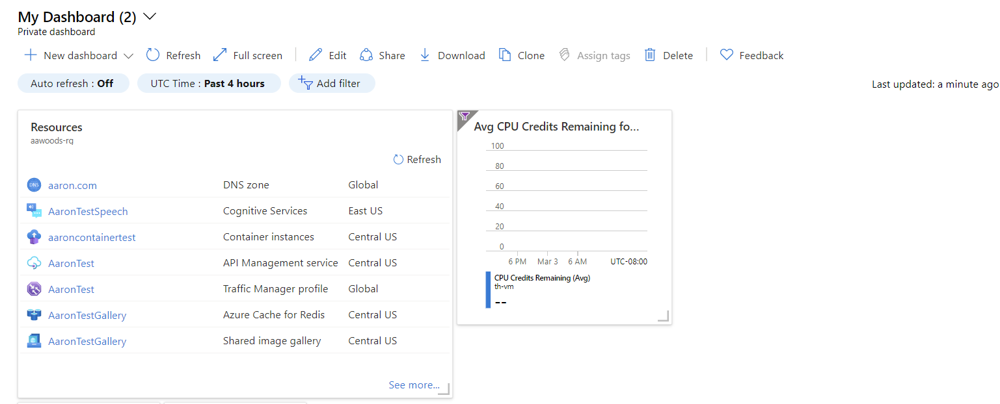
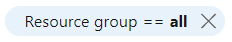
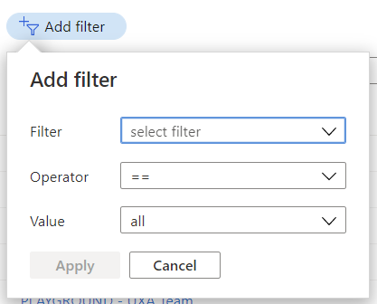
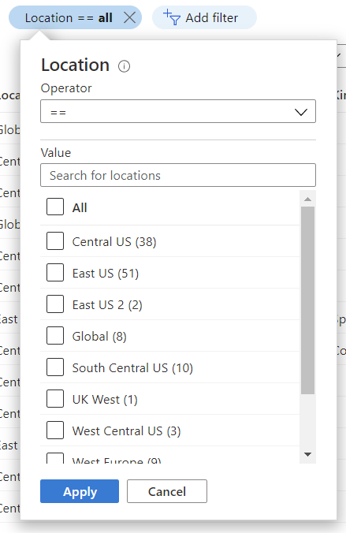

# Filtering
Filtering enables users to quickly winnow down a list, table or chart to display the result set they are seeking.

## Context
Users configure lists of resources and graphical representations of data to show only the information they want to see.

## Problem
Users have a lot of resources in Azure and want to see a subset if items.  Azure also stores time series data and users want to see a specific time range of that data.

## Solution
The portal enables users to add, remove and customize filters so that users can see exactly what they want.

### Also known as
<!-- Bulleted list of other terms used to describe the solution, if any -->
* Pill filters

## Examples

### Example images
<!-- Include example image of the solution in the portal -->
Dashboard

All resources
<!-- TODO UX screenshot of new browse -->

Activity log

### Example uses

* Dashboard
* All resources
* Activity logs
* Metrics
* Virtual Machine Size

## Use when
Use filtering when it is possible for the items to exceed what can be displayed on one page.  Also use filtering when showing time series data on a page or chart so that the user can filter to specific ranges.

## Anatomy

### Page or table
These controls are all logically on one continuous line.
* Search: a text entry box to perform text matching against items
* Filter: zero or more filters to easily filter a particular aspect of the items in the list
* Add filter: a control to add more filters to the page. A page that contains a fixed set of non-removable filters and no additional filters, will not have an `Add filter` control.
* Reset filters: a link to reset the filters on the page to the same state as when the page was initially loaded

Wrapping behavior

The single line of controls will wrap one control at a time.

### Search
A text box where the user enters text to match against the result set.

### Filter
The filter displays
* current state of filter with `type` in normal text and filter `configuration` in bold
    * a filter in an unconfigured state will show `None` as the configuration text
* visual indicator that filter can be interacted with
* if removable
    * visual indicator to separate the delete click target area from the filter selection target area
    * visual indicator to delete filter

Filter 

Removable filter

Configuring the filter will open a filter configuration dialog where users can set the filter options.  Do not expand the filter control size during configuration, this expansion causes the filter row to wrap and the entire page to relayout.  This "movement" is very distracting and makes filtering hard to use.
<!-- TODO UX get image of filter configuration-->

### Add filter
Control that uses the same visual style as the filters and includes an **Add** icon and the text to `Add filter`.  

The configuration dialog for `Add filter` is a searchable list of available filters in normal font.
<!-- TODO UX screenshot with correct text style text label should be singular -->

### Reset filters
A link with text `Reset filters` that restores the page filters to the state when the page was opened

## Behavior
<!-- TODO UX - resolve bldae pinning behavior - blade pinned with filter set?  resolve with activity logs -->

### Selecting filter value
Upon selection, the filter will open a dialog box that enables users to configure the filter

Selection state with configuration dialog open

`NOTE` - configuration dialog box should be left aligned with the filter
<!-- TODO UX screenshot with correct alignment -->

The filter configuration is saved when
* Single selection list - when the user makes the select.  This is shown in the `Add filter` behavior
* Multi-selection list - when the user closes or clicks away from the filter.  This is shown in the `Subscription filter` in the `All resources` page
* A group of multi-selection lists - when the user closes or clicks away from the filter.  This is shown in the `Metrics` page
* Multiple controls - when the user selects the `Apply` button.  Any other action will keep the filter in its existing state.  This is shown in the `Time range ftiler` on the `Dashboard` page

### Adding a filter
Newly added filter will appear on page in edit state with primary filter expanded

When the last available filter has been added to the page, the `Add filter` button should still be available and instead of showing a searchable list of available filters, it should show a message that "All available filters have been added"

### Time range filtering

If users would benefit from increased filtering functionality, you can inciude additional time range values and add specify the time zone

If additional options won't add value to the scenario, keep it clean and simple. 

## Do
<!-- Bulleted list of reminders for best practices-->

## Don&#39;t
<!-- Bulleted list of things to avoid -->

## Related design guidelines
<!-- Links to Related design guidelines.  Always include the link to the readme -->
* Design guidelines [top-design.md](top-design.md)

## Research and usability
<!-- Links to the research for the solution -->

## Telemetry
<!-- Links to portal telemetry showing the solution usage -->

# For developers
Developers can use the following information to get started implementing this pattern

## Tips and tricks
<!-- Bulleted list of tips and tricks for developers -->

## Related documentation
<!-- Links to related developer docs -->
