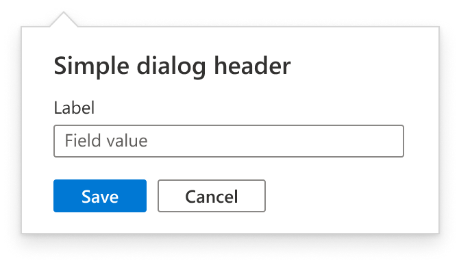
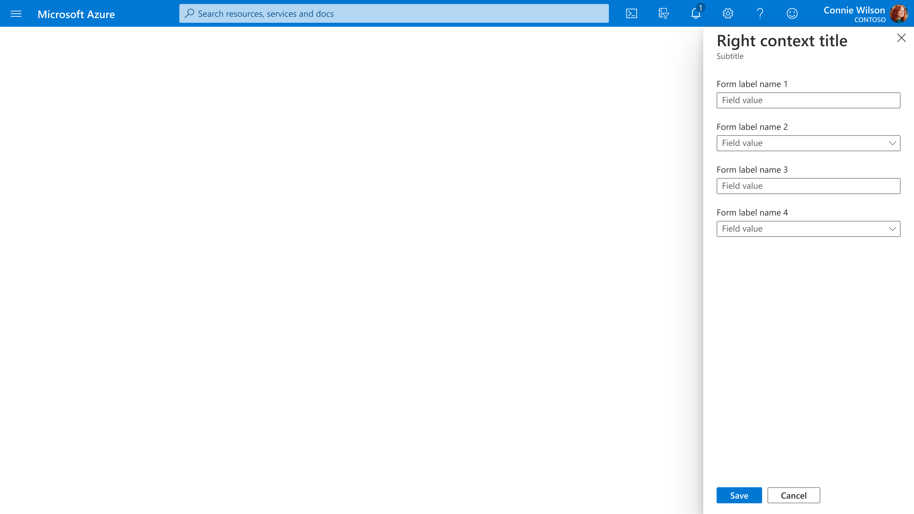
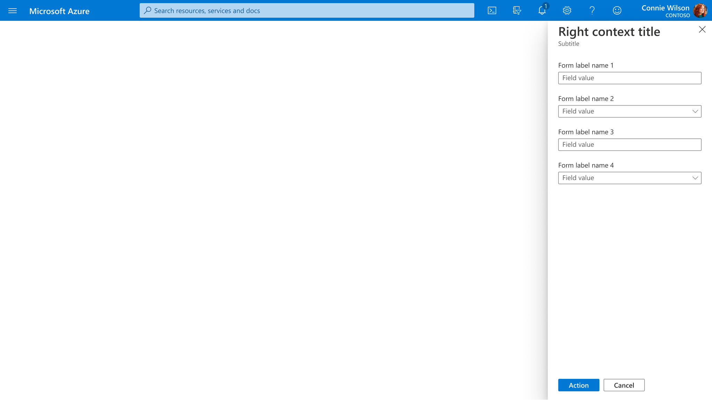
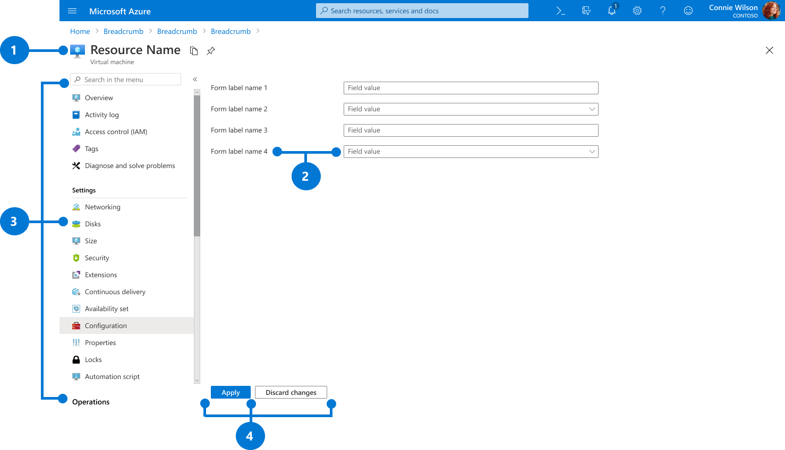
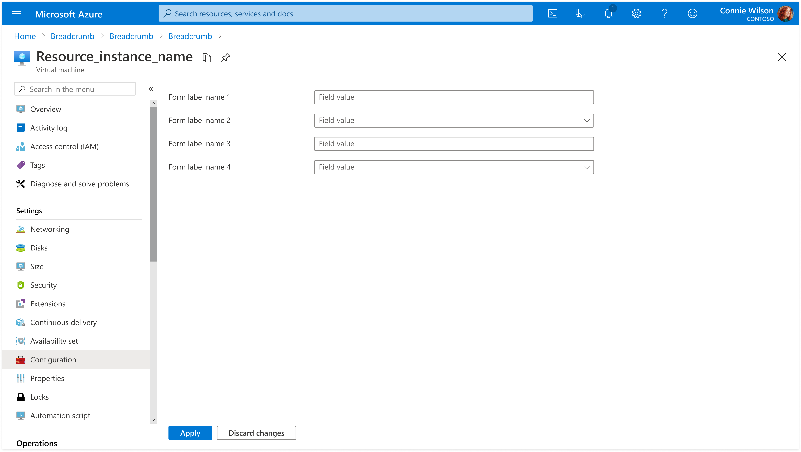
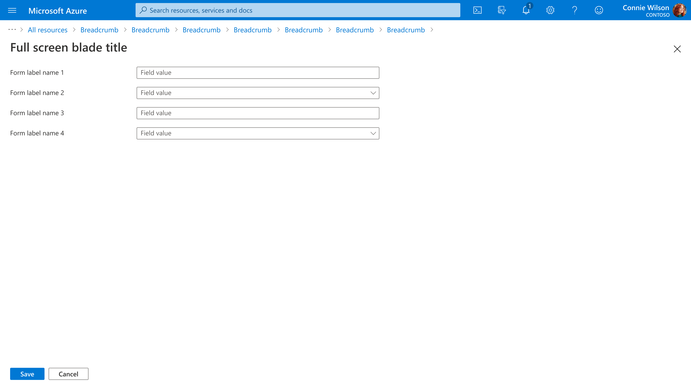
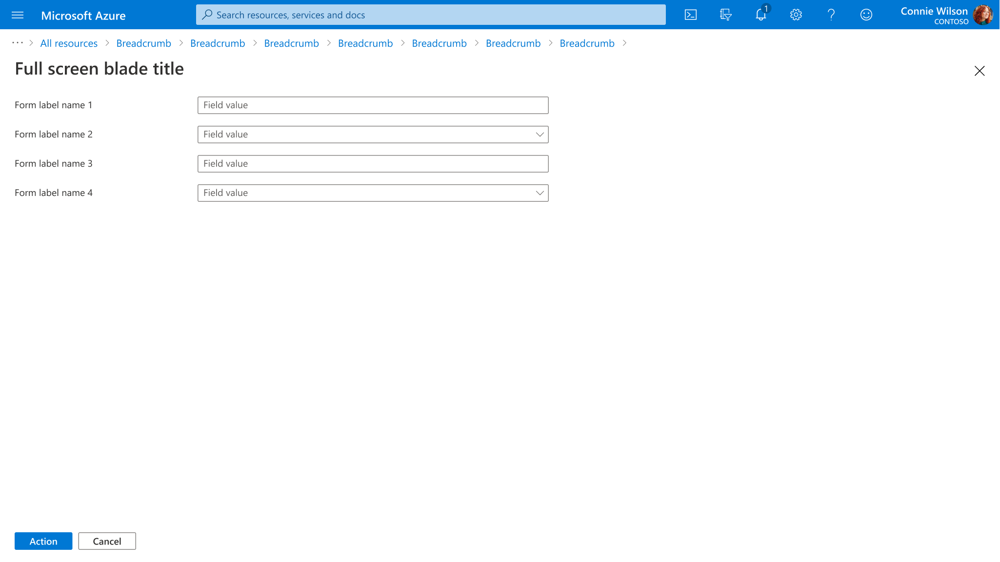

# Forms
The Form design pattern enables users to easily input information and successfully commit changes.

## Context
Users need to edit and save changes in Azure.

## Problem
Users need an intuitive and consistent way to provide and confirm information.

## Solution
The Forms design pattern makes it easy for users to provide information while maintaining a consistent experience across Azure. Several variations of forms exist depending on the type of information being collected and the desired user interaction. Form validation ensures that information is collected accurately, and users are clearly informed when errors are made. Variations of the form design pattern include:

1. Form in dialog
2. Form in context pane
3. Form in menu page
4. Form in full screen page
5. Form with tabs
6. Form in wizard

## Variations

### 1. Form in dialog

#### Example Images

#### Example Uses

Create a VM following this [link](https://portal.azure.com/#create/microsoft.freeaccountvirtualmachine) and stop this VM to see form in dialog.

#### Use When

A form in dialog is used for a very simple input/acknowledgement and appears next to the user click target.

#### Anatomy

A form in dialog has the following features:

1. Title
2. Labels and corresponding fields
3. Buttons

#### Title

See [common behavior section](#common-behavior)

#### Labels and corresponding fields

See [common behavior section](#common-behavior)

#### Button and Design Recommendation

There are 2 types of form to use for dialog: simple edit form and action form. The dialog form is closed after users click on a button.

The design of **simple edit form** in dialog is shown below:

Button labels and behavior:

* "Save" – validate fields and either show invalid fields indication or save the changes and close the dialog
* "Cancel" – close the dialog without performing validation

The design of **action form** in dialog is shown below:

Button labels and behavior:

* "\<same as action\>" – validate fields and either show invalid fields indication or perform the action and close the dialog
* "Cancel" – close the dialog without performing validation

### 2. Form in context pane

#### Example Images

#### Example Uses

Create a VM following this [link](https://portal.azure.com/#create/microsoft.freeaccountvirtualmachine) and click change tags of this VM from the essential area to see form in context pane.

#### Use When

A form in context pane is used when more space is needed for users to provide information, without forcing the user to input this information on a separate page. Context panes appear on the right side of the screen and float over the existing content. Context panes can vary in width.

#### Anatomy

A form in context pane has the following features:

1. Title
2. Subtitle
3. Labels and corresponding fields
4. Buttons

#### Title

See [common behavior section](#common-behavior)

#### Labels and corresponding fields

See [common behavior section](#common-behavior)

#### Button and Design Recommendation

There are 2 types of form to use for context panes: simple edit form and action form.

* Command bar is not allowed inside the context pane
* Context pane should close when the user clicks on a footer button, and show the previous view updated with the changes made in the context pane
* A notification toast should be provided at the top right corner to notify users of success or failure of the form submission

The design of **simple edit form** in context pane is shown below:

Button labels and behavior:

* "Save" – validate fields and either show invalid fields indication or save the changes and close the form
* "Cancel" – close the form without performing validation

 The design of **action form** in context pane is shown below :

Button labels and behavior:

* "\<same as action\>" – validate fields and either show invalid fields indication or perform the action and close the form
* "Cancel" – close the form without performing validation

The design of a form in context pane with notification toast after submission is shown below:

### 3. Form in menu page

#### Example Images

#### Example Uses

Create a VM following this [link](https://portal.azure.com/#create/microsoft.freeaccountvirtualmachine) and click change tags of this VM from the menu area to see form in menu page.

#### Use When

A form in menu page is used when the input form is invoked directly from the resource’s menu and serves as a way to edit existing input values.

#### Anatomy

A form in menu page has the following features:

1. Title
2. Command bar
3. Labels and corresponding fields
4. Menu
5. Buttons

#### Title

See [common behavior section](#common-behavior)

#### Labels and corresponding fields

See [common behavior section](#common-behavior)

#### Button and Design Recommendation

* Command bar can be placed above a form but it is not associated with the form
* Commands perform tasks that are irrelevant of the form and do not interact with any form element
* Use a status bar to inform the status of applied or discarded changes: successful (green), failed (red), or in progress (blue)
* Keep the status bar visible until the form is edited again

The design of form in menu page is shown below:

Button labels and behavior:

* "Apply" – validate fields and either show invalid fields indication or save the changes and remain on the same form
* "Discard changes" – discard the changes and remain on the same form

The design of form in menu page with status bar after submission is shown below:

### 4. Form in full screen page

#### Example Images

#### Example Uses

Create a VM following this [link](https://portal.azure.com/#create/microsoft.freeaccountvirtualmachine) and move this VM to a different resource group to see form in full screen page.

#### Use When

A form in full screen page is used when the input form needs the space or will invoke a child view.

#### Anatomy

A form in full screen page has the following features:

1. Title
2. Labels and corresponding fields
3. Buttons

#### Title

See [common behavior section](#common-behavior)

#### Labels and corresponding fields

See [common behavior section](#common-behavior)

#### Button and Design Recommendation

There are 3 types of forms to use for full screen page: complex edit form, simple edit form, and action form.

**Complex edit form in full screen page**

Complex edit form in full screen page is used for changing existing values and it is complex so that users need time to fill out and save multiple times along the way.

* Command bar is not allowed inside the full screen page
* Keep form open after users click "Apply" button or "Discard changes" button
* Close form and prompt users to save or discard change after users click "Close" button
* Use a status bar to inform the status of applied or discarded changes: successful (green), failed (red), or in progress (blue)
* Keep the status bar visible until the form is edited again

The design of complex edit form in full screen page is shown below:

Button labels and behavior:

* "Apply" – validate fields and either show invalid fields indication or save the changes and remain on the same form
* "Discard changes" – discard the changes and remain on the same form
* "Close" – prompt user to save or discard the changes and close the form

The design of complex edit form in full screen page with status bar after submission is shown below:

**Simple edit form and action form in full screen page**

Simple edit form in full screen page is used for changing existing values and it's simple enough for users to make changes in one go. Action form is used to submit input once, such as "Create", "Connect", "Add", "Move".

* Command bar is not allowed inside the full screen page form
* Close form after users click button and show previous view updated with the change made by the form
* Use a toast notification at the top right corner to notify success or failure of the form submission

The design of simple edit form in full screen page is shown below:

Button labels and behavior:

* "Save" – validate fields and either show invalid fields indication or save the changes and close the form
* "Cancel" – close the form without performing validation

The design of action form in full screen page is shown below:

Button labels and behavior:

* "\<same as action\>" – validate fields and either show invalid fields indication or perform the action and close the form
* "Cancel" – close the form without performing validation

The design of form with notification toast after submission is shown below:

### 5. Form with tabs

Tabs can be used inside a form to indicate multiple steps or aspects. They can be used in any type of forms such as menu page form, full page form, etc. They cannot be used above the form to avoid hierarchical confusion. When tabs are present, a line separator is visible at all time to indicate the buttons are at the form level as opposed to inside an individual tab.

### 6. Form in wizard

Wizard form is a full screen page with tabs across the top and is used as a form to create a new Azure resource. Please refer to resource create pattern for more information to create wizard: [Create a resource](https://review.docs.microsoft.com/en-us/azure/portal-sdk/portal-sdk/generated/design-patterns-resource-create)

## Common Behavior

### Title

The title should reflect the action, for example: "Edit properties", "Stop this virtual machine", "Delete this virtual machine"

### Labels and corresponding fields

Labels should be kept concise and not provide instructions, for example: "Machine name"

### Validation

As users enter information, field content is validated. Upon form submission, the entire form is validated.

#### Placeholder text

Include placeholder text can be formatted in two ways:

1. As an instruction

2. As an example of a valid input format

#### Field validation

Do not make users guess field (TextBox) or password (PasswordBox) requirements. Instead, enable field validations for TextBox and PasswordBox in your experience. You can enable the showValidationsAsPopup option to give the user feedback as they type.

* [TextBox](design-patterns-controls-TextBox.md)
* [PasswordBox](design-patterns-controls-PasswordBox.md)

#### Error messaging

Provide highly visible and specific error messages.

### Control Recommendations

Visit the control guidance to help you in selecting the right control for your page: [Controls guidance](design-patterns-controls.md)

### Design Recommendations

The design for submitting and canceling a form should follow these recommendations. Sometimes a form is invoked from multiple places. For example, the Tag resource form is invoked from a resource menu on most Azure resource and invoked in a context pane from the essentials control. In this case, the Tag resource form is designed as a menu page form opened from a resource menu and does not follow the recommendations of a typical context pane form.

* Buttons are at the bottom of the page in a non-scrollable docked area
* Buttons are enabled at the time
* A line separator is visible when the content starts to scroll
* Use a single Close button if experience is informational only
* Use Yes and No buttons for destructive actions and include a confirmation question in the dialog - "Delete this VM?"
* Use Ok and Cancel as a last resort if a better action name is not apparent

Summary of buttons and corresponding behaviors:

* "Save" – validate fields and either show invalid fields indication or save the changes and close the form
* "Cancel" – close the form without performing validation
* "\<same as action\>" – validate fields and either show invalid fields indication or perform the action and close the form
* "Apply" – validate fields and either show invalid fields indication or save the changes and remain on the same form
* "Discard changes" – discard the changes and remain on the same form
* "Close" - prompt user to save or discard the changes and close the form

## Do

* Mark required fields with a red asterisk * to distinguish them from optional fields
* Left align the input fields on the page. Jagged edges are difficult to skim
* Visually group related fields into sections with an intro sentence and learn more links. 
* Avoid ambiguous spacing where labels are equidistant from multiple fields. Refer this link to use whitespace effectively in form

## Don&#39;t

* Don't phrase labels as questions.
* Don’t put instructions into labels.  For example, don’t use "Select a resource group" as a label.  The label should be "Resource group"
* Avoid buttons for clearing a form. The risk of accidental deletion outweighs the unlikely need to start over

## Related design guidelines

* [Controls guidance](design-patterns-controls.md)
* [InfoBalloon](design-patterns-controls-InfoBalloon.md)
* [PasswordBox](design-patterns-controls-TextBox.md)
* [TextBox](design-patterns-controls-TextBox.md)
* [Section](design-patterns-controls-Section.md)
* [Full screen](design-patterns-page-fullscreen.md)
* [Create a resource](design-patterns-resource-create.md)
* [Design guidelines](top-design.md)

## Research and usability

## Telemetry

## Implementation

Developers can use the following information to get started implementing this pattern:

Tips and tricks

* To show the labels and input field on the same line, include your controls in a Section and set the leftLabelPosition option to true
* For input fields that may not be immediately familiar, include an info balloon (InfoBalloon)

Related documentation

* [Dialog](top-extensions-dialogs.md)
* [Context Pane](top-extensions-context-panes.md)
* [Portal Forms](top-extensions-forms.md)
* [Developing Forms](portalfx-forms.md)
