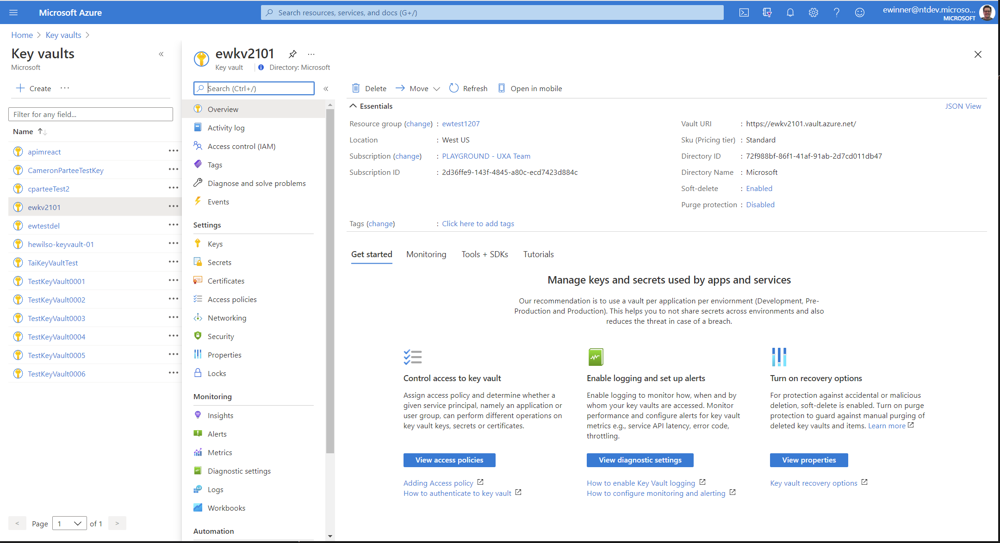

# Full screen pages
Use navigation patterns for the portal that fill the screen and behave like most websites.

## Context
As users navigate the portal, they expect a common web interaction experience.

## Problem
Earlier portal designs used narrow blades that stacked to the right into horizontally scrolling "journeys" as the user navigated.  These stacked blades often resulted in existing blades being partially displayed which made it hard for the user to know where to look and understand where in the portal they were.  Horizontal scrolling is also more foreign than the common vertical scrolling of long web pages.

Users have made it very clear they don’t like horizontal scrolling – in large part because it doesn’t match how they expect to interact with websites.   

## Solution
In 2017 Azure moved from narrow blades to full page experiences and have introduced dialogs and context panes to further avoid unnecessary context switches.

### Also known as

-   Avoid horizontal scrolling
-   Avoid context switches

## Examples

### Example images

### Example uses
These Azure resources are good examples of this design pattern 

* Creating a VM - [Free account virtual machine](https://rc.portal.azure.com/#create/microsoft.freeaccountvirtualmachine)
* Browsing all resources - [All resources](https://rc.portal.azure.com/#blade/HubsExtension/ArtBrowseBlade/resourceType/Microsoft.Resources%2Fresources)
* Virtual Machine

## Use when
Full screen is a foundation of any page in the Azure portal. All resources are built upon full screen experiences.

## Anatomy
Full screen navigation involves:
<!-- TODO UX - get screenshot for anatomy that includes Dialog -->

1. Menu
2. Toolbar
3. Content area
4. Context pane
5. Dialog

## Behavior
The current blade should occupy the available screen space and any subsequent user interactions should seek to minimize navigating the user.

The user will invoke an action using one of the following items
* menu
* toolbar
* button
* link
* card

In order to minimize the disruption to the user, an action should display subsequent UI as close to the user's previosu click target as possible by using one of the following approaches in priority order

1. Take the action with no further user interaction needed, user may see updates to current page or portal notifcations.  Examples:
    * Refreshing a page takes immediate affect with no further user input needed.
    * Starting a VM immediately calls the API.  Portal notifications are used to track the start action and result.
2. Open a dialog to display info or confirm the action.  Example:
    * Deleting a VM invokes a dialog to explain the ramifications of the action and have the user confirm via Yes/No buttons.
3. Open a context pane to display info and perform the action.  Example:
    * Edit columns in All Resources invokes a context pane for the user to configure columns and then save via an Apply button.
4. Select an existing resource menu on the same page.  Example:
    * Clicking the Blobs card on the Storage account overview page selects the Storage Accounts Blobs menu item.
5. Open a new full screen page in the portal.  Example:
    * Clicking resource name on the resource group overview page opens the resource page.
6. Open a website that is external to the Azure portal.  Example:
    * Clicking the links on the bottom of the monitor overview page will navigate you to a site outside the portal.
    * Note whenever a link will result in the user leaving the portal, you should show the LaunchCurrent MsPortalFx.Base.Images.LaunchCurrent() icon after the link text as part of the link tag.  See [portalfx-icons-builtin.md](portalfx-icons-builtin.md) for full list of icons.

### Menu blade
The portal menu blade occupies a vertical portion of the page and opens all of its associated pages in full screen by default.  You should avoid having a menu blade open another menu blade or open a website that is external to the portal as this interaction is very jarring and the user can feel lost.  The best way to provide smoother navigation is to provide a content page which the first menu will display.  This page can be mostly static content to explain the relationship between the current view and the next navigation.  An element on that page (link, button, card) can then be used to open a new menu within the portal or go to an external site.

### Toolbar
Toolbars are located at the top of the page and invoke actions.  Toolbar actions rarely will open a site external to the portal.  If they must, the LaunchCurrent icon should be used as the toolbar icon and not be shown trailing the text

### Content area
The content area of a page provides content, links, buttons, cards and content area actions - like adding a row to a grid.  These actions can leverage the appropriate action behavior, including leaving the portal.

### Context pane
A context pane is a full height element that opens on top of the underlying page and appears docked to the right-edge of the portal.  Context panes can have varying widths depending on the content being displayed.  Context panes should folow a layout similar to dialogs with buttons at the bottom that perform the appropriate action and close the context pane.  Through Vanadium, context panes constitute the end of a navigation path and should not invoke resource menu items or full screen pages in the portal.

### Dialog
A dialog is an element that floats above the underlying page and appears near the element which invokes it.  The dialog is sized according to the content being displayed.  Dialogs should have a single button (i.e. Close ) or a pair of buttons (i.e. Ok/Cancel, Save/Discard, Yes/No, Move/Cancel, Delete/Cancel ) at the bottom that will take the appropriate action and close the dialog.

### Maximized blades
All browse pages and menu pages open full screen by default.

### Origin snapping
Whenever a new full screen page is opened, the newly opened page snaps to the left of the screen, moving all other blades out of view

### Navigation and back stack
Even though previous blades are no longer visible, the user can traverse to an earlier blade from their current journey.

Use the portal breadcrumbs or the browser back button

Content page clicks that are equivalent to a resource menu selection should perform a resource menu selection and *not* stack a full screen blade to the right and do horizontal scrolling

Use the Close button in the right corner

## Do

* Keep input fields at a max width of 265px
* Show the result of a user click as close to the click target as possible - try Dialog then Context Pane then a full screen page

## Don&#39;t

* Blades shouldn’t open at a specified size, instead the page should open as “maximized” (`InitialDisplayState="Maximized"`)
* When linking to a site outside of Azure, such as documentation, don’t open the page in the same browser window. It should open in a new tab.

## Related design guidelines

* Responsive design [design-patterns-page-responsive-design.md](design-patterns-page-responsive-design.md)
* Create a Resource [design-patterns-resource-create.md](design-patterns-resource-create.md)
* Browse Resources [design-patterns-resource-browse.md](design-patterns-resource-browse.md)
* Manage a Resource [design-patterns-resource-manage.md](design-patterns-resource-manage.md)
* Design guidelines [top-design.md](top-design.md)

## Research and usability

Research history and retrospective for Azure Portal Full Screen
[Full screen history and retrospective](https://microsoft.sharepoint.com/:p:/r/teams/azureteams/aapt/azureux/portalfx/_layouts/15/Doc.aspx?sourcedoc=%7B78bf3a97-2ccc-4920-886d-ce508980c3d8%7D&action=default)

## Telemetry

* Non full screen pages [View report](https://aka.ms/portalfx/fundamentals/nonfullscreenblades)

* Non full screen resource creation pages [View report](https://aka.ms/portalfx/fundamentals/allcreate)

# For developers
Developers can use the following information to get started implementing this pattern

## Tips and tricks

* Set a max-width on your content in the CSS (blade/part templates) OR set initial DisplayState=“normal” in a blade’s PDL.

## Related documentation

* Blade [top-extensions-blades.md](top-extensions-blades.md)
* Context Pane [top-extensions-context-panes.md](top-extensions-context-panes.md)
* Dialog [top-extensions-dialogs.md](top-extensions-dialogs.md)
* Notifications [top-extensions-notifications](top-extensions-notifications)
* Built-in icons [portalfx-icons-builtin.md](portalfx-icons-builtin.md)
