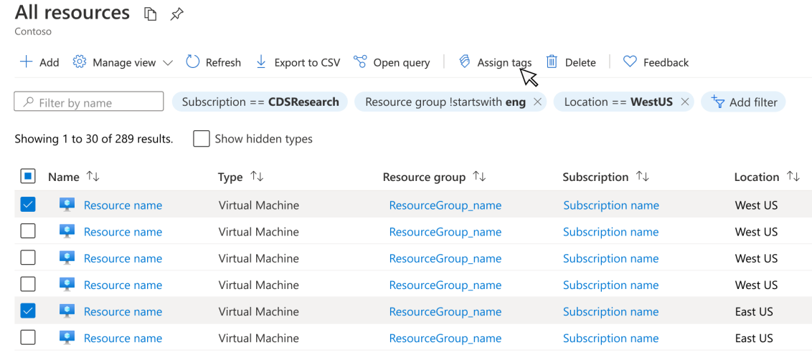

# Page with tables
Most web pages and portals surface items in tables to show lists of items that can be searched, sorted and compared.

Last updated Oct 2021 (see [change logs](#change-logs))

## Context
In Azure, users frequently interact with pages of items in tables.

## Problem
Users arrive at a page with tables of items and want to perform actions on the objects.

## Solution
The Azure portal uses blades to represent a page and has a grid control to manage items. Grids consist of objects grouped together and sorted vertically, usually presented with actions that a user can perform on an item. Grids are used for surfacing a table of objects to provide meaningful data on each item. 

### Also known as
- Browse
- Grid
- List

## Examples

### Example images

### Example uses
-   [All resources](https://ms.portal.azure.com/#blade/HubsExtension/ArtBrowseBlade/resourceType/Microsoft.Resources%2Fresources)
-   [All users](https://ms.portal.azure.com/#blade/Microsoft_AAD_IAM/UsersManagementMenuBlade/AllUsers)

## Use when
Grids are used for surfacing a tables of objects to provide meaningful data on each item. When displaying data in a grid, ensure that users can filter, see an item count, and sort the columns when possible. Grids will often contain more logical data than can be shown directly in a single page. There are two methods that are used to manage large amounts of data: Dynamic scrolling (loading more rows into the grid as the user scrolls) or using a paginator.

## Anatomy

A grid can contain:
1.  Column header
2.  Column sorter
3.  Checkbox
4.  Iconography
5.  Context menu (ellipsis)
6.  Scrollbar or pagination

## Behaviors

### Bulk commanding (multi-select)
A user can select one or more items using the leftmost column, then choose a command from the command bar above to perform actions like Remove or Delete. This pattern is ideal for scenarios when a user wants to perform a single action on many list items.

### Context menu
The ellipses on the right edge of each row contain commands for cases where multiple actions are possible for a single selected row, like Edit or Delete. Common design practice is to keep all commands in the context menu rather than putting an icon, i.e. a trash can for Delete, directly on the grid. Context menus can have child context menus, made available with a chevron at the right edge of a parent context menu item.

### Hierarchical grid
This pattern allows users to expand a parent row to directly see the parent’s children without changing the user’s context. Often the child rows contain links that allow our users to navigate directly to view or edit the child object. Currently the hierarchical grid can only accommodate a single column with the parent/child hierarchy. Common design practice is to try to place the hierarchy column as one of the leftmost columns in the grid to allow for more text in the expanded rows. Also, note that not every row in a hierarchy column needs to have children for this pattern to be useful.

### Editable grid
Inline add allows a user to quickly add or edit an item in the context of the list, without having to open a context pane or a new page. This interaction model is ideal for objects that don’t require a great deal of fields to fill out. The editable grid allows for various controls within a list item, like dropdowns or checkboxes.

### Empty grid
If there is no item to be shown, grid should follow the design of an empty grid. Refer to [notification design pattern](design-patterns-page-notifications.md) for more details.

### Contextual commands
Actions can be pulled out of the command bar to be in closer proximity to the grid objects they’re related to. This is valuable when there are multiple grids on the page or the grid is far from the command bar. However if the grid is the only content on a page, common design practice is to use the global command bar.

## Do
- Allow for column sorting. Users should be able to sort by ascending and descending order by clicking the column header

- Direct link from table cells. For example, The name of a resource is displayed with link styling, and clicking that link will open the resource

- Apply responsive breakpoints. The default view should render nicely at any size between 1280px and 1920px

- Remember column customization between sessions. Changes applied to columns shown and column widths should be persistent across sessions and browsers

## Don’t
- Don’t name a column “Name” if you can be more descriptive. For example, for a list of disks, use “Disk” as the column name

- Don’t use long column labels. Try to avoid situations where valuable grid real estate is consumed because a column header is longer than the data in that column

## Related design guidelines
* Design guidelines [top-design.md](top-design.md)

## Research and usability

## Telemetry

# For developers
Developers can use the following information to get started implementing this pattern

## Tips and tricks

## Related documentation
* Grid control [portalfx-controls-grid.md](portalfx-controls-grid.md)

## Change logs

### Oct 2021
* Add empty grid info

### Mar 2021
* Updated UI styles to latest

### Jul 2020
* Published