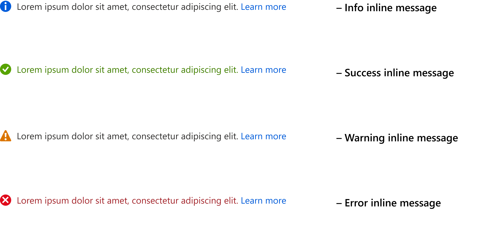
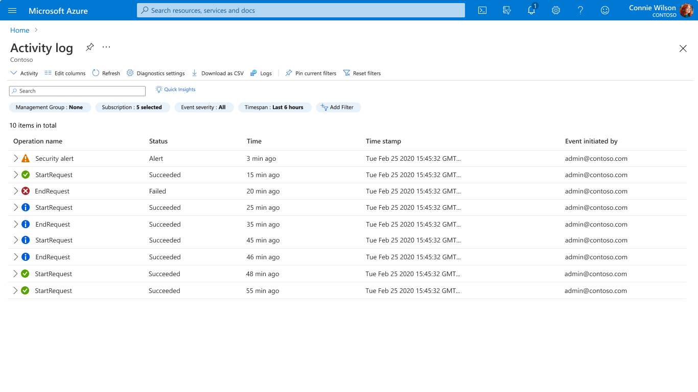
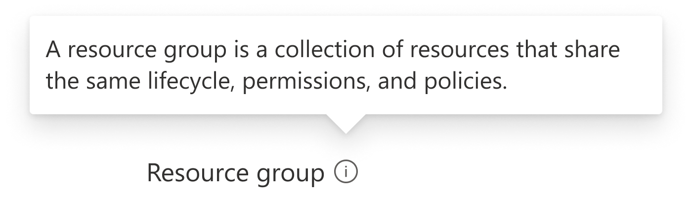

# Notification Guidelines

Last updated Feb 2021 (see [change logs](#change-logs))

The notification design pattern enables users to understand the result of actions. 

## Context
Users need guidance and feedback throughout the portal so they can quickly accomplish tasks and understand the results of their actions.

## Problem
Users need an intuitive and consistent way to have confidence that actions are completed  in Azure.

## Solution
The portal offers several notification approaches to provide information that is important and relevant to user actions. These approaches will help users understand and use features efficiently.
Types  of notifications include:
1. Local synchronous  notification – immediate, direct response to a user action or input
2. Global asynchronous notification – information related to a system event or previously submitted long running task from the user
3. Guiding and teaching UI – text to guide the user to successfully accomplish a task.

### Also known as
* Guidance and feedback
* Toast notifications
* Error reporting
* Validation
* In-line messaging
* Info balloon
* Tooltip

## Variations

### >
<li>Local synchronous notifications</li>
<

#### Examples
Example images
 

Example uses

Go to Create a resource group, choose a subscription that you don’t have the permission to create a resource, enter a resource group name and click another component of the page. A synchronous system status will be displayed to indicate the error message.

#### Use when
Displaying a notification that relates to the current user flow, immediately responds to a user’s action.

#### Anatomy
 

#### Behavior
a. Dialog
  

Dialog shows a critical information message. Dialog will be dismissed when user clicks on the buttons of dialog or when user clicks on anywhere outside of dialog. Clicking on anywhere outside of dialog will be similar to click on Cancel button on dialog. Dialog is a high-level urgency notification.
Checklist:
* Triggered by user action
* User cannot proceed without giving an input
* The UI needs to be blocked
* User needs to see this information immediately
* There is a critical service event, or the action is irreversible
* User doesn’t anticipate the popup to happen

b. Inline validation
 

 

Inline validation is a type of inline message that is used to inform user about validation or info message of an input field. Inline validation will not block user from interacting with other components of the page. The message will be dismissed programmatically when user update the input field with a valid value.
Checklist:
* The validation happens live
* User needs contextual information on their input
* The information relates to a form field
* The message is triggered by user action

c. Inline validation and message bar
 

Inline validation and message bar are combined to inform users about an error message of an input field. They will not block users from interacting with other components of the page. They will be dismissed when user updates the input field with a valid value.
Checklist:
* An error needs to be displayed after validation or it is hard to see the contextual error on its own
* User needs contextual error information on their input and a high-level summary
* The information relates to a form field
* The message is triggered by user action

d. Status indicator
 

Status indicated is a type of inline message that is used to inform user about an error or info message. They will not block user from interacting with other components of the page. 
Checklist:
* User needs lightweight contextual confirmation of their action or status of a process
* The message is triggered by user action or system
* There is no other UI change that would clearly indicate that the system registered user’s action

e. Message bar
 

 

 

Message bar is used to inform user about an issue, error or subscription. It will not block user from interacting with other components of the page.
Checklist:
* The message relates to the state of the entire product or surface
* The message is triggered by the system
* The information doesn’t require immediate action
* The message can relate to an upgrade

f. Error page
 

Error page is  used to inform user about an error and empty state of a page.
Checklist:
* Error is preventing user to access app content
* The message is triggered by the system
* Error relates to a full page or a surface (card/panel, etc)

###  start="2">
<li>Global or asynchronous notification</li>
<

#### Examples
Example images
 

Example uses

Go to Create a storage account. After clicking on create, go to another Azure service (such as Virtual Machine or Bot Services). When system deploys a storage account, it will show an asynchronous toast notification to inform user about the completion.

#### Use when
Displaying a notification that does not relate to the current user flow.

#### Anatomy
 

#### Behavior
	
Toast  and panel notification

 

 

Toast is used to notify user about an operational awareness. It is invoked programmatically and is dismissed manually or programmatically. It will not block user from interacting with other components of the page. User can click on the toast notification to expand it to a panel notification to see detailed information.
Checklist:
* Relevant messages that user opted-in need to be surfaced
* Inform user about timely event
* Message is triggered by the system
* Information is useful but not critical
* All content from toasts gets archived in the notification center

If user want to see historical data, they can view it from Activity Log 

 

###  start="3">
<li>Guiding and teaching UI</li>
<

#### Examples
Example images
 

Example uses

Go to Create a resource group and hover mouse to a label tooltip.

#### Use when
Helping user to better understand a feature and to easier complete a task.

#### Anatomy

#### Behavior
a. Texts  on the page 
 

 

Text on page can impact users’ decisions when there is enough space: section name, section description, field label, field value, etc. If UI has enough space, explicit text on the page is preferred compared to tooltip because user might skip information hiding in tooltip.

b. Tooltip
 

Tooltip is an infoballoon that is triggered by user to provide a few word to help user understand product better.
Checklist:
* User needs a few words to understand the purpose of non-textual control
* The control is evergreen
* The control is triggered by the user

c. Coachmark 
 

Coachmark is a coachmark that is triggered by user to instruct user to complete a task. Refer to this [link]( https://developer.microsoft.com/en-us/fluentui#/controls/web/coachmark) for more details.
Checklist:
* Provide users evergreen contextual information on the content
* The control is triggered by the user
* The message relates to the content, not UI.
* Often includes **Learn more** link that opens a pop-up with more information.

Coachmark is only available in react view. This is a new component, and we would like to keep track its usage to update the design pattern. If you want to use it, please contact our team [Azure Portal UXA](UXATL@microsoft.com).

d. Teaching bubble
 

Teaching bubble is triggered by system to help tutor user in a new feature. Refer to this [link]( https://developer.microsoft.com/en-us/fluentui#/controls/web/teachingbubble) for more details.
Checklist:
* User needs temporary teaching tips on how to use parts of the UI or learn about new features.
* A sequence of steps may be needed. 
* The tip relates to UI on how to use the service, not the content. 
* Message is triggered by the system
Teaching bubble is only available in react view. This is a new component, and we would like to keep track its usage to update the design pattern. If you want to use it, please contact our team [Azure Portal UXA](UXATL@microsoft.com).

## Do
* Use concise instructional text on the page and in each section of the page  
* Use **learn more** links to guide the user to more complete information in Azure documentation or marketing pages
* Mark required fields so the user knows where input is necessary
* Use label text that is clear and consistent for shared concepts like subscription, resource group and region
* Set the **InfoBalloon** content for each field to display additional guidance

## Don’t
* Don’t send notifications for multiple instances stemming from the same underlying issue to avoid spam global notifications

## Related design guidelines
* Design toolkit notification elements
    * <a href="https://www.figma.com/file/Bwn8rmUOYtnPRwA3JoQTBn/Azure-Portal-Toolkit?node-id=3388%3A393118" target="_blank">Notification toasts</a>
    * <a href="https://www.figma.com/file/Bwn8rmUOYtnPRwA3JoQTBn/Azure-Portal-Toolkit?node-id=7781%3A2" target="_blank">StatusBar</a>
    * <a href="https://www.figma.com/file/Bwn8rmUOYtnPRwA3JoQTBn/Azure-Portal-Toolkit?node-id=21266%3A356689" target="_blank">InfoBox</a>
    * <a href="https://www.figma.com/file/Bwn8rmUOYtnPRwA3JoQTBn/Azure-Portal-Toolkit?node-id=3342%3A153" target="_blank">InfoBalloon</a>
* Design guidelines [top-design.md](top-design.md)

## Research and usability

## Telemetry

## For developers
Developers can use the following information to get started implementing this pattern

### Tips and tricks
<!-- Bulleted list of tips and tricks for developers -->
* Each control supports an **InfoBalloonContent** setting so you do not need to use separate InfoBalloon control

### Interactive control and sample source code
Go to the playground site to use the latest control and get source code for your project.  [Learn more about playground](./top-extensions-controls-playground.md).

*  <a href="https://ms.portal.azure.com/?Microsoft_Azure_Playground=true#blade/Microsoft_Azure_Playground/ControlsIndexBlade/InfoBalloon_create_Playground" target="_blank">InfoBalloon in the interactive controls playground</a>

*  <a href="https://ms.portal.azure.com/?Microsoft_Azure_Playground=true#blade/Microsoft_Azure_Playground/ControlsIndexBlade/InfoBox_create_Playground" target="_blank">InfoBox in the interactive controls playground</a>

### Related documentation
<!-- Links to related developer docs -->
* Portal toast notifications [top-extensions-notifications.md](top-extensions-notifications.md)

## Change logs

### Feb 2021
* Aligned to fluent design
* Added teaching guidance

### Jul 2019
* Published

