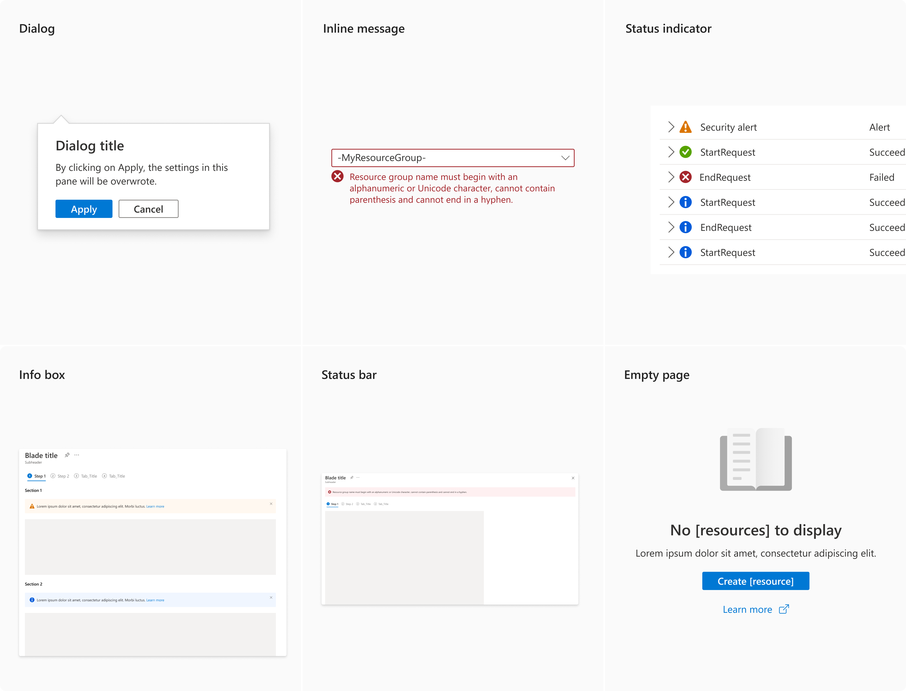
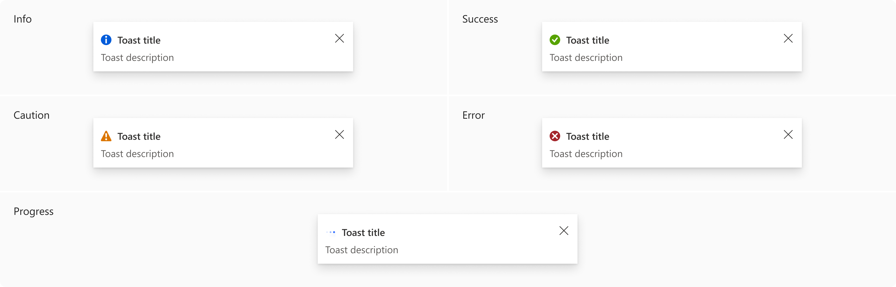
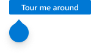

# Notification Guidelines

Last updated Oct 2021 (see [change logs](#change-logs))

The notification design pattern enables users to understand the result of actions. 

## Context
Users need guidance and feedback throughout the portal so they can quickly accomplish tasks and understand the results of their actions.

## Problem
Users need an intuitive and consistent way to have confidence that actions are completed  in Azure.

## Solution
The portal offers several notification approaches to provide information that is important and relevant to user actions. These approaches will help users understand and use features efficiently.
Types  of notifications include:
1. Local synchronous  notification – immediate, direct response to a user action or input
2. Global asynchronous notification – information related to a system event or previously submitted long running task from the user
3. Guiding and teaching UI – text to guide the user to successfully accomplish a task.

### Also known as
* Guidance and feedback
* Toast notifications
* Error reporting
* Validation
* In-line messaging
* Info balloon
* Tooltip

## Variations

### 1. Local synchronous notifications

There are 6 variants of local synchronous notifications:

#### a. Dialog

##### Examples

##### Use when
Dialog shows a critical information message.

##### Behavior
Dialog will be dismissed when user clicks on the buttons of dialog or when user clicks on anywhere outside of dialog. Clicking on anywhere outside of dialog will be similar to click on Cancel button on dialog. Dialog is a high-level urgency notification.

Checklist:
* Triggered by user action
* User cannot proceed without giving an input
* The UI needs to be blocked
* User needs to see this information immediately
* There is a critical service event, or the action is irreversible
* User doesn’t anticipate the popup to happen

If dialog doesn't require any action, it can have only one primary close button, as below:

In case if notification message is big, a context pane can be used instead of a dialog. If it doesn't require any action, it can have only one primary close action, as below:

#### b. Inline message

##### Examples

The icon can be one of five options: purple rocket, blue "i", yellow warning triangle, green check, or red "x".
The body text should concisely describe the information to the user, ideally in a single sentence. It can include hyperlinks to navigate users to other pages to see more information. Its width needs to align with the field width above. Max 110 characters per line for the body text.

##### Use when
Inline validation is a type of inline message that is used to inform user about validation or info message of an input field.

##### Behavior
Inline validation will not block user from interacting with other components of the page. The message will be dismissed programmatically when user update the input field with a valid value.

Checklist:
* The validation happens live
* User needs contextual information on their input
* The information relates to a form field
* The message is triggered by user action

#### c. Status indicator

##### Examples

##### Use when
Status indicator is a type of inline message that is used to inform user about an error or info message. 

##### Behavior
Satus indicator will not block user from interacting with other components of the page. 

Checklist:
* User needs lightweight contextual confirmation of their action or status of a process
* The message is triggered by user action or system
* There is no other UI change that would clearly indicate that the system registered user’s action

#### d. Info box

##### Examples

The optional close "x" button can be used to close info box temporarily
The icon can be one of five options: purple rocket, blue "i", yellow warning triangle, green check, or red "x".
The body text should concisely describe the information to the user, ideally in a single sentence. It can include hyperlinks to navigate users to other pages to see more information. Its width needs to align with the field width above. Max 110 characters per line for the body text.

##### Use when
Info box is used to inform user about an message (issue, warning, info) that is related to a section of page.

##### Behavior
Info box will not block user from interacting with other components of the page.

Checklist:
* The message related to state of the section that info box belongs
* The information doesn’t require immediate action
* Texts, links and buttons can be included

#### e. Status bar

##### Examples

The icon can be one of five options: purple rocket, blue "i", yellow warning triangle, green check, or red "x".
The body text should be brief, and limit to one line if possible. Be succinct and your users are more likely to read everything you say. Embed links can be used in the message to help users solve the problem. 

##### Use when
Status bar is used to inform user about an message (issue, warning, info) that is related to whole page. 

##### Behavior
Status bar will not block user from interacting with other components of the page.

Checklist:
* The message relates to the state of the entire product or surface
* The information doesn’t require immediate action
* The message can relate to an upgrade
* There is not close icon in top right
* Only texts are allowed
* Bar can be clickable

Example of status bar, info box and inline message in a page:

#### f. Empty page

##### Examples

##### Use when
Empty page can be used in an empty grid or an empty blade that doesn't have any instance.

Empty grid

Empty blade

##### Behavior

Checklist:
* The grid header is required for empty grid
* Icon is required and should match the resource menu icon shown in the blade header with grayscale and 50% opacity 
* Greeting string is required and should say “No [object name] to display
* Body text is optional and is used to explain what the item is and why the user might need it
* Call to action primary button is required  to add or create something so that the grid is no longer empty
* Secondary button can be added
* External links are optional and can be used to lead to documentation or Azure.com

### 2. Global or asynchronous notification

#### Examples
Example images
 

Example uses

Go to Create a storage account. After clicking on create, go to another Azure service (such as Virtual Machine or Bot Services). When system deploys a storage account, it will show an asynchronous toast notification to inform user about the completion.

#### Use when
Displaying a notification that does not relate to the current user flow.

#### Behavior
	
The position of notification toast and notification panel are as follow:

 

Variants of notification toast

Notification toast is used to notify user about an operational awareness. It is invoked programmatically and is dismissed manually or programmatically. It will not block user from interacting with other components of the page. User can click on the toast notification to expand it to a notification panel to see detailed information. Notification toast and notification panel are only storing data per section.

In a notification toast, title can go up to two lines, and links can be internal or external. Only one primary button can be added to a notification toast.

Checklist:
* Relevant messages that user opted-in need to be surfaced
* Inform user about timely event
* Message is triggered by the system
* Information is useful but not critical
* All content from toasts gets archived in the notification center

If user want to see historical data, they can view it from Activity Log. Activity Log stores everything from notification center.
 

### 3. Guiding and teaching UI

#### Examples
Example images
 

Example uses

Go to Create a resource group and hover mouse to a label tooltip.

#### Use when
Helping user to better understand a feature and to easier complete a task.

#### Anatomy

#### Behavior
a. Texts  on the page 
 

 

Text on page can impact users’ decisions when there is enough space: section name, section description, field label, field value, etc. If UI has enough space, explicit text on the page is preferred compared to tooltip because user might skip information hiding in tooltip.

b. Tooltip
 

Tooltip is an infoballoon that is triggered by user to provide a few word to help user understand product better.

Checklist:
* User needs a few words to understand the purpose of non-textual control
* The control is evergreen
* The control is triggered by the user

c. Coachmark 
 

Coachmark is a callout that is triggered by user to instruct user to complete a task. Refer to this [link]( https://developer.microsoft.com/en-us/fluentui#/controls/web/coachmark) for more details.

Checklist:
* Provide users evergreen contextual information on the content
* The control is triggered by the user
* The message relates to the content, not UI.
* Often includes **Learn more** link that opens a pop-up with more information.

Coachmark is only available in react view. This is a new component, and we would like to keep track its usage to update the design pattern. If you want to use it, please contact our team [Azure Portal UXA](UXATL@microsoft.com).

d. Teaching bubble
 

Teaching bubble is triggered by system to help tutor user in a new feature. Refer to this [link]( https://developer.microsoft.com/en-us/fluentui#/controls/web/teachingbubble) for more details.

Checklist:
* User needs temporary teaching tips on how to use parts of the UI or learn about new features.
* A sequence of steps may be needed. 
* The tip relates to UI on how to use the service, not the content. 
* Message is triggered by the system
Teaching bubble is only available in react view. This is a new component, and we would like to keep track its usage to update the design pattern. If you want to use it, please contact our team [Azure Portal UXA](mailto:UXATL@microsoft.com).

## Do
* Use concise instructional text on the page and in each section of the page  
* Use **learn more** links to guide the user to more complete information in Azure documentation or marketing pages
* Mark required fields so the user knows where input is necessary
* Use label text that is clear and consistent for shared concepts like subscription, resource group and region
* Set the **InfoBalloon** content for each field to display additional guidance

## Don’t
* Don’t send notifications for multiple instances stemming from the same underlying issue to avoid spam global notifications

## Related design guidelines

* [Azure Design Template ](https://www.figma.com/file/05KqaSJg4hLMxo2FeyAUag/Notification-guidelines?node-id=41%3A20590)
* [Design guidelines](top-design.md)
* Design toolkit notification elements
    * <a href="https://www.figma.com/file/Bwn8rmUOYtnPRwA3JoQTBn/Azure-Portal-Toolkit?node-id=3388%3A393118" target="_blank">Notification toasts</a>
    * <a href="https://www.figma.com/file/Bwn8rmUOYtnPRwA3JoQTBn/Azure-Portal-Toolkit?node-id=7781%3A2" target="_blank">StatusBar</a>
    * <a href="https://www.figma.com/file/Bwn8rmUOYtnPRwA3JoQTBn/Azure-Portal-Toolkit?node-id=21266%3A356689" target="_blank">InfoBox</a>
    * <a href="https://www.figma.com/file/Bwn8rmUOYtnPRwA3JoQTBn/Azure-Portal-Toolkit?node-id=3342%3A153" target="_blank">InfoBalloon</a>

## Research and usability

## Telemetry

## For developers
Developers can use the following information to get started implementing this pattern

### Tips and tricks
<!-- Bulleted list of tips and tricks for developers -->
* Each control supports an **InfoBalloonContent** setting so you do not need to use separate InfoBalloon control

### Interactive control and sample source code
Go to the playground site to use the latest control and get source code for your project.  [Learn more about playground](./top-extensions-controls-playground.md).

*  <a href="https://ms.portal.azure.com/?Microsoft_Azure_Playground=true#blade/Microsoft_Azure_Playground/ControlsIndexBlade/InfoBalloon_create_Playground" target="_blank">InfoBalloon in the interactive controls playground</a>

*  <a href="https://ms.portal.azure.com/?Microsoft_Azure_Playground=true#blade/Microsoft_Azure_Playground/ControlsIndexBlade/InfoBox_create_Playground" target="_blank">InfoBox in the interactive controls playground</a>

### Related documentation
<!-- Links to related developer docs -->
* Portal toast notifications [top-extensions-notifications.md](top-extensions-notifications.md)

## Change logs

### Oct 2021
* Converted lo-fi impages to hi-fi images for notification design and added details for empty page design

### Feb 2021
* Aligned to fluent notification design
* Added teaching guidance

### Jul 2019
* Published

