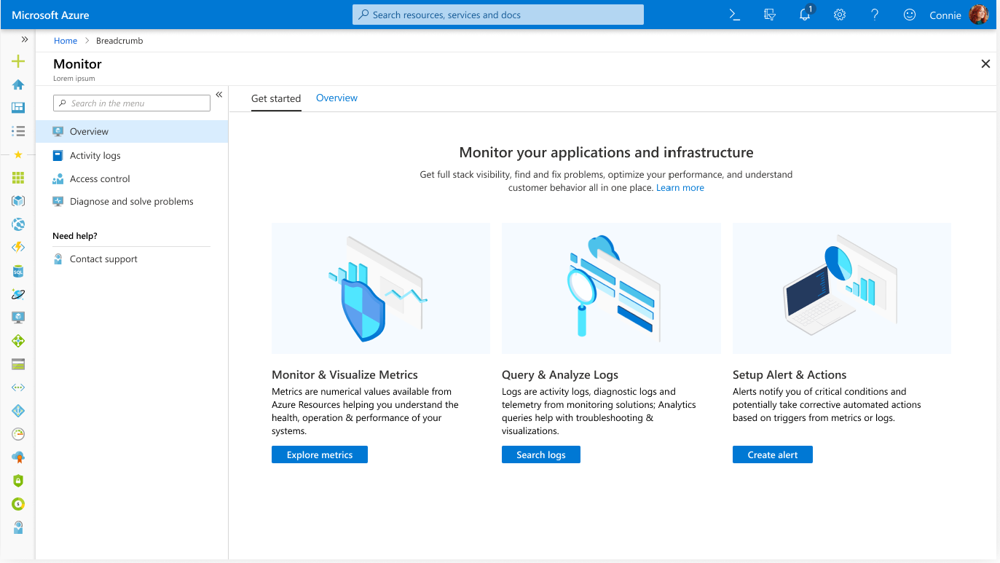
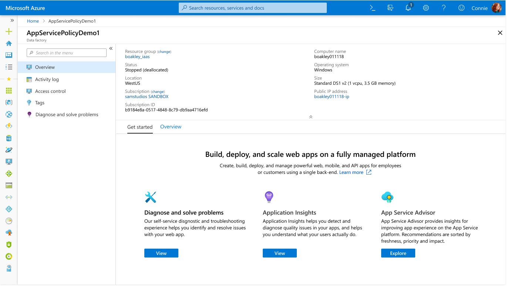
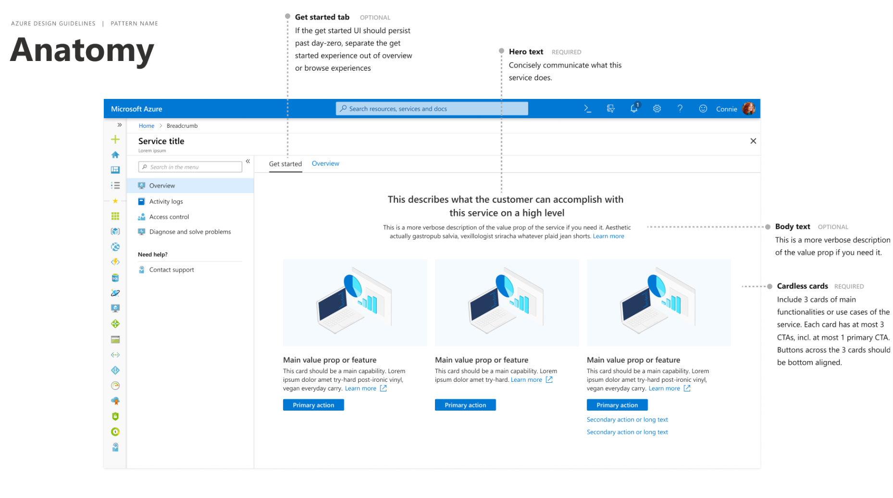

# Overview Page
Enable users to quickly and easily understand what value an Azure service offers and to easily realize that value.

## Context
As users navigate the portal, they open services and resources and expect information on how to use the service and resource to their benefit.

## Problem
Azure has a huge surface area of services and resources.  New services and resources are brought online while new features are added to existing services and resources.  Whether encountering a new or familiar service or resource, users need to quickly understand the purpose of services and resources so that they can easily get more value from Azure.

## Solution
The overview page is the home page for a service or resource. The overview page provides the purpose, top actions and key information so that users can quickly get value from Azure.

### Also known as

- Landing page
- Service home page
- Resource home page
- Getting started

## Examples

### Example images

#### Service overview page

#### Resource overview page

### Example uses
<ul>
<li><a href="https://ms.portal.azure.com/#blade/Microsoft_Azure_Monitoring/AzureMonitoringBrowseBlade/overview" target="_blank">Azure Monitor</a></li>
<li><a href="https://ms.portal.azure.com/#blade/Microsoft_Azure_CostManagement/Menu/overview" target="_blank">Cost Management</a></li>

</ul>

## Use when
Use the overview page pattern when you are designing the home page for your service or resource.

## Anatomy
The overview page for a service should contain a toolbar and content area.

The overview page for resources should contain a toolbar, essentials panel, and content area.  See more details on resource overview page layout in the [manage a resource design pattern](portalfx-design-resource-manage.md)
<!-- NEED anatomy for resource or a frameless anatomy that is just the content area but still show variance if illustrations and icons -->

### Elements of a overview page
* **Tabs** at the top allow for extensibility of the design and provide access to other overview page content
* **Hero text** centered at the top of the content area concisely communicates the offerings value in action-oriented language.
* **Body text** a more verbose description of the offering that should include a **Learn more** link to docs
* **Cardless card** communicate 3 scenarios using concise action-oriented language that avoids delving into Azure resource taxonomies.
    * Service - the card has an **illustration** on the top, a short scenario description, long description, learn more link and call to action
    * Resource - the card has an **icon** on the top, a short scenario description, long description, learn more link and call to action
* **Call to action** each card can have up to 3 calls to action "CTAs" with the most important using a primary button and the others a link.

## Behavior
<!-- Description of overall behavior -->

## Do
* Use concise action-oriented, value-centric language to describe your offering
* Provide only 3 scenarios using action-oriented language.  The overview page is not an exhaustive list of all features, it highlights the 3 primary scenarios/features.
* Within each scenario, provide up to 3 calls to action that will enable the user to realize the scenario
* Get illustrations by following the Azure portal illustration request process
* Limit button text to 1 or 2 words, use links for longer CTAs
* Strive to make the text length across the cards similar so the page looks balanced
* Ensure your overview page designs can be rendered within the performance bar

## Don&#39;t
* Don't assume the user will know anything about your service or resource
* Don't use long paragraphs for the body text or content of a card
* Don't put any extra content at the bottom of the page, especially a "link farm"
* Don't include more than 3 cards with illustrations.  Determine the top 3 scenarios for the customer to get started with your service.

## Related design guidelines

* Design guidelines [top-design.md](top-design.md)

## Research and usability
<!-- Links to the research for the solution -->

## Telemetry
<!-- Links to portal telemetry showing the solution usage -->

# For developers
Developers can use the following information to get started implementing this pattern

## Tips and tricks
<!-- Bulleted list of tips and tricks for developers -->

## Related documentation
<!-- Links to related developer docs -->
