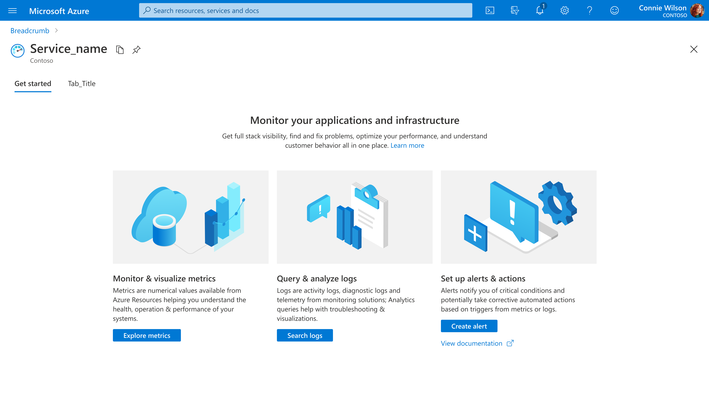
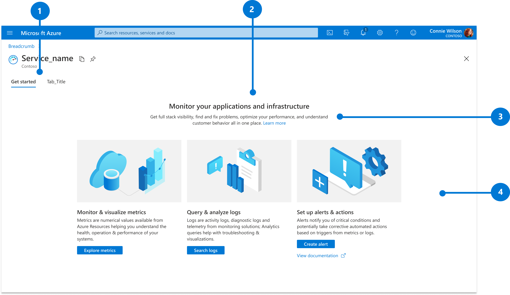
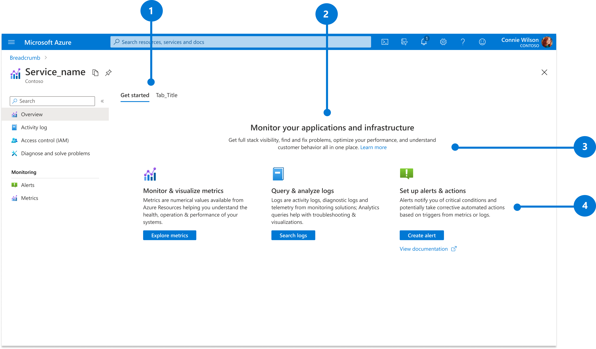

# Overview Page

Last updated Feb 2021 (see [change logs](#change-logs)) 

Enable users to quickly and easily understand what value an *Azure service* offers and to easily realize that value. 

To view the design guideline for overview page of an *Azure resource*, please refer to [manage a resource design pattern](design-patterns-resource-manage.md)

## Context

As users navigate the portal, they open services and expect information on how to use the service to their benefit. 

## Problem

New services are brought online in Azure while new features are added to existing services. Whether encountering a new or familiar service, users need to quickly understand the purpose of services so that they can easily get more value from Azure. 

## Solution

The overview page is the home page for an Azure service. The overview page provides the purpose, top actions and key information so that users can quickly get value from Azure. 

### Also known as

- Landing page 
- Overview page 
- Service home page 
- Getting started 

## Examples

### Example images

### Example uses

<ul> 
<li><a href="https://ms.portal.azure.com/#blade/Microsoft_Azure_Monitoring/AzureMonitoringBrowseBlade/overview" target="_blank">Azure Monitor</a></li> 
<li><a href="https://ms.portal.azure.com/#blade/Microsoft_Azure_CustomerHub/MyCustomersBladeV2/overview" target="_blank">My Customer – Azure Lighthouse</a></li> 
</ul> 

## Use when

Use the overview page pattern when you are designing the home page for an Azure service.

## Anatomy

Anatomy of overview page with illustrations and without menu 

Anatomy of overview page with icons and with menu 

An overview page of Azure service has the following features: 

1. Tab 

2. Hero text 

3. Body text (optional) 

4. Cardless card 

## Behavior

If the service has more than one menu page, a left menu bar will be shown to navigate between different menu pages. 

### Tabs

Tabs at the top of the page allow for extensibility of the design and provide access to other overview page contents. It is required to have a “Get started” tab in the most left and other tabs. Tabs will be shown if the service has 2 or more tabs, and it will not be shown if there is only one tab. 

#### Get started tab

* **Hero text** centered at the top of the content area concisely communicates the offerings value in action-oriented language. 

* **Body text** a more verbose description of the offering that should include a **Learn more** link to docs. 

* **Cardless card** communicates 3 scenarios using concise action-oriented language that avoids delving into Azure service taxonomies. A card of Azure service has an **illustration** or an **icon** on the top, a short scenario description, long description, learn more link and call to action. Each card can have up to 3 **calls to action** "CTAs" with the most important using a primary button and the others a link. 

The Get Started design can be used in the first menu "Overview" or in a non-menu overview page, not in any other menu item.

#### Other tabs

There is known usage of other tabs in Azure such as Tutorials, What’s new (view [Monitor]( https://portal.azure.com/?feature.customportal=false#blade/Microsoft_Azure_Monitoring/AzureMonitoringBrowseBlade/overview) for reference). 

Currently there is not enough usage of these other tabs to establish a guideline. Azure Portal will keep track of this usage and will add this to the guideline once there is enough usage. If you want to have any recommendations about other tabs for overview page of Azure service, please contact our team [Azure Portal UXA](mailto:UXATL@microsoft.com).

## Do

* Use concise action-oriented, value-centric language to describe your offering 

* Provide only 3 scenarios using action-oriented language. The overview page is not an exhaustive list of all features, it highlights the 3 primary scenarios/features. 

* Within each scenario, provide up to 3 calls to action that will enable the user to realize the scenario 

* Get illustrations by following the Azure portal illustration request process 

* Limit button text to 1 or 2 words, use links for longer CTAs 

* Strive to make the text length across the cards similar so the page looks balanced 

* Ensure your overview page designs can be rendered within the performance bar 

## Don&#39;t

* Don't assume the user will know anything about your service 

* Don’t start your hero text with “Get started” – lead with your value prop 

* Don't use long paragraphs for the body text or content of a card 

* Don't put any extra content at the bottom of the page, especially a "link farm" 

* Don't include more than 3 cards with illustrations. Determine the top 3 scenarios for the customer to get started with your service. 

## Related design guidelines

* [Azure Design Template ](https://www.figma.com/file/SkCj1C9nh5lZTuIz0uhcY2/Azure-Portal-Pattern-Templates?node-id=466%3A14670)
* [Design guidelines](top-design.md)
* [Manage a resource](design-patterns-resource-create.md) 

## Research and usability

<!-- Links to the research for the solution --> 

## Telemetry

<!-- Links to portal telemetry showing the solution usage --> 

## For developers

Developers can use the following information to get started implementing this pattern 

### Tips and tricks

<!-- Bulleted list of tips and tricks for developers --> 

### Related documentation

<!-- Links to related developer docs --> 

## Change logs

### Feb 2021

* Added link to manage a resource pattern and updated anatomy 

### Sep 2019

* Revised and add content for page overview 

### Jul 2019

* Published 

 