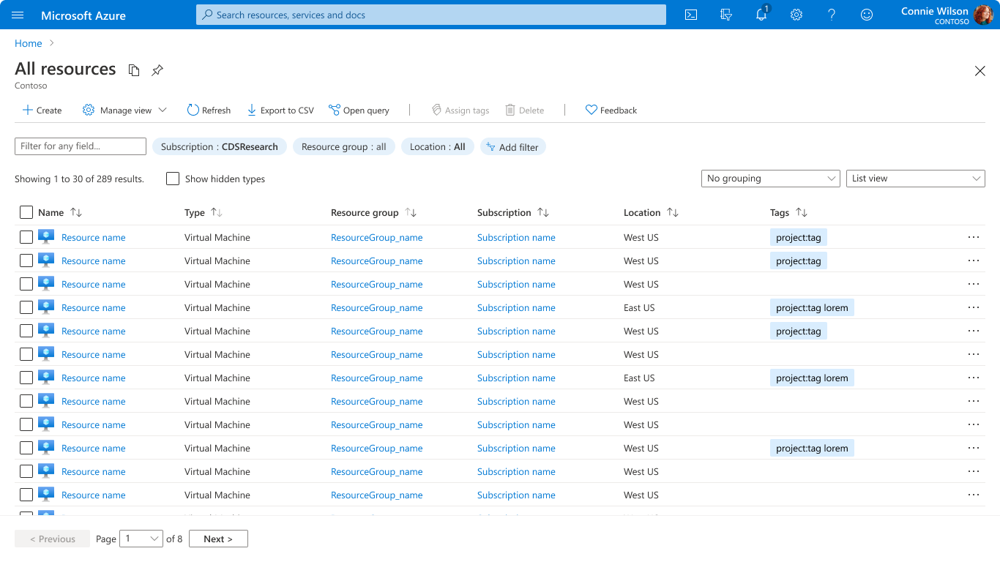
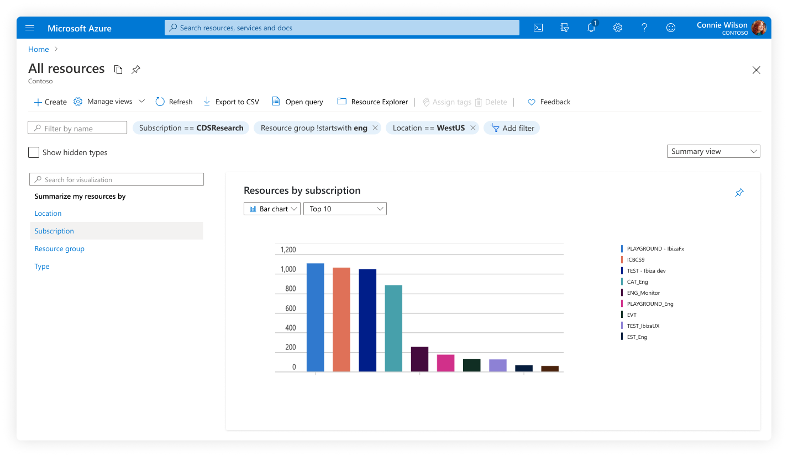

# Browse Resources
The Browse Resources pattern provides discovery and management of resources across subscriptions and resource groups.

## Context
Users need to locate and manage their Azure resources.

## Problem
Managing Azure resources can be an overwhelming experience, particularly when users have several subscriptions using multiple types of resource. Users need an intuitive way to view, locate, navigate, and run commands against a specific resource or group of resources.

When users have not created a resource of a specific type, they need to learn its benefits and quickly create a resource.

## Solution
The browse resources design pattern provides an intuitive way to view, navigate, and manage Azure resources.

Key resource properties are displayed in a table view with easy filtering, searching, sorting, grouping, and summarizing capabilities. The user can run commands by selecting one or more resources from the table and clicking on toolbar buttons. Selecting a resource from the table in the browse experience will open the resource and initiate the `manage a resource` experience.

Users can also create new resources from the browse experience. The “Add” command in the toolbar initiates the `create a resource` experience.

### Previously known as

* Resource list
* Browse
* Resource browse
* Azure resource graph browse
* ARG browse

  

## Examples

### Example images
Example images of the Browse Resources design pattern are shown below for List View, Summary View, and Empty View, respectively.

#### List View

#### Summary View

#### Empty View

### Example uses
The following Azure Portal experiences are good examples of the Browse Resources design pattern: 
* <a href="https://ms.portal.azure.com/#blade/HubsExtension/BrowseAll" target="_blank">Browse - All Resources</a>
* <a href="https://ms.portal.azure.com/#blade/HubsExtension/BrowseResource/resourceType/Microsoft.Storage%2FStorageAccounts" target="_blank">Browse - Storage Accounts</a>

## Use when
The Browse Resources design pattern should be used when showing a list of Azure resources.

## Anatomy
<!-- Work with UX to get latest screenshot, ensure it has all elements of anatomy for the Browse Resource design and experience. -->

The browse resources pattern is a full-screen experience that offers the following features:
1.	Title
2.	Toolbar: General Commands
3.	Toolbar: Selection Commands
4.	Search
5.	Filtering
6.	Column Grouping
7.	View Options
8.	Record Count
9.	Column Sorting
10. Pagination

## Behavior

### Title
The title of a browse page is generally a descriptive, plural noun that reflects the items on the grid. Examples: “All resources", “Virtual machines", “Storage accounts".

### Toolbar
The toolbar for the Browse Resource pattern contains commands that allow the user to manage their resources.
1.	The **general commands** are displayed as icons to the left of the separator, and do not require a table row selection before the user can click them.
2.	The **selection commands** displayed as icons to the right of the separator, are only enabled when one or more resource items are selected from the table.

The recommended general and selection commands for the Browse Resources toolbar are:

#### General Commands:

* **Add** invokes the resource create experience
* **Manage View** provides options to edit the table view, save a view, or revert to default
* **Refresh** repopulates the table with fresh record data
* **Export to CSV** downloads a .csv file of the table data currently in view

#### Selection Commands:

* **Assign tags** enables tagging for the selected grid items
* **Delete** will permanently remove the selected grid items from Azure
* **Feedback** opens a voluntary survey to collect feedback on the Azure experience

Additional general and selection commands can be added on a case-by-case basis but should always go to the left and right of the separator in the toolbar, respectively.

### Search
Users can filter their resources by entering text into the type-ahead search bar below the toolbar. As the user types, the table is updated to only reflect records that are related to the given query.

### Filtering
Users can filter the table results using the “pill-shaped” filters below the toolbar. If the default filters are not sufficient, the user can also create a custom filter using the “Add filter” option next to the default filters.

### Column Grouping
Users can group the content of the table by resource type, subscription, resource group or location. Additional grouping options are provided depending on the resource domain (i.e. virtual machines, storage accounts). Grouping will reorganize the list of records into groups with parent-child relationships according to the user’s grouping selection.

### View Options
Users have the option to view their resources in “List View” or “Summary View.” In list view, the user’s resources are displayed in a table with rows and columns. In summary view, the user’s resources are displayed on a map. To change between list and summary view, the user can click on the “Manage views” option from the toolbar and select “View as visuals.”

#### List View
* The table columns represent key resource properties that help the user locate, navigate, and ultimately action on a resource. The default columns for the Browse Resources design pattern are `resource name`, `resource group`, `location`, and `subscription`.
* If additional key resource properties are required to help the user navigate their resources, these columns can be added to the default table view. The user also has the ability to edit the key property columns displayed in the grid. When the user clicks on the “Manage view” then “Edit columns” command in the toolbar, they will be able to select from default and available columns.

#### Summary View
* In summary view, users have the option of summarizing their resources by location, resource group, type, and subscription. They can also choose to visualize their summary in a map, bar chart, or donut chart.

### Record Count
Users are provided with a record count just below the search bar that summarizes the number of table results.

### Column Sorting
The user can sort the table based on the values in a particular column by clicking on the chronological sorting buttons (up or down) of a given column header.

### Pagination
The user can page through additional resources in the table by clicking the “Next” button at the bottom of the table, or selecting a specific page of results.

### Empty state
When the resource list has no items to display, the user is provided with information on how to get started. The icon, message, and link are generated from the asset definition.

## Do
* Consider user experience when picking table columns which influence sorting, filtering, and summarizing capabilities.
* Include some common columns in your grid: Name, location and subscription
* Include key resource properties as columns for the specific resource types
* Include an empty message/link to explain the value of your resource

## Don&#39;t

* Don’t offer too many columns in the default view. Users can always add more if they need to.     

## Related design guidelines

* [Page with Tables](design-patterns-page-grid.md)
* [Full Screen Pages](design-patterns-page-fullscreen.md)
* [Create a Resource](design-patterns-resource-create.md)
* [Manage a Resource](design-patterns-resource-manage.md)
* [Design Guidelines](top-design.md)

## Research and usability
The browse resources pattern has been tested extensively. You can view an updated list of Browse Resources research at this <a href="https://hits.microsoft.com/search?q=browse%20filter&filter=entityType%20!%3D%20Resource__entityType!%3DStudy%20Observation&top=10" target="_blank"> HITs Link</a>. A few of these studies are listed below for your convenience:

* <a href="https://hits.microsoft.com/Insight/1139543" target="_blank"> Columns sorting and filtering</a>
* <a href="https://hits.microsoft.com/Study/6008469" target="_blank"> Browse filtering labeling and autofill</a>
* <a href="https://hits.microsoft.com/Study/6008267" target="_blank"> Browse filtering dropdowns</a>
* <a href="https://hits.microsoft.com/Study/6008256" target="_blank"> Browse overflows and pagination</a>
* <a href="https://hits.microsoft.com/Study/6008155" target="_blank"> Browse filtering</a>
* <a href="https://hits.microsoft.com/Study/6018197" target="_blank"> Browse visualization (summary view)</a>
* <a href="https://hits.microsoft.com/study/6009787" target="_blank"> Updated pill filter design </a>

## Telemetry
<!-- Each of the following links for telemetry reports should be aka.ms/ links. If the report is updated or the hyperlink changes, simply update the Target URL for the given aka.ms/ link and this code will update with the latest report. -->
* Browse by new (ARG) vs old (ARM) by resource type <a href="https://msit.powerbi.com/groups/4f11aaa4-1faf-4bf3-9983-1dc7351bf5b6/reports/96afcc27-4b67-43c2-aab3-03ad14abac0b/ReportSection489c8c2be4bd53b7eebe?noSignUpCheck=1" target="_blank"> (View Report)</a>.
* Browse frequency by resource type including empty browse counts over the last 7 days <a href="https://aka.ms/portalfx/fundamentals/browsetelemetry" target="_blank"> (View Report)</a>.

## Implementation
Developers can use the following information to get started implementing this pattern:

### Tips and tricks

* Set your icon - `AssetType` icon Icon="{Resource CommonImages.snowmobile, Module=V1/ResourceTypes/Common/CommonLogos}"
* Set your description for use in empty browse - `AssetType` description Description="{Resource AssetTypeNames.Snowmobile.linkTitle, Module=ClientResources}"
* Empty message/link - `AssetType` link <Link Title="{Resource AssetTypeNames.Snowmobile.linkTitle, Mobile=ClientResources}" Uri="http://www.bing.com"/>

### Engineering Documentation

<!-- TODO Fixup links when new browse publishes -->
* Building browse experiences [top-extensions-browse.md](top-extensions-browse.md)
    * Add command [portalfx-browse.md#add-command](portalfx-browse.md#add-command)
    * Customizing columns [portalfx-browse.md#add-command](portalfx-browse.md#add-command)
    * Context menu commands [portalfx-browse.md#adding-context-menu-commands](portalfx-browse.md#adding-context-menu-commands)
* Assets [portalfx-assets.md](portalfx-assets.md)
    * Empty state messaging [portalfx-assets.md#assets-defining-your-asset-type](portalfx-assets.md#assets-defining-your-asset-type)
