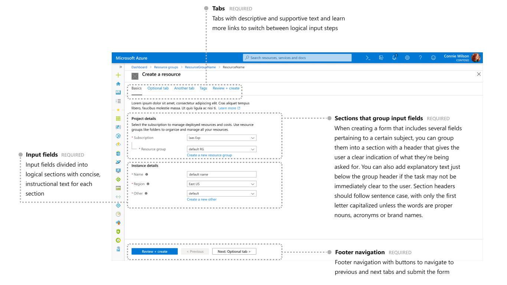
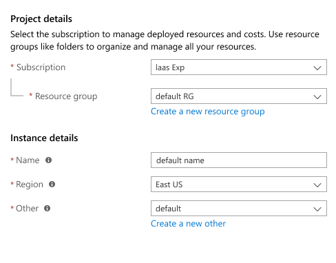
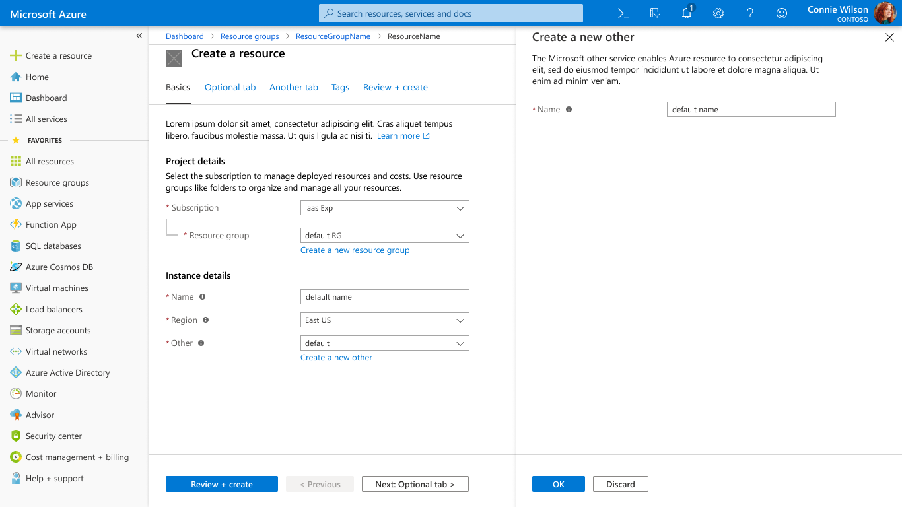
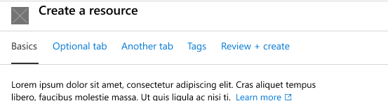
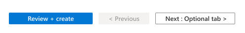
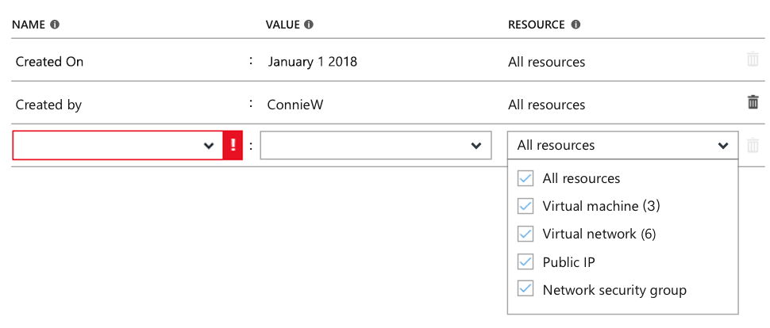
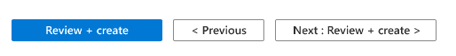
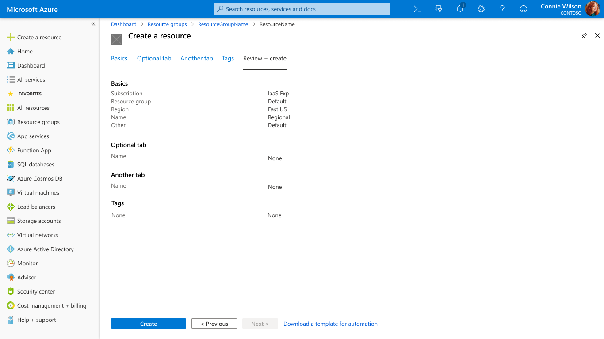
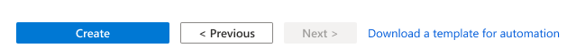
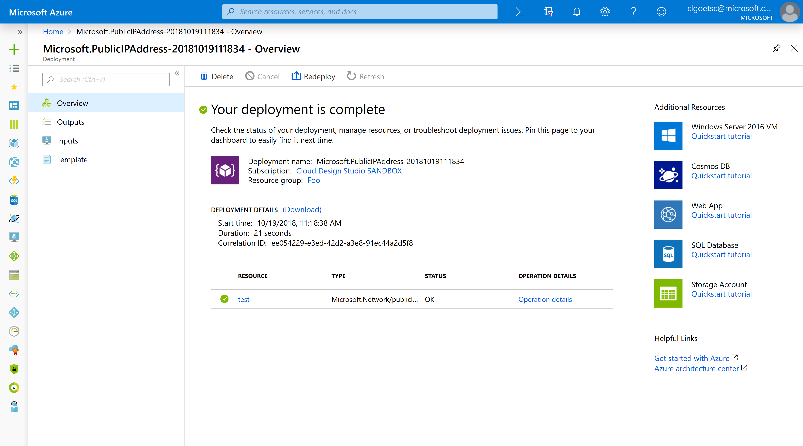

# Create a resource
The "create a resource" pattern provides a simple, intuitive and quick experience for creating resources by requiring a minimum number of fields and providing default values. The pattern also enables users to walk through detailed configuration options in order to set additional configuration options. The experience uses a fullscreen page with tabs to separate configuration steps and guide the user.

### Declarative JSON based creates

If you are authoring a new create experience or moving an existing create to our new compliant full screen create, do consider the new declarative JSON based create documented [here](portalfx-cuid.md). This can significantly reduce your dev costs (under 2 hours) while giving you a compliant, full screen create without any future maintenance costs!

## Context
Users want to create Azure resources.

## Problem
Creating a resource in Azure can vary from a simple experience with a few required fields to a complex one with many fields, concepts and related resources.

## Solution
The resource create pattern enables quick configuration of a new resource by requiring a minimum number of fields and providing default values. The pattern also enables users to walk through detailed configuration options in order to set many resource options.  The experience uses a fullscreen page with tabs to separate configuration steps and guide the user.

### Also known as

- Full screen create
- Tabbed create
- Create wizard
- Resource create 

## Examples

## Example image

### Example uses
These create experiences are good examples of this design pattern 

<ul>
<li>Create a <a href="https://portal.azure.com/#create/microsoft.freeaccountvirtualmachine" target="_blank">Free account virtual machine</a></li>
<li>Create a <a href="https://portal.azure.com/#create/Microsoft.ContainerInstances" target="_blank">Container instance</a></li>
<li>Create a <a href="https://portal.azure.com/#create/microsoft.aks" target="_blank">Kubernetes cluster</a></li>
</ul>

## Use when
Creating a resource in Azure

## Anatomy
<!-- TODO UX get screenshot that includes "Learn more" links in section text -->

The create a resource experience contains:
* Tabs to provide logical steps and provide descriptive and supportive text and learn more links about each step
* Sections to logically group input fields and provide concise, instructional text for each grouping of fields
* Input fields to gather user input and provide information about each field
* Footer navigation with buttons to navigate to previous and next tabs and submit the form

### Tabs

Tabs separate the creation into logical steps.

Each tab should include a brief description. When possible include **Learn more** links to relevant docs.

### Sections that group input fields
When creating a form that includes several fields pertaining to a certain subject, you can group them into a section with a header that gives the user a clear indication of what they’re being asked. You can also add explanatory text just below the group header if the task may not be immediately clear to the user.
Section headers should follow sentence case, with only the first letter capitalized unless the words are proper nouns, acronyms or brand names.

* Alignment: The **smartAlignLabels** option for Tab and Section controls will enable the proper label and input alignment

### Input fields

* Alignment: Label and controls should be on the same line.  The **smartAlignLabels** option for Tab and Section controls will enable this behavior
* Info Bubbles: If you have input fields that may not be immediately familiar to users, include an info bubble that shows more information.
* Required values: Fields should indicate whether the input is required
* Validation: Individual fields should perform vaklidation in real-time to provide immediate feedback regarding user input at the field level. The entire form will validate when the user navigates to the Review + create tab.  This validation will handle any missing required values in addition to server-side validation logic.

### Sub create in a context pane
Context panes can be used for sub creates within the create flow. The sub create allows users to configure services or to create resources that are related to the main resource that's being created, without losing the overall context.

### Footer navigation
The footer area contains the call to action (CTA) for creating the resource, as well as two buttons used for navigating between tabs. If your resource supports templates, you will also have a download template link in the footer of the Review + create tab.

The items that are typically in the footer area are
* Review + create button - on all tabs except the last tab - clicking the review and create button navigates the page to the last tab
* Create button - only on the last tab in the same location and the same size as the **Review + create** button - clicking the create button submits the deployment job to ARM
* Previous button - on all tabs, disabled on the first tab, label is "\< Previous" on all tabs - clicking the previous button navigates to the previous tab
* Next button - on all tabs, disabled on the last tab, label is "Next : *next_tab_name* \>" except on last tab where label is "Next \>" - clicking the next button navigates to the next tab
* Download a template for automation link - only on the last tab, label is "Download a template for automation" - clicking the download link opens the **Template** blade from where the user can download or save the template to library

## Behavior
Use the tabs & sections to organize content. The **Basics** tab should be the starting point for all creates and contain essential configuration info. The design should allow for quick resource creation at any time with unrestricted navigation between tabs. Enabling users to freely navigate the tabs reduces the friction for users looking to learn about your resource.  The combination of quick creation and tab exploration can lead to additional resource deployments over time.

### Tabs
Tabs organize input content into visible "pages". The Basics tab should be the starting point for all creates and contain essential configuration info. The design should allow for quick resource creation at any time with unrestricted navigation between tabs. Enabling users to freely navigate the tabs reduces the friction for users looking to learn about your resource. The combination of quick creation and tab exploration can lead to additional resource deployments over time.

Most creates should have a minimum of 3 tabs; **Basics**, **Tags**, **Review + create**.  All other tabs are optional.  Tab naming should follow sentence case, with only the first letter capitalized unless the words are proper nouns, acronyms or brand names.

#### Basics
The first tab contains fields required for creating the resource. Set default values when possible to eliminate additional time spent on create.

The **Basics** tab should contain the typical fields for Azure resources in the following sections
* **Project details** - section that groups
    * **Subscription** - use the SubscriptionDropDown control
    * **Resource group** - use the ResourceGroupDropDown control
    * The default text for Project Details is "Select the subscription to manage deployed resources and costs. Use resource groups like folders to organize and manage all your resources."
* **Instance details** - section that groups
    * **Name** - the name of the resource
    * **Region** - used to be referred to as Location - use the LocationDropDown control
    * SKU/Cost/Pricing tier - enable the user to control the cost of the resource - use a simple selector control or the PricingControl

If your resource comes in different sizes or SKUs, make sure to include the pricing tier in your create flow. To make it easy for users to update resources sizes and SKUs, include the pricing tier in the manage a resource experience.
<!-- TODO UX add info on pricing tier using grid for easy comparison -->

Footer navigation

The **Basics** tab should have the following in the footer area
* Review + create button with label "Review + create"
* Previous button (disabled) with label "\< Previous"
* Next button with label "Next : *next_tab_name* \>"

#### Optional tabs
Additional tabs are used to organize optional settings specific to your resource.  All optional tabs should be after the **Basics** tab and before the **Tags** tab.  Tabs should have short names, typically a noun. Tab naming should follow sentence case, with only the first letter capitalized unless the words are proper nouns, acronyms or brand names.

Footer navigation

The optional tabs should have the following in the footer area
* Review + create button with label "Review + create"
* Previous button with label "\< Previous"
* Next button with label "Next : *next_tab_name* \>"

#### Tags
Many enterprises are starting to create subscription and resource group polices that require tagging resources at create time.  Not including the **Tags** tab will block those users from deploying resources using the portal.  The **Tags** tab is always the penultimate tab.

* **Tags** - use the TagsByResource control to enable users to assign key value pairs to the selected Resource Types.

Footer navigation

The **Tags** tabs should have the following in the footer area
* Review + create button with label "Review + create"
* Previous button with label "\< Previous"
* Next button with label "Next : Review + create \>"

#### Review + create
Allowing the user to verify all settings prior to submission ensures accuracy and reduces the need for user redeployments.  Use the summary control to help organize content from multiple tabs.  Disable the create button until validation succeeds.  The **Review + create** tab is always the last tab.

Validation

Validation should occur when the user navigates to the last tab, **Review + create**, with the following behavior
* Display an error message at the top of the page using the error icon and the text "Validation failed. Required information is missing or not valid."
* Mark each tab which contains an invalid field with a red dot after the tab name

Footer navigation

The **Review + create** tabs should have the following in the footer area
* Create button with label "Create" that is in the same location and the same size as the "Review + create" button
* Previous button with label "\< Previous"
* Next button (disabled) with label "Next \>"
* Download a template for automation link with label "Download a template for automation"

## Post create
The post create page provides realtime deployment status, help with troubleshooting, and improved error display. Best practice is to include additional information here to help the user learn more about the resource being created, as well as related Azure resources.

## Do
-   Include a brief description at the of each tab about the tab content. When possible include `Learn more` links to relevant docs.

-   Include a brief description for each section on a tab.

-   Put all required fields on the first tab so the user can quickly create your resource

-   Mark required fields with the red asterisk

-   Include info bubbles if there are input fields that may not be immediately familiar

## Don&#39;t
-   Don’t just map your old create experience to separate tabs.

-   Don't include lengthy and unclear explanatory text. It should be used to clarify and set expectations in a few short sentences

-   Don't show the required indicator on the tabs - this was in an older design and has been dropped

## Related design guidelines

-   Azure Design Template [Create a resource](https://www.figma.com/file/Bwn8rmUOYtnPRwA3JoQTBn/Azure-Portal-Toolkit?node-id=8077%3A0)
-   Forms [design-patterns-page-forms.md](design-patterns-page-forms.md)
-   Full screen [design-patterns-page-fullscreen.md](design-patterns-page-fullscreen.md)
-   Browse Resources [design-patterns-resource-browse.md](design-patterns-resource-browse.md)
-   Manage a Resource [design-patterns-resource-manage.md](design-patterns-resource-manage.md)
-   Guidance and feedback [design-patterns-page-notifications.md](design-patterns-page-notifications.md)
-   Design guidelines [top-design.md](top-design.md)

## Research and usability

* Create March 2017: https://hits.microsoft.com/study/6006240
* Create – sub-create Jan 2018: https://hits.microsoft.com/study/6005381
* Create – sub-create Feb 2018: https://hits.microsoft.com/study/6005427
* Create – Tabs + links Sept 2018: https://hits.microsoft.com/study/6005479
* Post create March 2018: https://hits.microsoft.com/study/6006070

## Telemetry

* Non full screen resource creation pages [View report](https://aka.ms/portalfx/fundamentals/allcreate)

# For developers
Developers can use the following information to get started implementing this pattern

## Tips and tricks

-   Set a maximimum width of 700px for the page area that contains input fields
-   To include the visual connector between Subscription and resource group, set `Nested = True` on the resource group control.
-   The spacing between the items in the footer is 12px

## Related documentation

### Declarative JSON based creates

If you are authoring a new create experience or moving an existing create to our new compliant full screen create, do consider the new declarative JSON based create documented [here](portalfx-cuid.md). This can significantly reduce your dev costs (under 2 hours) while giving you a compliant, full screen create without any future maintenance costs!

### Native typescript create

-   Create a Resource [top-extensions-create.md](./top-extensions-create.md)

