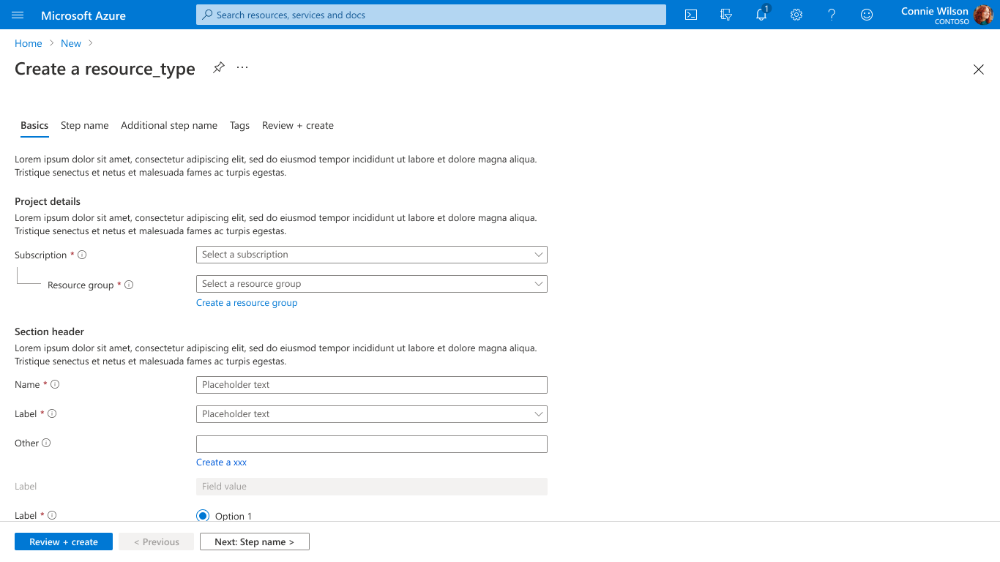
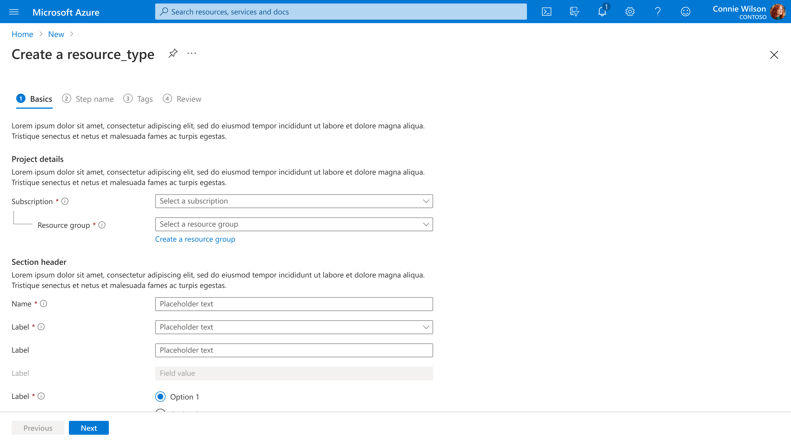
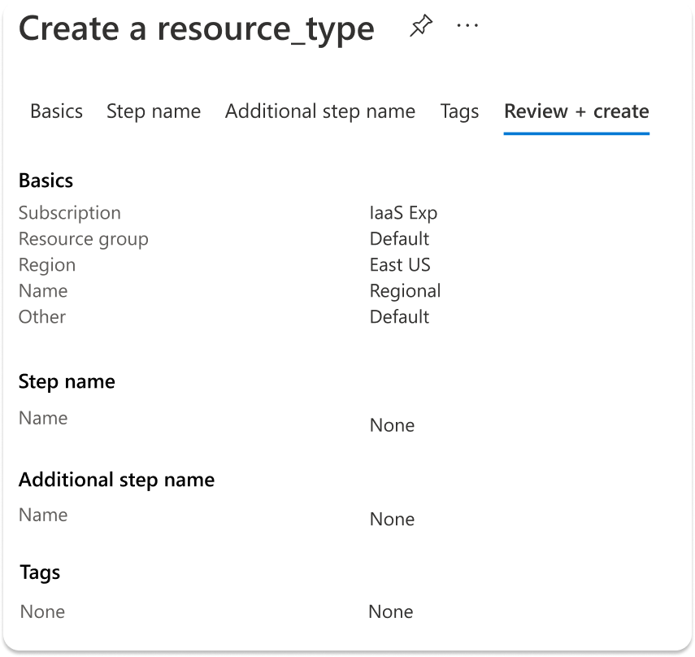
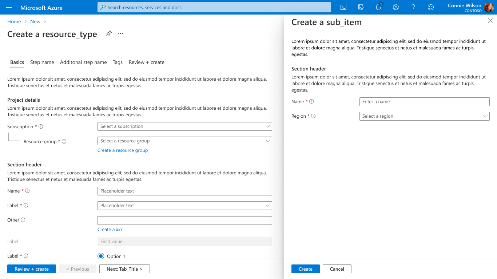
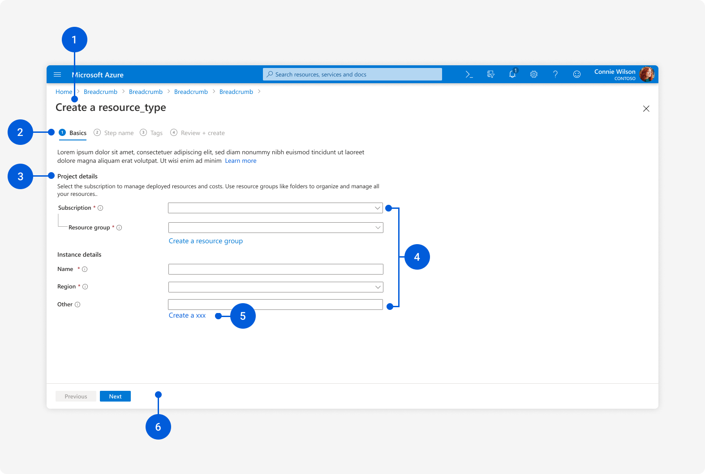

<!-- Updates made to documentation on 7/23/20 by Aaron P. Woods, Sr. PM of the UXA Team in Atlanta.  -->

# Create a Resource
The Create a Resource pattern guides users through the process of creating Azure resources.

## Context
Users need to create Azure resources.

## Problem
Creating a resource in Azure can vary from a simple experience with a few basic steps to a complex process with many requirements and advanced configuration options. Users need an intuitive way to input the necessary information quickly and accurately so that they are able to deploy their resources and power their business.

## Solution
The Create a Resource design pattern makes it easy to create Azure resources by organizing fields into steps to guide the configuration of the resource. Once the user submits the create form, a post-create experience allows the user to track the deployment of their newly created resource.

### Previously known as

* Full-screen create
* Tabbed create
* Create wizard
* Resource create
* Non-sequential create
* Sequential create
* Step wizard

### Steps
Logical steps guide users through the process of configuring various options for a given resource.

There are two types of steps, optional and required.  A specific create experience must use steps of the same type, you cannot mix optional steps with required steps.

<strong>Optional Steps</strong>  
Optional steps, previously referred to as “non-sequential create,” enable the user to switch between steps in whatever order they choose. Steps do not have to be completed in the order that they are shown, and some can be skipped. Once the user is satisfied with their inputs and configuration settings, they move to the “Review + create” step which runs validation across all steps.

<strong>Required Steps</strong>  
Required steps, previously referred to as “sequential create”, force the user to complete steps in order. Each step is validated when the user progresses to the next step.

#### Post-Create
After creation, users are provided with a post-creation summary that enables them to track the completion status of the newly created resource. Once complete, users can open the resource and initiate the manage a resource experience.

## Examples

### Example images
Example images of the Create a Resource design pattern are shown below for the optional steps, required steps, and post-create experiences:

#### Optional Steps

#### Required Steps

#### Post-Create

### Example uses
The following Azure Portal experiences are good examples of the Create a Resource design pattern:

* Optional Steps
    * Create a <a href="https://portal.azure.com/#create/microsoft.freeaccountvirtualmachine" target="_blank">Free account virtual machine </a>
    * Create a <a href="https://portal.azure.com/#create/Microsoft.ContainerInstances" target="_blank">Container instance </a>
    * Create a <a href="https://portal.azure.com/#create/microsoft.aks" target="_blank">Kubernetes cluster </a>
* Required Steps
    * Create a <a href="https://portal.azure.com/#create/Microsoft.ApplicationGateway" target="_blank">Application gateway </a>

## Use when
The Create a Resource design pattern should be used when creating a resource in Azure.

## Anatomy: Create a Resource (Optional Steps)
<!-- Work with UX to get latest screenshot, ensure it has all elements of anatomy for the Browse Resource design and experience. -->

The Create a Resource (Optional Steps) pattern is a full-screen experience that offers the following features:
1.	Title
2.	Steps
3.	Sections
4.	Input Fields
5.	Sub-Create
6.	Footer Navigation

## Behavior: Create a Resource (Optional Steps)

### Title
The title of a Create a Resource page generally starts with “Create a ___” where the blank is filled with a singular noun that reflects the type of resource being created. Sentence case should be used for the title header. For example, “Create a virtual machine", “Create a storage account” and “Create a SQL database”.  Create experiences do not use an icon or subtitle in the title area.

### Steps

#### General
The steps allow the user to navigate the creation process by separating the creation into logical steps. In the optional steps process, the user has the freedom to switch between steps without having to complete the current step. However, all required fields must be completed before the user can create their resource. Some general design and interaction principles to follow regarding the steps include:

* Step names should be short, describe the information being collected, and follow sentence case with only the first letter capitalized unless the words are proper nouns, acronyms or brand names.
* Step names should be nouns and not verbs.  Using nouns helps keep the names short and avoids duplication in step names. For example, use “Security” instead of “Configure security settings”.
* Each step should include a brief description and learn more links just below the step name to provide additional guidance for the input fields that follow.

#### Default Steps and Content
Most creates should have a minimum of 3 steps: <strong>Basics, Tags, Review + create</strong>. Additional steps can be used to configure more options. The Basics step should be the starting point for all creates and contain essential configuration info.

#### Basics Step
The Basics step contains the typical fields required for creating Azure resources. Input fields should be set to the default value when possible to reduce the time required to deploy a resource under typical (default) settings.

The <strong> Basics </strong> step should contain the following fields for Azure resources in the following sections:

* <strong> Project Details (section)</strong>
    * Default descriptive text
    * Subscription
        * Use the SubscriptionDropDown control
    * Resource group
        * Use the ResourceGroupDropDown control
* <strong>Instance Details (section)</strong>
    * Name
        * The name of the resource
    * Region
        * Use the LocationDropDown control

If your resource comes in different sizes or SKUs, make sure to include the pricing tier in your create flow.

The <strong>Basics</strong> step should have the following in the footer area:
* Review + create button with label "Review + create"
* Previous button (disabled) with label "< Previous"
* Next button with label "Next : next_step_name >"

#### Additional Steps
Additional steps are used to organize settings specific to your resource. All <strong> additional </strong> steps should appear after the <strong>Basics</strong> step and before the <strong>Tags</strong> step.

The <strong>additional</strong> steps should have the following in the footer area:
* Review + create button with label "Review + create"
* Previous button with label "< Previous"
* Next button with label "Next : next_step_name >"

#### Tags Step

Many enterprises use polices that require tagging resources. Excluding the <strong>Tags</strong> step will block those customers from deploying resources using the portal. For this reason, the <strong>Tags</strong> step is a critical step.

* <strong>Tags</strong> - use the TagsByResource control to enable users to assign key value pairs to the selected resource types.

The <strong>Tags</strong> step should have the following in the footer area:
* Review + create button with label "Review + create"
* Previous button with label "< Previous"
* Next button with label "Next : Review + create >"

#### Review &amp; Create Step
The “Review + create” step of the process allows the user to verify all settings prior to submission. This helps to ensure accuracy of information and reduce the need for re-deployments. The <strong>Review + create</strong> step is always the last step.
* Use the summary control to help organize content from multiple steps.
* Disable the create button until validation succeeds.

Validation should occur when the user navigates to the last step, <strong>Review + create</strong>, with the following behavior when validation passes and fails:

* <strong>Pass</strong>
    * Display an success message at the top of the page using the success icon and the text "Validation passed.”  
    

    
    

* <strong>Fail</strong>
    * Display an error message at the top of the page using the error icon and the text "Validation failed. Required information is missing or not valid.
    * Mark each step which contains an invalid field with a red dot after the step name
  
    

    
    

The <strong>Review + create</strong> step should have the following in the footer area:
* Create button with label "Create" that is in the same location as the "Review + create" button
* Previous button with label "< Previous"
* Download a template for automation link with label "Download a template for automation"

### Sections
When creating a form that includes several fields related to a particular subject, items should be grouped into a section with a header to make it clear that the fields are interrelated. Section headers should follow sentence case, with only the first letter capitalized unless the words are proper nouns, acronyms or brand names. Explanatory text should be added just below the group header to provide additional clarification and a link to learn more.
* Alignment
    * The <strong> smartAlignLabels </strong> option for TabControl and Section controls will enable the proper label and input alignment.

### Input Fields
Input fields are used to collect the information required for resource configuration.

* <strong>Alignment</strong>
    * Label and controls should be on the same line. The <strong>smartAlignLabels</strong> option for TabControl and Section controls will enable this behavior
* <strong>Info Bubbles</strong>
    * If you have input fields that may not be immediately familiar to users, include an info bubble that shows more information.
* <strong>Required values</strong>
    * Fields should indicate whether the input is required
* <strong>Validation</strong>
    * Individual fields can perform syntax validation in real-time to provide immediate feedback. The entire form will validate when the user navigates to the Review + create step. The form-level validation will handle any missing values and run server-side validation logic.

### Sub-Create
The sub-create allows users to configure services or to create resources that are related to the main resource that's being created, without losing the overall context. Dialogs, context panes or full screen pages can be used for sub-creates within the create flow.

### Footer Navigation
The footer area contains the call to action (CTA) for creating the resource, as well as two buttons used for navigating between steps. If your resource supports templates, you will also have a download template link in the footer of the Review + create step.

The items that are typically in the footer area are:
* <strong>Review + create button</strong>
    * On all steps except the last step
    * Clicking the review and create button navigates the page to the last step
* <strong>Create button </strong>
    * Only on the last step in the same location as the <strong>Review + create</strong> button
    * Clicking the create button submits the deployment job to ARM
* <strong>Previous button </strong>
    * On all steps, disabled on the first step
    * Label is "< Previous" on all steps
    * Clicking the previous button navigates to the previous step
* <strong>Next button</strong>
    * On all steps, disabled on the last step
    * Label is "Next : next_step_name >" except on last step where label is "Next >"
    * Clicking the next button navigates to the next step
* <strong>Download a template for automation link </strong>
    * Only on the last step
    * Label is "Download a template for automation"
    * Clicking the download link opens the <strong>Template</strong> blade from where the user can download or save the template to library

## Anatomy: Create a Resource (Required Steps)
<!-- Work with UX to get latest screenshot, ensure it has all elements of anatomy for the Browse Resource design and experience. -->

The Create a Resource (Required Steps) pattern is a full-screen experience that offers the following features:
1.	Title
2.	Steps
3.	Sections
4.	Input Fields
5.	Sub-Create
6.	Footer Navigation

## Behavior: Create a Resource (Optional Steps)
The behavior of the required steps process is similar to the experience outlined above for optional steps with a few subtle differences as noted in the following sections.

### Title
Same as provided for optional steps.

### Steps

#### General
The Steps allow the user to navigate the creation process by separating the creation into logical steps. In the required steps process, the user is required to fill out all of the information in each step before advancing to the next step in the process, starting with the “Basics” step. Step names and learn more links should follow the guidelines provided in the optional steps process.

#### Default Steps &amp; Content
Most creates should have a minimum of 3 steps:<strong> Basics, Tags, Review + create</strong>. All other steps are optional. The Basics step should be the starting point for all creates and contain essential configuration info. The Review + create step should be the final step in the process.

Step naming for additional steps should follow sentence case, with only the first letter capitalized unless the words are proper nouns, acronyms or brand names.

#### Step Order &amp; Numbering
The steps should be listed in the following order:
* Step 1 – Basics
* Step 2 – (Additional steps as needed)
* Step 3 – Tags
* Step 4 – Review

Note that the “Tags” and “Review” steps may have different step numbers depending on the number of additional steps for a given create process. However, it is important that the “Tags” and “Review” steps are the second to last and final steps, respectively.

#### Step Badges
The step badge is the icon that appears to the left of the step title. There are 3 types of badges:
1.	Number badge
2.	Success badge
3.	Error badge.

The number badge has a disabled state to indicate the steps that the user has yet to reach. The success and error badges are used to indicate when validation has passed or failed, respectively, for a given step.

#### Step Validation
In the required steps process, validation occurs on each step of the process. If an input field does not pass validation, error states are shown on the given field, and the error badge is displayed next to the step name.

#### Basics Step
Guidelines for the basic step follow the documentation mentioned previously for the optional step process with the exception of the footer area.

The <strong>Basics</strong> step should have the following in the footer area for the required steps process:
* Previous button (disabled) with label "Previous"
* Next button with label "Next"

#### Additional Steps
Guidelines for the additional optional steps follow the documentation mentioned previously for the optional step process with the exception of the footer area.

The <strong>Additional</strong> step should have the following in the footer area for the required steps process:
* Previous button with label "Previous"
* Next button with label "Next"

#### Tags Step

Guidelines for the tags steps follow the documentation mentioned previously for the optional step process with the exception of the footer area.

The <strong>Tags</strong> step should have the following in the footer area for the required steps process:
* Previous button with label "Previous"
* Next button with label "Next"

#### Review + Create Step
The Review + create step of the process allows the user to verify all settings prior to submission. This helps to ensure accuracy of information and reduce the need for re-deployments. The <strong>Review + create </strong>step is always the last step.
* Use the summary control to help organize content from multiple steps.

Since validation occurs during each step of the required steps process, when the user reaches the <strong>Review + create </strong> tag, they are essentially provided with a summary of the most important info provided during the creation process

The <strong>Review + create </strong> steps should have the following in the footer area for the required steps process:
* Previous button with label "Previous"
* Create button with label "Create"

### Sections
Guidelines for Sections follow the documentation mentioned previously for the optional step process.

### Sub-Create
Guidelines for the sub-create experience follow the documentation mentioned previously for the optional step process.

### Footer Navigation
The footer area contains the buttons for navigating between steps. If your resource supports templates, you will also have a download template link in the footer of the final step.

The items that are typically in the footer area are:
* <strong> Previous button </strong>
    * On all steps, disabled on the first step
    * Label is "Previous" on all steps
    * Clicking the previous button navigates to the previous step
* <strong> Next button </strong>
    * On all steps except the “Review + create” step
    * Label is "Next”
    * Clicking the next button navigates to the next step
* <strong> Create button </strong>
    * Only on the last step in the same location as the <strong>Next </strong> button
    * Clicking the create button submits the deployment job to ARM
* <strong> Download a template for automation link </strong>
    * Only on the last step
    * Label is "Download a template for automation"
    * Clicking the download link opens the <strong>Template </strong> blade from where the user can download or save the template to library

## Anatomy: Post-Create
<!-- Work with UX to get latest screenshot, ensure it has all elements of anatomy for the Browse Resource design and experience. -->
The post create page provides real-time deployment status, help with troubleshooting, and error visibility. Best practice is to include additional information here to help the user learn more about the resource being created, as well as related Azure resources.

The Post-Create page is a full-screen experience that offers the following features:
1.	Title
2.	Toolbar
3.	Status
4.	Basic Info
5.	Deployment Details
6.	Upsell
7.	Tutorials
8.	Next Steps
9.	Call-to-Action

## Behavior: Post-Create

### Title
The title of a Post-Create page generally starts with “Create a ___” where the blank is filled with a singular noun that reflects the type of resource being created. Sentence case should be used for the title header. For example, “Create a virtual machine", “Create a storage account” and “Create a SQL database”. Below the title there should be a subtitle that says “Deployment.”

### Toolbar
The toolbar of the Post-Create page generally has a few commands that allow the user to control their recent deployment. This includes the following options: Delete, Cancel, Redeploy, and Refresh.

### Status
The deployment status is listed as a secondary title that resides in the main content area below the toolbar. It’s recommended that the following deployment statuses are used for deployments that are in progress, complete, and failed:
* In progress – “Your deployment is underway”
* Complete – “Your deployment is complete”
* Failed – “Your deployment failed”

### Basic Info
Basic info includes the deployment name, subscription, resource group, start time, and correlation ID.

### Deployment Details
Detailed deployment progress is provided in the “Deployment details” section of the page. When the deployment is underway, this section is expanded by default. However, once the deployment is complete, this “Deployment details” are collapsed by default.

### Upsell
Partner extensions can choose up to one feature to upsell in the “Upsell” area of the right-side panel. An icon is required, as shown in the example below for upselling Security Center resources for the Virtual Machine post-create experience:

It should be noted that the “Upsell” area and supporting content is optional.

### Tutorials
Free Microsoft tutorials are provided in the “Tutorials” area of the right-side panel. This area can support up to 5 hyperlinks, which should open in a new tab when clicked. Framework will default content if partner don’t customize.

### Next Steps
The “Next steps” section of the page is intended for resources that require extra steps after deployment to complete the resource. The entire “Next steps” section is optional. If a partner extension doesn't provide content for “Next steps,” then this section should not be visible.

The “Next steps” section is hidden while the deployment is in progress with a status of “Your deployment is underway.” However, once the deployment is complete, this section is visible and defaults to the expanded state.

The ‘Next steps’ section supports up to 5 hyperlinks, which should all open a new tab. All links must have “Required” or “Recommended” tags.

### Call-to-Action
Once a deployment is complete, the “Go to resource” button becomes visible on the page. This provides a quick way for the user to visit the newly deployed resource.

## Do

#### Optional Steps
* Each step should include a brief description about the step content. When possible include Learn more links to relevant docs.
* Each section should include a brief description
* Put the fields in the steps in the order of the nature of the creation.
* Put all required fields on the <strong>Basic</strong> step so the user can quickly create your resource.
* Mark required fields with the red asterisk.
* Include info bubbles if there are input fields that may not be immediately familiar.

#### Required Steps
* Add the step badges next to the step title.
* Replace the “Next” button with “Create” on the last step of the process.

#### Post-Create
* Design two states for Post-Create: deployment is underway & deployment is complete.
* Customize tutorial links.
* Delete Next steps

## Don&#39;t

#### Optional Steps
* Don’t just map your old create experience to separate steps.
* Don't include lengthy and unclear explanatory text. It should be used to clarify and set expectations in a few short sentences.
* Don't show the required indicator on the steps - this was in an older design and has been dropped.

#### Required Steps
* Don’t put labels on the buttons.
* Don't include lengthy and unclear explanatory text. It should be used to clarify and set expectations in a few short sentences.

#### Post-Create
* Don’t put random contents in Next Steps section.
* Don’t include more than 1 content in upsell.

## Related design guidelines

* [Azure Design Template ](https://www.figma.com/file/Bwn8rmUOYtnPRwA3JoQTBn/Azure-Portal-Toolkit?node-id=8077%3A0)
* [Forms](https://review.docs.microsoft.com/en-us/azure/portal-sdk/portal-sdk/generated/design-patterns-page-forms)
* [Full screen](https://review.docs.microsoft.com/en-us/azure/portal-sdk/portal-sdk/generated/design-patterns-page-fullscreen)
* [Browse Resources](https://review.docs.microsoft.com/en-us/azure/portal-sdk/portal-sdk/generated/design-patterns-resource-browse)
* [Manage a Resource](https://review.docs.microsoft.com/en-us/azure/portal-sdk/portal-sdk/generated/design-patterns-resource-manage)
* [Guidance and feedback](https://review.docs.microsoft.com/en-us/azure/portal-sdk/portal-sdk/generated/design-patterns-page-notifications)
* [Design Guidelines](https://review.docs.microsoft.com/en-us/azure/portal-sdk/portal-sdk/generated/top-design)

## Research and usability
The Create a Resource pattern has been tested extensively. A few studies are listed below for your convenience:

* <a href="https://hits.microsoft.com/study/6006240" target="_blank"> Create March 2017</a>
* <a href="https://hits.microsoft.com/study/6005381" target="_blank"> Create – sub-create Jan 2018</a>
* <a href="https://hits.microsoft.com/study/6005427" target="_blank"> Create – sub-create Feb 2018</a>
* <a href="https://hits.microsoft.com/study/6005479" target="_blank"> Create – Tabs + links Sept 2018</a>
* <a href="https://hits.microsoft.com/study/6006070" target="_blank"> Post create March 2018</a>

Telemetry
•	Non full-screen resource creation pages <a href="https://aka.ms/portalfx/fundamentals/allcreate" target="_blank"> View report</a>

## Implementation
Developers can use the following information to get started implementing this pattern:

### Tips and tricks
1. Set a maximum width of 700px for the page area that contains input fields
2. To include the visual connector between Subscription and resource group, set Nested = True on the resource group control.
3. The spacing between the items in the footer is 12px

## Engineering Documentation

### Declarative JSON-based Create
If you are authoring a new create experience or moving an existing create to our new compliant full screen create, consider leveraging the new [Declarative JSON-based Create](https://review.docs.microsoft.com/en-us/azure/portal-sdk/portal-sdk/generated/portalfx-cuid).

The declarative approach can significantly reduce your development costs (under 2 hours) while giving you a certified, full screen create with minimal future maintenance costs!

### Native Typescript Create
* [Create a Resource](https://review.docs.microsoft.com/en-us/azure/portal-sdk/portal-sdk/generated/top-extensions-create)
