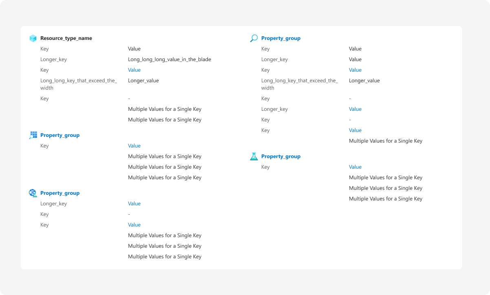
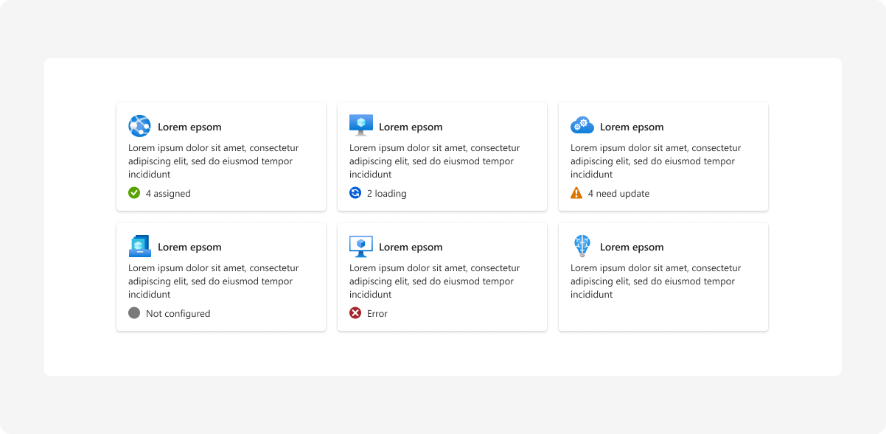
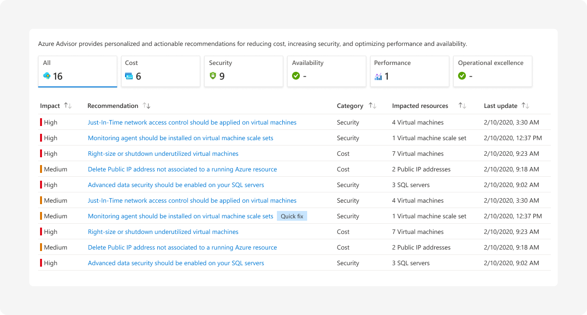

# Manage a Resource
Last updated Oct 2021 (see [Change Log](#change-log))

The Manage a Resource pattern guides users through the complete configuration of a single Azure resource.

## Context
Users need to manage all aspects of an Azure resource.

## Problem
Managing a resource in Azure can vary from a simple experience with common settings to a complex experience with advanced configuration options. Although the level of complexity may differ from resource to resource, for settings and actions that are common across resources, users expect a familiar experience. Users need an intuitive, consistent way to locate and configure common settings and resource management actions.

## Solution
The Manage a Resource design pattern makes it easy to locate, configure, and optimize Azure resource settings. The Manage a Resource pattern also exposes all actions (start, stop, delete, move, etc.) that can be taken against a resource. The Manage a Resource experience is typically opened from the [Browse Resources](./design-patterns-resource-browse.md) experience. However, the Manage a Resource experience can also be opened from the list of recent resources, search results, or related resources.

### Previously known as
* Resource blade
* Resource detail
* Resource menu
* Resource manage
 

## Examples

### Example images
An example image of the Manage a Resource design pattern is shown below:

### Example uses
The following Azure Portal experiences are good examples of the Manage a Resource design pattern:

* Key vault
* Virtual machine

Links to specific resources cannot be included in the documentation. To see a live version of the Manage a Resource design pattern, go to the Azure Portal and browse “All Resources.” Next, find a key vault or virtual Machine resource and simply navigate to it.

## Use when
Managing a single azure resource.
<!-- 3/24/21 update essentially replaces the entire body of this document between the "Use When" section and the "Do's and Don't" section -->

## The “Manage a Resource” Experience

### Overview Page
The Overview Page is the home page for the Manage a Resource experience. It provides users with a holistic view of essential resource properties, information on how to get started, key metrics, and helpful tutorials. This page is meant to serve as a hub for viewing and managing resource settings that are used regularly.

### Resource Menu
The Resource Menu is available on all Resource Pages and contains menu items with that link to the other Resources Pages. Settings that are common across all Azure resources have a designated resource menu item, icon, name, and location. This makes it easy for users to locate common settings from one Azure resource to the next. For settings that are specific to a given Azure resource, this document provides guidance on where and how to add them to the Resource Menu.

### Resource Pages
Each Resource Menu item opens a page that allows the user to drill deeper for more information. Monitoring and Resource health pages require the resource team’s resource provider to do additional onboarding to the monitoring and health infrastructure.

## Anatomy: Overview Page

The Overview Page offers the following features:
1.	Title
2.	Resource Menu
3.	Overview Page Toolbar
4.	Overview Page Essentials Area
5.	Overview Page Content Area

## Behavior: Overview Page

### Title
The title of a Manage a Resource page should reflect the name of the resource instance. For example, if the name of a VM instance was “Azure VM,” then the title of the Manage a Resource page should show as “Azure VM”. The subtitle shows the resource type “Virtual machine”.

### Resource Menu
The Resource Menu offers a way to navigate between all Resource Pages. The Resource Menu includes menu items (and associated pages) that are common to all resources throughout the portal, as well as menu items for settings that are resource-specific.

Some common menu items will show by default and others will require onboarding by the resource provider (details in developer documentation). Additional, resource-specific menu items should be labeled and grouped properly as shown in the anatomy diagram below. Resource menu item labels should always be sentence case with the first word capitalized and any other words in lowercase letters (i.e. “Toolkit settings”).

#### <strong> Learn more </strong>:
* [Resource Menu Blade](https://review.docs.microsoft.com/en-us/azure/portal-sdk/portal-sdk/generated/top-blades-resourcemenublade)
  * Tips on how to enable the Resource Menu and add menu items
* [Azure Portal Toolkit](https://www.figma.com/file/Bwn8rmUOYtnPRwA3JoQTBn/Azure-Portal-Toolkit?node-id=3059%3A368196)
  * Resource Menu UI design in Figma

### Overview Page Toolbar
The Toolbar is used to perform default and resource-specific actions on the Overview Page.

### Overview Page Essentials Area
The Essentials Panel surfaces key properties that are common for all Azure resources and important resource specific properties.

### Overview Page Content Area
The Overview Page Content Area provides quick access to detailed information and resource menu items that are used frequently. The Get Started content is recommended, and other content areas can be added if necessary. When multiple content areas are provided, tabs are used to separate the various content areas.

## Anatomy: Resource Menu
The Resource Menu content is composed of a search input field, common menu-items, and custom menu-items. The menu items are organized into subgroups. Subgroups should contain between 2-7 items and arranged in the Resource Menu as shown below:

 

1.	Search Input Field
2.	Top-level Group
3.	Settings Group
4.	Resource-specific Group(s)
5.	Monitoring Group
6.	Automation
7.	Support + troubleshooting Group

## Behavior: Resource Menu

### Search Input Field
The Search Input Field at the top of the resource menu allows the user to filter the menu items to just the items that match their search input string.  Menu items can have associated keywords to match additional terms.

### Top-level Group
Unlike the groups to follow, the top-level group does not have a header. The top-level group should include the following menu items at a minimum:
* Overview
* Activity log
* Access control (IAM)
* Tags
* Diagnose and solve problems
* 
 Resource-specific item 

Any resource-specific menu items that are added to the top-level group should be placed at the <strong> bottom </strong> of this list. Menu groups should be kept between 2-7 items.

### Settings Group
The Settings Group should include the following menu items at a minimum:

* 
 Resource-specific item 

* Properties
* Locks

Any resource-specific menu items that are added to the Settings Group should be placed at the <strong> top </strong> of this list. Menu groups should be kept between 2-7 items.

### Resource-specific Group
Any Resource-specific Group and its corresponding items should be placed between the Settings Group and the Monitoring Group. Menu groups should be kept between 2-7 items.

### Monitoring Group
The Monitoring Group should include the following menu items at a minimum:
* Alerts
* Metrics
* Logs
* Diagnostic settings
* 
 Resource-specific item 

Any resource-specific menu items that are added to the Monitoring Group should be placed at the <strong> bottom </strong> of this list. Menu groups should be kept between 2-7 items.

### Automation Group
The Automation Group should include the following menu items at a minimum:
* Tasks
* Export template
* 
 Resource-specific item 

Any resource-specific menu items that are added to the Automation Group should be placed at the <strong> bottom </strong> of this list. Menu groups should be kept between 2-7 items.

### Support + troubleshooting Group
The Support + troubleshooting Group should include the following menu items at a minimum:
* Resource health
* 
 Resource-specific item 

* New support request

Any resource-specific menu items that are added to the Monitoring Group should be placed at the <strong> bottom </strong> of this list <strong> but not below </strong> the “New support request” menu item. Menu groups should be kept between 2-7 items.

## Anatomy: Overview Page Toolbar
The Toolbar is composed of the following default and resource-specific commands:

 

1.	Primary Command
2.	Other Command(s)
3.	Common Commands

For more information on how to arrange and group commands please see [design-patterns-controls-Toolbar.md](./design-patterns-controls-Toolbar.md)

## Behavior: Overview Page Toolbar

### Primary Command
The primary command is resource-specific and usually represents the primary action that users would like to accomplish for a particular resource type. Some examples include:
* Run
* Start
* Connect
* Launch

It is recommended to use a verb (followed by a noun when necessary) for the Primary Command label. An [Azure Portal Icon](https://www.figma.com/file/fQO2yNBwr773QI4ANvb1Z4/Azure-Portal-Icons?node-id=2626%3A0) that relates to the command label should be used to the left of the label.

### Other Command(s)

Other commands are also resource-specific and usually represents the secondary, but valuable and/or frequently used action, that users would like to accomplish for a particular resource type. Some examples include:
* Restart
* Stop
* Capture
* Open in explorer

It is recommended to use a verb (followed by a noun when necessary) for the Other Command labels. An [Azure Portal Icon](https://www.figma.com/file/fQO2yNBwr773QI4ANvb1Z4/Azure-Portal-Icons?node-id=2626%3A0) that relates to the command verb should be used to the left of the label.

### Common Commands
The common commands generally apply to all resource types, but in some cases one or more may not be needed. When used, they should be placed at the end of the list of “Other Commands” along with their corresponding [Azure Portal Icon](https://www.figma.com/file/fQO2yNBwr773QI4ANvb1Z4/Azure-Portal-Icons?node-id=2626%3A0) shown in the anatomy above. The common command labels, actions, and order of appearance are:
* Delete
  * Opens the corresponding “Delete a Resource” experience to delete the current resource
* Move
  * Opens a dropdown menu to move the current resource to a different subscription, resource group or region
* Refresh
  * Refreshes the Overview Page
* Open in mobile
  * Opens a context pane showing a QR code that allows the user to scan this page and open it on their mobile device

## Anatomy: Overview Page Essentials Area
User feedback has shown that users rely heavily on the essentials panel for looking up key information. Properties can contain hyperlinks that open related resources (i.e. resource group, subscription, hosting plan, etc.). The links can also point to external sites.

 

The Essentials Panel is divided in two columns. The left column contains properties common to all resources and the right column contains properties that are specific to this resource.
1.	Left-side Essentials Items
2.	Right-side Essentials Items

## Behavior: Overview Page Essentials Area

### Left-side Essentials Items
The primary command is resource-specific and usually represents the primary action that users would like to accomplish for a particular resource type. Some examples include:
* Resource group
* Status (optional)
* Location
* Subscription name (hyperlinks to subscription blade)
* Subscription ID
* Tags – displays all tags and stretches across the width of both columns

### Right-side Essentials Items
The primary command is resource-specific and usually represents the primary action that users would like to accomplish for a particular resource type. Some examples include:
* Up to 5 (max) of the most used/most valuable resource-specific properties
* Do not use more than 5 as other properties can be placed in the Properties Content Area
* Labels should be limited to a maximum length of 150px

## Anatomy: Overview Page Content Area

 

The Overview Page includes a Content Area below the Essentials Area. When multiple content areas are desired, each Content Area is placed on its own tab.
1.	Overview Page Tabs (only shown when multiple content areas exist)
2.	Content Area (for a given tab)

### Behavior: Overview Page Content Area
The following Overview Page Content Areas are recommended to be included on the Overview Page using a different tab for each area as  presented below:
* Get started
* Properties
* Monitoring
* Capabilities
* Tutorials

All Overview Page Tab labels should be written in sentence case (i.e. “Get started”). The Capabilities Tab and Recommendations Tab should include a (#), where the # is representative of the number of capabilities or recommendations, respectively. If one or more of the tabs listed above are not used as part of the Overview Page experience, exclude that tab from the list of tabs. Similarly, if only a single tab is implemented from the list above, then do not use a tab label. Simply display the content in the Content Area without a tab.

#### <strong> Example: Get Started Content </strong>
 

 

The Get Started content is used to showcase the top 3 resource actions and/or documents that are useful for users who are utilizing the resource for the first time.

As shown above, when multiple Content Areas exists, this content should be placed on a tab called “Get started”. The recommended layout of the Get Started content is as follows:
* Hero Text
  * Text should be centered at the top of the content area.
  * Text should communicate the key value offering of the resource in action-oriented language that is clear and concise.
* Body Text
  * Text should provide a more detailed description of the offering.
  * Text should include a “Learn more” link at the end of the sentence that
* Feature Previews
  * Below the body text, list a maximum of 3 features using concise action-oriented language.
  * Features should be displayed using a borderless card layout that includes an icon, a short description (header), a long description (body), and a call-to-action (CTA) button or a “Learn more” link.
    * CTA buttons should link to resource-menu items and navigate the user to that resource page.
    * Learn more links are used when hyperlinking to documentation or other external resources that live outside of Azure Portal.

The Get Started design can be used in the first menu "Overview", not in any other menu item.

#### <strong> Example: Properties Content </strong>
 

 

The Properties Content is used to showcase additional resource-specific properties that are frequently accessed by users for the given resource. Some of these properties may already be highlighted in the “Essentials Panel” right-side while others may not.

As shown above, when multiple Content Areas exists, this content should be placed on a tab called “Properties”. The recommended layout of the Properties content is as follows:
* Sections
  * Each property section should correspond to a Resource Menu item.
  * Sections should not repeat any of the common ARM resource properties that are present in the Essentials Area in the left-side essentials items.
  * Sections should provide a “freestanding” summary of the menu item.
  * Essentials Area info that is presented in the right-side essential items can be repeated as needed to provide the “freestanding” summary.
* Section Columns
  * Sections should be presented in a 2 column-grid layout.  The 2nd column is optional based on number of properties shown.
  * Ideally the number of sections listed in each column are balanced. For example, a resource with 2 sections would have 1 section in each column.
* Section ordering
  * Sections should be presented in the same order that they appear in the Resource Menu
  * It is recommended to use fewer than 5 sections per column while attempting to visually balance the number of sections and/or section content in each column.
* Section content
  * Icon and title should match corresponding Resource Menu item. It is also acceptable for the icon and title to match the name of the Resource Type.
  * The title should be a hyperlink that activates the Resource Menu item. In the case that the title represents the name of the Resource Type, the title is not hyperlinked.
  * Information about the property should be provided as follows:
    * Label-value pairs with the labels on the left hand side and the values on the right-hand side.
    * The values can be hyperlinks when appropriate.
    * The number of label-value pairs per section should be kept under 10
    * In lieu of label-value pairs, a multi-valued property can be presented as a number (count of values) or a list of values (as in VM extensions)

#### <strong> Example: Monitoring Content </strong>
 

 

The Monitoring Content is used to display the most useful resource-specific charts and metrics.

As shown above, when multiple Content Areas exists, this content should be placed on a tab called “Monitoring”. The recommended layout of the Monitoring content is as follows:
* Place the charts in a responsive grid layout so that users are able to view the chart content on any device.
* Include the page header "Key metrics", and a hyperlink with the text “Click for additional metrics” that allows the user to access more data.
* Also include chart filters at the top of the page above all charts.

#### <strong> Example: Capabilities Content </strong>
 

 

The Capabilities Content is used to highlight valuable features of a resource that are not part of the Get Started or Properties content.

As shown above, when multiple Content Areas exists, this content should be placed on a tab called “Capabilities (#)”, where the (#) in the tab label should reflect the number of tiles listed on the page. For example, “Capabilities (7)” would be used to indicate that there are seven capabilities highlighted on the page. The recommended layout of the Capabilities content is as follows:
* Each capability card should correspond to a resource menu item
* Each Capability should be highlighted using a bordered card/tile with the following information:
  * Icon – should match resource menu icon
  * Title – should match resource menu text
  * Short description
  * Configuration status (when applicable)

<strong> Capabilities – Card Interaction </strong>
* When user activates (click or keyboard) an unconfigured capability, the card should open a context pane to configure the capability.
* When a user activates (click or keyboard) a configured capability, the card should navigate to the corresponding menu item.

#### <strong> Example: Recommendations Content </strong>
 

 

The Recommendations Content is used to show the active Azure Advisor recommendations for the resource.

As shown above, when multiple Content Areas exists, this content should be placed on a tab called “Recommendations (#)”, where the (#) in the tab label should reflect the number of tiles listed on the page. For example, “Recommendations (4)” would be used to indicate that there are four active recommendations for the resource. The recommended layout of the Capabilities content is as follows:
* Please note that the entire content of this tab is available as a single control.

#### <strong> Example: Tutorials Content </strong>
 

 

The Tutorials Content is used to display the most useful resource-specific Microsoft training, videos, and useful links to “How to…” documents.

As shown above, when multiple Content Areas exists, this content should be placed on a tab called “Tutorials”. The recommended layout of the Tutorials content is as follows:
* Free trainings from Microsoft
  * Features each free training on a bordered card/tile that includes the following:
    * Book icon denoting learning resource
    * Short description
    * Number of units and total time to complete
    * Long description
    * “Start” hyperlink to the training page
* Video tutorials
  * Features each video tutorial as a video card/tile that includes the following:
    * Thumbnail image/screenshot of video
    * Title of video
    * Video length
* Useful links
  * Provide a list of links and place them in a 1 to 3 column grid format based on how many rows are required.
  * Each column should have a short header that indicates the category of useful links listed in the rows below it. Some examples are:
    * Collecting data
    * Monitoring
    * Onboarding
  * Each row should have no more than 10 hyperlinks.
  * Each hyperlink should be displayed as a short description of the learning provided. 

<!-- 3/24/21 update essentially replaces the entire body of this document between the "Use When" section and the "Do's and Don't" section -->

## Do

* Build your resource menu and overview page using the declarative framework
* Ensure you have efficient APIs to get data for your overview page
* Do leverage a status bar for resource level or page level messaging (error, warning, info, upsell)
* Use empty page design if blade has no instance to show, refer to [notification design pattern](design-patterns-page-notifications.md) for more details

## Don&#39;t

* Don’t create menu groups that have only one menu item
* Don’t put so much information on your resource overview page that it fails the performance bar. You'll end up removing it to meet the bar.
* Don’t build your overview page as a PDL blade

## Related design guidelines
* Azure Portal Pattern Templates (Figma): [Manage a Resource pattern](https://www.figma.com/file/SkCj1C9nh5lZTuIz0uhcY2/Azure-Portal-Pattern-Templates?node-id=743%3A0)
* Azure Portal Toolkit (Figma): [Resource Menu design](https://www.figma.com/file/Bwn8rmUOYtnPRwA3JoQTBn/Azure-Portal-Toolkit?node-id=3059%3A368196)
* Overvew page [design-patterns-page-overview.md](design-patterns-page-overview.md)
* Create a Resource [design-patterns-resource-create.md](design-patterns-resource-create.md)
* Browse Resources [design-patterns-resource-browse.md](design-patterns-resource-browse.md)
* Design guidelines [top-design.md](top-design.md)

## Research and usability
The Manage a Resource pattern has been tested extensively. A few studies are listed below for your convenience:

* Sequential Getting Started Design Pattern for Azure portal ([View Study](https://hits.microsoft.com/Study/6014684))
* Azure FAST Study 9: Get started in resource blade ([View Study](https://hits.microsoft.com/Study/6010988))
* Azure FAST Study 6: Get started in the resource blade ([View Study](https://hits.microsoft.com/Study/6010723k))
* Azure Storage Account TOC Tree Test Study: Validation of a Proposed New Information Architecture ([View Study](https://hits.microsoft.com/Study/6017146))
* Azure Storage Account Open Card Sort Study: Towards an Improved Information Architecture ([View Study](https://hits.microsoft.com/Study/6016469))
* Azure Virtual Machine Open Card Sort Study: Towards an Improved Information Architecture ([View Study](https://hits.microsoft.com/Study/6017078))
* TOC (Table of Content) Navigation in Azure Portal ([View Study](https://hits.microsoft.com/Study/6020793))

## Telemetry

* Manage a resource usage with the Azure portal ([View Report](https://aka.ms/portalfx/fundamentals/resourcemenu))

# Implementation
Developers can use the following information to get started implementing this pattern:

## Tips and tricks
1. Use the portal declarative framework
    * Resource menu is supported
    * Overview page is supported
2.	Resource menu – when not using declarative
    * Use the ResourceMenu SDK building block
    * Opt in to ResourceMenu using the AssetType ResourceMenu entry
    * Assign keywords to your Resource Menu items to help the user find items
    * Enable the recommended flags on your resource menu
      * `enableSupportTroubleshootV2`
      * `enableProperties`
      * `enableAlerts`
      * `enableMetrics`
      * `enableLogs`
      * `enableDiagnostics`
      * `enableResourceHealth`
    * Make your resource menu static to help meet the performance bar
3.	Overview page – when not using declarative
    * If you have requirements that are not met by the declarative framework, then build your overview page using ReactView.
    * To display tags in the Essentials Panel, add this line to the options object passed to the essentials control:  includeTags:true
    * Make sure you have efficient APIs for overview data
    * Include common Overview page commands - <strong> Move, Delete, Refresh </strong> and <strong> Open in mobile </strong>
4.	Make sure your RP has onboarded to Geneva for metrics and logs so you can enable the monitoring menu items
5.	Make sure your RP has onboarded to health services so you can enable the diagnose/troubleshooting and resource health menu items

## Engineering Documentation

* Resource Menu [top-blades-resourcemenublade.md](./top-blades-resourcemenublade.md)
* Essentials [portalfx-controls-essentials.md](./portalfx-controls-essentials.md)
* Toolbar control [portalfx-controls-toolbar.md](portalfx-controls-toolbar.md)
* Context Pane [top-extensions-context-panes.md](top-extensions-context-panes.md)
* Properties page [portalfx-blades-properties.md](portalfx-blades-properties.md)

### Declarative
Many of the views described in the design pattern are offered as declarative views.  See the declarative documentation [top-declarative.md](https://github.com/Azure/portaldocs/blob/master/portal-sdk/generated/top-declarative.md) for details

## Change Log

### Oct 2021
* Added empty blade info

### Mar 2021
* Added detailed guidance for the Overview Page Toolbar, Essentials Area, and Content Area.

### Jul 2019
* Published
