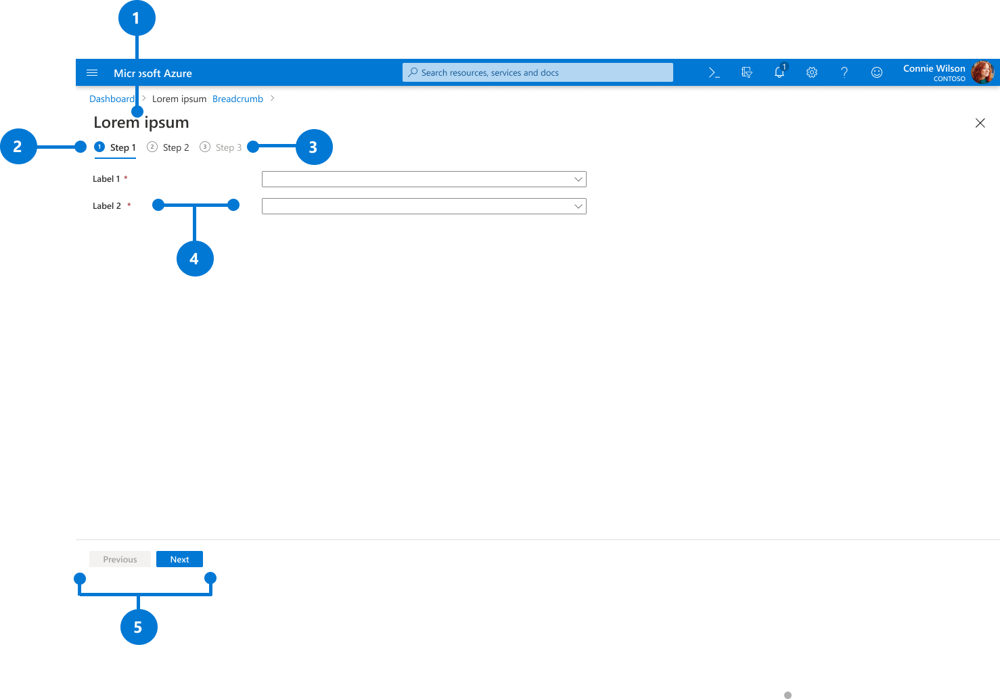

# Step Wizard

Last updated Dec 2020 (see [change logs](#change-logs))

The Step Wizard pattern provides guidelines for a set of sequential steps to perform a task. This pattern is not recommended for Azure resource creation, refer to [Create a Resource pattern](design-patterns-resource-create.md). 

## Context
Users need to complete a set of steps to perform a task in Azure. 

## Problem
To perform a task in Azure, users need an intuitive and consistent way to provide complex information in sequential steps. 

## Solution
The Step Wizard design pattern offers an approach that enables users to walk through a series of steps in sequential order. The experience uses a full screen page with tabs to separate related configuration steps and guide users during the process. 

### Also known as
* Sequential wizard 
* Wizard 

## Examples

### Example images

#### Step wizard with the first tab

#### Step wizard with the middle tab

 

#### Step wizard with the last tab

### Example uses
Configure backup in the Backup Center. Go to Backup Center in Azure portal, click on add backup button, choose datasource type “Azure Database for PostgreSQL servers”, and click proceed button. 

## Use when
Step Wizard pattern should be used for sequential tasks that the next steps are dependent on the previous steps.

## Anatomy

 
The Step Wizard pattern is a full-screen experience that offers the following features:
1.	Title
2.	Badges
3.	Tabs
4.	Labels and corresponding fields
5.	Footer navigation buttons

## Behavior

### Labels and corresponding fields
Labels should be kept concise and not provide instructions, for example: "Machine name".

### Validation
Validations are done at every step of the wizard. If there is at least one validation error in one step, the wizard should block users from advancing to the next step.

 

### Tabs
Tabs and corresponding sections are used to organize sequential content. Tabs are disabled until users reach the given step of the process. Once active, users can interact with the content on that tab.

### Badges
Badges are used to make it easy for the user to understand the state of the given step. The badge variants show users when the step is active, disabled, finished, or when there’s an error.

#### Light theme badges

 

#### Dark theme badges

## Do
* Put fields in steps in order of a natural task flow
* Mark required fields with red asterisk
* Include info bubbles if there are input fields that may not be immediately familiar
* Primary action button should only appear in the last step and the label should reinforce the action (Move, Save, etc)

## Don&#39;t
* Don't use this pattern for non-sequential tasks
* Don't use this pattern to create Azure resources – there is a specific pattern for Azure resources
* Don't put labels on buttons
* Don't include lengthy and unclear explanation text. The text should only be used to clarify and set expectations in a few short sentences.

## Related design guidelines
* [Design Guidelines](top-design.md)
* [Create a Resource](design-patterns-resource-create.md)

## Research and usability

## Telemetry

## For developers
Developers can use the following information to get started implementing this pattern

### Tips and tricks
* Set a maximimum width of 700px for the page area that contains input fields
* Set the spacing between the items in the footer is 12px
* To show the labels and input field on the same line, include your controls in a Section and set the leftLabelPosition option to true
* For input fields that may not be immediately familiar, include an info balloon (InfoBalloon)

### Related documentation

* [Azure Design Template ](https://www.figma.com/file/SkCj1C9nh5lZTuIz0uhcY2/Azure-Portal-Pattern-Templates?node-id=525%3A0)
* [Design guidelines](top-design.md)
* [Top Extensions Create](top-extensions-create.md)
* [Portal Forms](top-extensions-forms.md)
* [Developing Forms](portalfx-forms.md)

## Change logs

### Dec 2020
* Updated UI design

### Jul 2019
* Published
