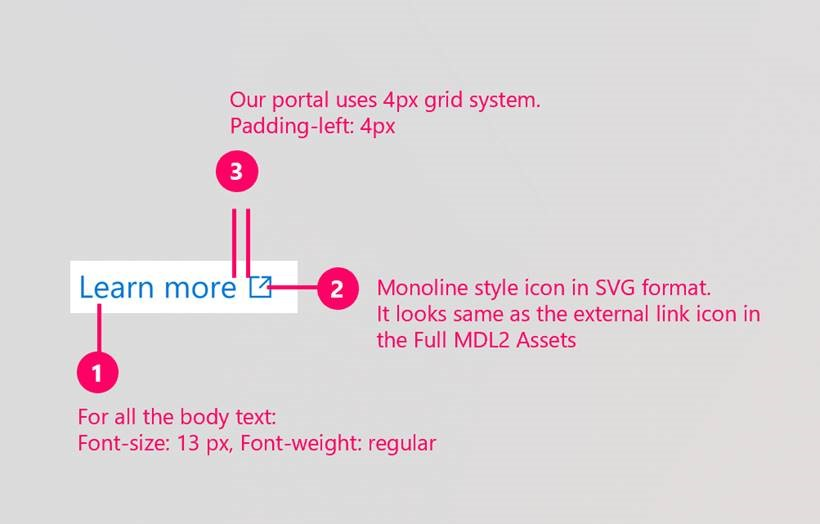

# Style guide tips
Here are some quick tips to align with the portal color themes, color pallette and type ramp that resonate with customers and meets accessibility requirements. 

## Style guide in Figma
* Style guide [Azure Portal Toolkit Style Section in Figma](https://www.figma.com/file/Bwn8rmUOYtnPRwA3JoQTBn/Azure-Portal-Toolkit?node-id=1592%3A0)

## Key style items
* Segoe UI is the standard typeface of the Azure portal
* Use sentence case for headers and labels. DO NOT USE ALL UPPERCASE, IT IS HARD TO READ
* Use 13px as body-text size
* Wrap text at 75 characters per line
* All the line style icons align with the monoline icon style from Full MDL Icon font.
* We use 4px grid system. The smallest padding/margin is 4px. 

## Screen resolutions
Ensure that your designs work well at all P0 resolutions.  Based on telemetry data \(see below\), resolution priorities are:

* P0 - experience needs to be great
    * 1366 - portal team uses 1366 × 786 as a baseline.  This is often the resolutions at events (Ignite, Build, etc)
    * 1920 
* P1 - experience needs to work
    * \>1920 
* P3 – experience needs to work
    * 1024

Designing for 1366 forces a focus on the most important information.    

### Telemetry
Reports showing portal usage by screen resolution
[Screen resolution telemetry](https://msit.powerbi.com/groups/4f11aaa4-1faf-4bf3-9983-1dc7351bf5b6/reports/bdd70bcd-ff00-44d6-a29b-4ba942c59867/ReportSection)

### External link
Links that open in new browser instances should follow this styling

## Related design guidelines
* Design guidelines [top-design.md](top-design.md)

# For developers
Developers can use the following information to get started implementing this pattern

## Related documentation
The portal includes a built in list of CSS classes that may be used inside of your templates.
* Style for extensions [portalfx-extensions-style.md](portalfx-extensions-style.md)
