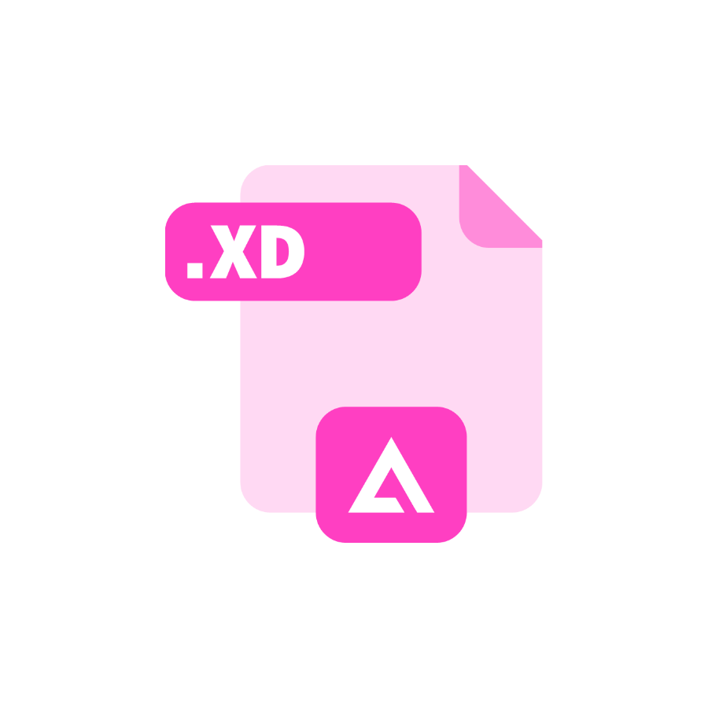

# Templates and Toolkits for designing Azure experiences

## Design Templates
Design templates will jumpstart your design for common Azure scenarios by providing pages with pre-assembled toolkit building blocks.

<a href="https://www.figma.com/file/Bwn8rmUOYtnPRwA3JoQTBn/Azure-Portal-Toolkit?node-id=3002%3A373291" target="_blank">

 Figma templates </a>
 
 

## Design Toolkits
Design toolkits contain building blocks to assemble pages in Azure

## First Tier
Prioritized source of truth

<a href="https://www.figma.com/file/Bwn8rmUOYtnPRwA3JoQTBn/Azure-Portal-Toolkit?node-id=3002%3A373291" target="_blank">

 Figma toolkit </a>
 No download is necessary.

## Second-tier
Committed to maintaining

<table>
<tr>
<td valign="top" width="300">
<a href="https://microsoft.sharepoint.com/:u:/t/UNI_CE/EeQ7d6ScPtxOn11y9u0uWDMBnxj0aAboy2KnvqBJOnB_VA?e=3WzClt" target="_blank">

 Sketch toolkit </a>
 Available from UNI/
 Load as a Sketch Library. 
 Do not open the Sketch version of the toolkit as a file.
</td>
<td valign="top">
<a href="https://microsoft.sharepoint.com/:f:/t/UNI_CE/EuZaLU4h1I5Fn3L9uL6YRcMBWA4H6ZRXQWbmzUv60KXJWQ?e=gsPway" target="_blank">

 Adobe XD toolkit </a>
 Available from UNI/
</td>
</tr>
</table>

## Third-tier
We will support if/as time allows
<table>
<tr>
<td valign="top" width="300">
<a href="https://microsoft.sharepoint.com/:f:/t/UNI_CE/EjEXdW54jiBOuWunOWsYLTsBeIZIDPTfPD6fFiMMaYUKDA?e=YSEE8w" target="_blank">

 PowerPoint toolkit </a>
 Available from UNI/
</td>
<td valign="top">
<a href="https://microsoft.sharepoint.com/:u:/t/UNI_CE/ET_B7JO5tJpCnBrXXaLID9AB9ltbHqj_v6eWkq147cvm_Q?e=zEB7t8" target="_blank">

 Adobe Illustrator toolkit </a>
 Available from UNI/
</td>
</tr>
</table>

## How to submit new controls or file bugs

If you are interested in submitting new controls to include or have bugs to file, please [contact us](http://aka.ms/azureportaltoolkitsfeedback) with the control details. 

# Design guidelines
* Design guidelines [top-design.md](top-design.md)

