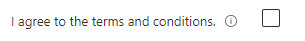

<a name="microsoft-common-checkbox"></a>
# Microsoft.Common.CheckBox
* [Microsoft.Common.CheckBox](#microsoft-common-checkbox)
    * [Description](#microsoft-common-checkbox-description)
    * [Guidance](#microsoft-common-checkbox-guidance)
    * [Definitions:](#microsoft-common-checkbox-definitions)
    * [UI Sample](#microsoft-common-checkbox-ui-sample)
    * [Sample Snippet](#microsoft-common-checkbox-sample-snippet)
    * [Sample output](#microsoft-common-checkbox-sample-output)

<a name="microsoft-common-checkbox-description"></a>
## Description
The CheckBox control lets users check or uncheck an option. The control returns **true** when the control is checked or **false** when not checked.
<a name="microsoft-common-checkbox-guidance"></a>
## Guidance
When you set required to **true**, the user must select the checkbox. If the user doesn't select the checkbox, the validation message is displayed.
<a name="microsoft-common-checkbox-definitions"></a>
## Definitions:
<a name="microsoft-common-checkbox-definitions-an-object-with-the-following-properties"></a>
##### An object with the following properties
| Name | Required | Description
| ---|:--:|:--:|
|name|True|Name of the instance.
|type|True|Enum permitting the value: "Microsoft.Common.CheckBox".
|label|True|Display text for the control
|defaultValue|False|Default value, set `true` for Checkbox to be `checked` upon loading the control. If not set, the defaultValue is set to `false` (un-checked). Default value also supports re-setting the default value if `defaultValue.resetTrigger` is evaluated as **true**.
|toolTip|False|Display text when hovered over the tooltip icon
|constraints|False|See [here](dx-control-Microsoft.Common.CheckBox-constraints.md) for more on constraints.
|visible|False|When visible is evaluated to *true* then the control will be displayed, otherwise it will be hidden.  Default value is **true**.
|fx.feature|False|
<a name="microsoft-common-checkbox-ui-sample"></a>
## UI Sample
  
<a name="microsoft-common-checkbox-sample-snippet"></a>
## Sample Snippet
  
```json
{
    "name": "legalAccept",
    "type": "Microsoft.Common.CheckBox",
    "label": "I agree to the terms and conditions.",
    "constraints": {
        "required": true,
        "validationMessage": "Please acknowledge the legal conditions."
    }
}
```

<a name="microsoft-common-checkbox-sample-output"></a>
## Sample output
  ```json
true
```

