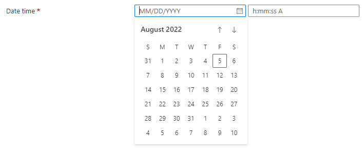

<a name="microsoft-common-datepicker"></a>
# Microsoft.Common.DatePicker
* [Microsoft.Common.DatePicker](#microsoft-common-datepicker)
    * [Description](#microsoft-common-datepicker-description)
    * [Guidance](#microsoft-common-datepicker-guidance)
    * [Definitions:](#microsoft-common-datepicker-definitions)
    * [UI Sample](#microsoft-common-datepicker-ui-sample)
    * [Sample Snippet](#microsoft-common-datepicker-sample-snippet)
    * [First Example -Date only](#microsoft-common-datepicker-first-example-date-only)
    * [Second Example -with Date and Time selection](#microsoft-common-datepicker-second-example-with-date-and-time-selection)
    * [Third Example -with Validation](#microsoft-common-datepicker-third-example-with-validation)
    * [Sample output](#microsoft-common-datepicker-sample-output)

<a name="microsoft-common-datepicker-description"></a>
## Description
A control for selecting a date and time value
<a name="microsoft-common-datepicker-guidance"></a>
## Guidance
- `constraints.validations` requires `isValid` and `message`. When `isValid` is **true**, then the `message` is displayed below the control as an error text.
- If `time.visible` is not set, only the Date selector is displayed. The output will default the time value to `00:00:00`.
- The following date functions are available for use with the DatePicker control

  - **getYear(DateTime_output)**: Return the year of the DateTime value
  - **getMonth(DateTime_output)**: Return the month of the DateTime value
  - **getDate(DateTime_output)**: Return the date of the DateTime value
  - **toUtc(DateTime_output)**: Convert the DateTime value to UTC time
  - **duration(Datetime d1, DateTime d2)**: Calculates the difference between d2 and d1 and return time value in milliseconds since midnight, January 1, 1970 UTC.
  - **durationFormat(DateTime-value)**:  Convert DateTime value in milliseconds to a specific format using any combination of yy MM dd hh mm ss.

    Examples
    ```json
    "[durationFormat(duration(utcNow(), steps('basics').datePicker), 'yy MM dd hh mm ss')]"
      => "1 year 1 month 20 days 9 hours 20 minutes 46 seconds"

    "[durationFormat(duration(utcNow(), steps('basics').datePicker), 'hh mm ss')]"
      => "9849 hours 20 minutes 17 seconds"

    "[durationFormat(duration(utcNow(), steps('basics').datePicker), 'dd')]" => "410 days"
    ```

  - [**addHours()**](https://learn.microsoft.com/azure/azure-resource-manager/managed-applications/create-ui-definition-date-functions#addhours)
  - [**addMinutes()**](https://learn.microsoft.com/azure/azure-resource-manager/managed-applications/create-ui-definition-date-functions#addminutes)
  - [**addSeconds()**](https://learn.microsoft.com/azure/azure-resource-manager/managed-applications/create-ui-definition-date-functions#addseconds)
  - [**utcNow()**](https://learn.microsoft.com/azure/azure-resource-manager/managed-applications/create-ui-definition-date-functions#utcnow)
 
<a name="microsoft-common-datepicker-definitions"></a>
## Definitions:
<a name="microsoft-common-datepicker-definitions-an-object-with-the-following-properties"></a>
##### An object with the following properties
| Name | Required | Description
| ---|:--:|:--:|
|name|True|Name of the instance.
|type|True|Enum permitting the value: "Microsoft.Common.DatePicker".
|label|True|Display text for the control
|subLabel|False|Defines the text to be displayed under the DatePicker control. The text will align-right of the DatePicker control.
|toolTip|False|Display tooltip for the control
|time|False|Setting `time.visibile` to **true** will render the Time picker. Setting `time.showSeconds` to **false** will only render the hour and minute, default is **true**.
|visible|False|When visible is evaluated to *true* then the control will be displayed, otherwise it will be hidden.  Default value is **true**.
|constraints|False|Setting `constraints.required` to **true** displays the required indicator. Defining an array of `constraints.validations` allows for validation of the input.
|fx.feature|False|
<a name="microsoft-common-datepicker-ui-sample"></a>
## UI Sample
  
<a name="microsoft-common-datepicker-sample-snippet"></a>
## Sample Snippet
  
<a name="microsoft-common-datepicker-first-example-date-only"></a>
## First Example -Date only
```json
{
    "name": "dateTime1",
    "type": "Microsoft.Common.DatePicker",
    "label": "start time",
    "visible": true,
    "constraints": {
    "required": true
    }
}
```

<a name="microsoft-common-datepicker-second-example-with-date-and-time-selection"></a>
## Second Example -with Date and Time selection
```json
{
    "name": "dateTime2",
    "type": "Microsoft.Common.DatePicker",
    "label": "end time",
    "visible": true,
    "time": {
        "visible": true
    },
    "constraints": {
        "required": true,
        "validations":
        [
            {
                "message": "can't be earlier than the start time",
                "isValid": "[less(duration(steps('datePicker').dateTime1, steps('datePicker').dateTime2), 0)]"
            }
        ]
    }
}
```

<a name="microsoft-common-datepicker-third-example-with-validation"></a>
## Third Example -with Validation
```json
{
    "name": "dateTime3",
    "type": "Microsoft.Common.DatePicker",
    "label": "showValidationMessage",
    "visible": true,
    "constraints": {
        "validations":
        [
            {
                "message": "selected date can't be earlier than today",
                "isValid": "[less(duration(addHours(utcNow(), -24), steps('datePicker').dateTime1), 0)]"
            }
        ]
    }
}
```

<a name="microsoft-common-datepicker-sample-output"></a>
## Sample output
  DatePicker outputs date and time values as input from user

Date only picker - the time is defaulted to `00:00:00`

```json
"Fri Aug 05 2022 00:00:00 GMT-0700 (Pacific Daylight Time)"
```

Date with Time picker enabled

```json
"Fri Aug 05 2022 17:00:00 GMT-0700 (Pacific Daylight Time)"
```

