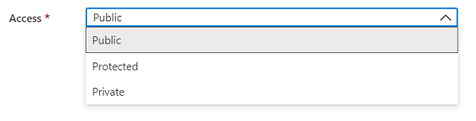
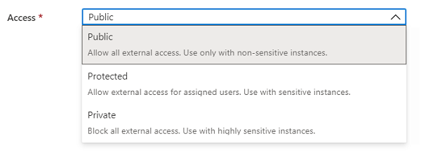
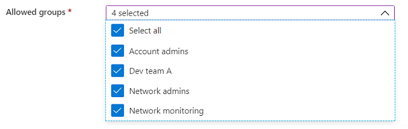
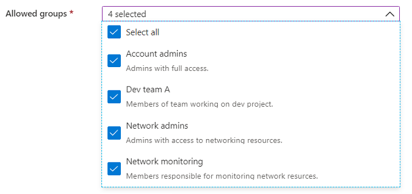
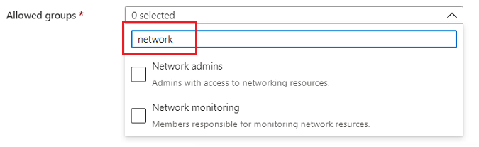
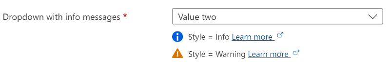

<a name="microsoft-common-dropdown"></a>
# Microsoft.Common.DropDown
* [Microsoft.Common.DropDown](#microsoft-common-dropdown)
    * [Description](#microsoft-common-dropdown-description)
    * [Guidance](#microsoft-common-dropdown-guidance)
    * [Basics](#microsoft-common-dropdown-basics)
    * [When to use](#microsoft-common-dropdown-when-to-use)
    * [Best practices](#microsoft-common-dropdown-best-practices)
        * [DropDown offers the following options:](#microsoft-common-dropdown-best-practices-dropdown-offers-the-following-options)
        * [Do](#microsoft-common-dropdown-best-practices-do)
        * [Don't](#microsoft-common-dropdown-best-practices-don-t)
    * [Definitions:](#microsoft-common-dropdown-definitions)
    * [UI Sample](#microsoft-common-dropdown-ui-sample)
    * [Sample Snippet](#microsoft-common-dropdown-sample-snippet)
    * [Sample output](#microsoft-common-dropdown-sample-output)

<a name="microsoft-common-dropdown-description"></a>
## Description
A selection control with a dropdown list. You can allow selection of only a single item or multiple items. You can also optionally include a description with the items.
<a name="microsoft-common-dropdown-guidance"></a>
## Guidance
<a name="microsoft-common-dropdown-basics"></a>
## Basics

A DropDown is a list in which the selected item is always visible, and the others are visible on demand by clicking a drop-down button.

<a name="microsoft-common-dropdown-when-to-use"></a>
## When to use

To select a single option among existing values. Choose the control best suited to your needs

* CheckBox - a choice to switch between 2 mutually exclusive options (on/off, enable/disable) or to indicate a subordinate setting (I agree to terms) when paired with another control opt in to a single choice. For example, use a single CheckBox for "I agree" instead of a different control where the user chooses between "I agree" and "I don't agree".
* TriStateCheckBox - can be checked, not checked or partially checked to indicate the checked state of children items in a hierarchy.
* DropDown - a single choice between a large number of options. The DropDown control is also used on a smaller set of options where the default option is recommended for most users. The DropDown control can also be used to make multiple selections from a set of options.
* OptionsGroup (Renders as RadioButton) - a single choice between 2-7 equally weighted options.

<a name="microsoft-common-dropdown-best-practices"></a>
## Best practices

DropDowns are used to simplify the design and make a choice within the UI. When closed, only the selected item is visible. When users click the drop-down button, all the options become visible. To change the value, users open the list and click another value or use the arrow keys (up and down) to select a new value.

<a name="microsoft-common-dropdown-best-practices-dropdown-offers-the-following-options"></a>
### DropDown offers the following options:

* Grouping of items
* Filtering / Searching
* Multiselect + Select all
* HTML formatting of items

<a name="microsoft-common-dropdown-best-practices-do"></a>
### Do

Use a DropDown when there are multiple choices that can be collapsed under one title. Or if the list of items is long or when space is constrained.
Use shortened statements or single words as options.
Use a DropDown when the selected option is more important than the alternatives (in contrast to radio buttons where all the choices are visible putting more emphasis on the other options).

<a name="microsoft-common-dropdown-best-practices-don-t"></a>
### Don&#39;t

Don't use DropDown when there are 2-7 equally weighted options that the user needs to see, use RadioButtons instead.
Developer tips and tricks
For nested DropDown items, i.e. whenever header items are used, Extension developers should make use of the ariaLabel options in both simple Item and Group item APIs for all drop-down items to reference the text content of their respective item-headers.
 
<a name="microsoft-common-dropdown-definitions"></a>
## Definitions:
<a name="microsoft-common-dropdown-definitions-an-object-with-the-following-properties"></a>
##### An object with the following properties
| Name | Required | Description
| ---|:--:|:--:|
|name|True|Name of the instance
|type|True|Enum permitting the value:"Microsoft.Common.DropDown".
|label|True|Display name for an instance
|infoMessages|False|The infoMessages are displayed below the control as inline messages. The infoMessages object has three properties: <code>style</code>, <code>text</code>, and <code>uri</code>. <code>infoMessages.style</code> and <code>infoMessages.text</code> are required values, while <code>infoMessages.uri</code> is not required. <br><br>1) <code>infoMessages.style</code> defines the style of the info message. Allowed values are **Info**, and **Warning**. <br><br>2) <code>infoMessages.text</code> defines the display text for the info message. <br><br>3) <code>infoMessages.uri</code> defines the resource to link to. 
|defaultValue|False|Default value shown in the DropDown. If specified, the default value must be a label presented in constraints.allowedValues.If not specified, the first item in constraints.allowedValues is selected. The default value is null. Default value also supports re-setting the default value if `defaultValue.resetTrigger` is evaluated as **true**.
|placeholder|False|Helper text that disappears when user begins editing. If placeholder and defaultValue are both defined, the defaultValue takes precedence and is shown.
|toolTip|False|To display text about the element when the mouse cursor is hovered over the information symbol.
|multiselect|False|Specify whether users can select more than one item
|selectAll|False|Display "select all" option in the DropDown
|filter|False|To enable users to search within a long list of options
|filterPlaceholder|False|Helper text displayed in filter box that disappears when user begins searching
|multiLine|False|Specify to enable multiLine to enable `allowedValue.description` to define the second line in DropDown
|defaultDescription|False|Text displayed if DropDown item don't have a description
|constraints|True|`constraints.allowedValues` must have at least one item. To emulate a value not being required, add an item with a label and value of "" (empty string) to `constraints.allowedValues`. See [here](dx-dropdownConstraints-allowedValues.md) for more on constraints.
|visible|False|Specify the visibility of the element. Value can be a boolean or an expression(string)
|fx.feature|False|
<a name="microsoft-common-dropdown-ui-sample"></a>
## UI Sample
  
  
  
  
  
  
<a name="microsoft-common-dropdown-sample-snippet"></a>
## Sample Snippet
  
```json
{
    "name": "element1",
    "type": "Microsoft.Common.DropDown",
    "label": "Example drop down",
    "placeholder": "",
    "defaultValue": ["Value two"],
    "toolTip": "",
    "multiselect": true,
    "selectAll": true,
    "filter": true,
    "filterPlaceholder": "Filter items ...",
    "multiLine": true,
    "defaultDescription": "A value for selection",
    "constraints": {
        "allowedValues": [
            {
                "label": "Value one",
                "description": "The value to select for option 1.",
                "value": "one"
            },
            {
                "label": "Value two",
                "description": "The value to select for option 2.",
                "value": "two"
            }
        ],
        "required": true
    },
    "visible": true
}
```

<a name="microsoft-common-dropdown-sample-output"></a>
## Sample output
  ```json
    "two"
```

