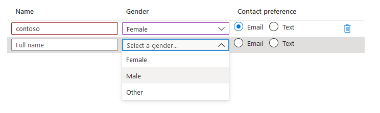

<a name="microsoft-common-editablegrid"></a>
# Microsoft.Common.EditableGrid
* [Microsoft.Common.EditableGrid](#microsoft-common-editablegrid)
    * [Description](#microsoft-common-editablegrid-description)
    * [Guidance](#microsoft-common-editablegrid-guidance)
    * [Definitions:](#microsoft-common-editablegrid-definitions)
    * [UI Sample](#microsoft-common-editablegrid-ui-sample)
    * [Sample Snippet](#microsoft-common-editablegrid-sample-snippet)
    * [Sample output](#microsoft-common-editablegrid-sample-output)

<a name="microsoft-common-editablegrid-description"></a>
## Description
A control for gathering tabular input. All fields within the grid are editable and the number of rows may vary.
<a name="microsoft-common-editablegrid-guidance"></a>
## Guidance
- The only valid controls within the columns array are the [TextBox](https://learn.microsoft.com/azure/azure-resource-manager/managed-applications/microsoft-common-textbox), [OptionsGroup](https://learn.microsoft.com/azure/azure-resource-manager/managed-applications/microsoft-common-optionsgroup), and [DropDown](https://learn.microsoft.com/azure/azure-resource-manager/managed-applications/microsoft-common-dropdown).
- The `$rowIndex` variable is only valid in expressions contained within children of the grid's columns. It's an integer that represents the element's relative row index and the count begins at one and increments by one. As shown in the schema's `"columns"`: section, the `$rowIndex` is used for validation.
- When validations are performed using the `$rowIndex` variable, it's possible to get the current row's value by combining the `last()` and `take()` commands.

For example:

`last(take(<reference_to_grid>, $rowIndex))`

- The `label` property doesn't appear as part of the control but is displayed on the final tab summary.
- The `ariaLabel` property is the accessibility label for the grid. Specify helpful text for users who use screen readers.
- The `constraints.width` property is used to set the overall width of the grid. The options are *Full*, *Medium*, *Small*. The default is *Full*.
- The `width` property on children of columns determines the column width. Widths are specified using fractional units such as *3fr*, with total space being allotted to columns proportional to their units. If no column width is specified, the default is *1fr*.
 
<a name="microsoft-common-editablegrid-definitions"></a>
## Definitions:
<a name="microsoft-common-editablegrid-definitions-an-object-with-the-following-properties"></a>
##### An object with the following properties
| Name | Required | Description
| ---|:--:|:--:|
|name|True|The name of the instance
|type|True|Enum permitting the value: "Microsoft.Common.EditableGrid"
|label|True|Display text for the control
|ariaLabel|True|Aria label for the control
|constraints|True|Define the row and column information. EditableGrid supports only Textbox, OptionsGroup and Dropdown in the column.
|visible|False|If **true** the control will display, otherwise it will be hidden.
|fx.feature|False|
<a name="microsoft-common-editablegrid-ui-sample"></a>
## UI Sample
  
<a name="microsoft-common-editablegrid-sample-snippet"></a>
## Sample Snippet

```json
// Enclosing comment
{
    "name": "people",
    "type": "Microsoft.Common.EditableGrid",
    "ariaLabel": "Enter information per person",
    "label": "People",
    "constraints": {
      "width": "Full",
      "rows": {
        "count": {
          "min": 1,
          "max": 10
        }
      },
      "columns": [
        {
          "id": "colName",
          "header": "Name",
          "width": "1fr",
          "element": {
            "type": "Microsoft.Common.TextBox",
            "placeholder": "Full name",
            "constraints": {
              "required": true,
              "validations": [
                {
                  "isValid": "[startsWith(last(take(steps('grid').people, $rowIndex)).colName, 'contoso')]",
                  "message": "Must start with 'contoso'."
                },
                {
                  "regex": "^[a-z0-9A-Z]{1,30}$",
                  "message": "Only alphanumeric characters are allowed, and the value must be 1-30 characters long."
                }
              ]
            }
          }
        },
        {
          "id": "colGender",
          "header": "Gender",
          "width": "1fr",
          "element": {
            "name": "dropDown1",
            "type": "Microsoft.Common.DropDown",
            "placeholder": "Select a gender...",
            "constraints": {
              "allowedValues": [
                {
                  "label": "Female",
                  "value": "female"
                },
                {
                  "label": "Male",
                  "value": "male"
                },
                {
                  "label": "Other",
                  "value": "other"
                }
              ],
              "required": true
            }
          }
        },
        {
          "id": "colContactPreference",
          "header": "Contact preference",
          "width": "1fr",
          "element": {
            "type": "Microsoft.Common.OptionsGroup",
            "constraints": {
              "allowedValues": [
                {
                  "label": "Email",
                  "value": "email"
                },
                {
                  "label": "Text",
                  "value": "text"
                }
              ],
              "required": true
            }
          }
        }
      ]
    }
  }
// Enclosing comment

```
<a name="microsoft-common-editablegrid-sample-output"></a>
## Sample output

```json
{
    "colName": "contoso",
    "colGender": "female",
    "colContactPreference": "email"
  }

```
