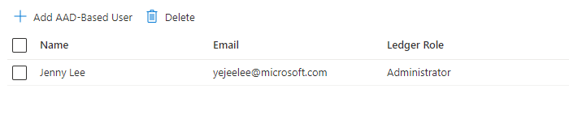

<a name="microsoft-common-grid"></a>
# Microsoft.Common.Grid
* [Microsoft.Common.Grid](#microsoft-common-grid)
    * [Description](#microsoft-common-grid-description)
    * [Definitions:](#microsoft-common-grid-definitions)
    * [UI Sample](#microsoft-common-grid-ui-sample)
    * [Sample Snippet](#microsoft-common-grid-sample-snippet)
    * [First Example -simple](#microsoft-common-grid-first-example-simple)
    * [Second Example](#microsoft-common-grid-second-example)
    * [Sample output](#microsoft-common-grid-sample-output)
    * [First Example output](#microsoft-common-grid-first-example-output)

<a name="microsoft-common-grid-description"></a>
## Description
The Grid control supports both inline and using a blade for gathering input.
<a name="microsoft-common-grid-definitions"></a>
## Definitions:
<a name="microsoft-common-grid-definitions-an-object-with-the-following-properties"></a>
##### An object with the following properties
| Name | Required | Description
| ---|:--:|:--:|
|name|True|Name of the instance
|type|True|Enum permitting the value: "Microsoft.Common.Grid".
|label|True|<br>1)label.summary is the display name of the grid output displayed in the "Review + create" section. <br>2) label.addition is the display name of the 'add row button'. <br>3) label.delete is the display name of the 'delete row button'. <br>label.ariaLabel is used to communicate the label to screen reader users.
|defaultValue|False|Specify default rows of the Grid
|addBlade|True|Specify a blade that is used for adding a row to Grid. See [here](dx-grid-bladeReference.md) for more on blade reference.
|editBlade|False|Specify a blade that is used for editing a row to Grid. See [here](dx-grid-bladeReference.md) for more on blade reference.
|constraints|True|See [here](dx-grid-constraints.md) for more on constraints.
|visible|False|Specify the visibility of the element. Value can be a boolean or an expression(string)
|fx.feature|False|
<a name="microsoft-common-grid-ui-sample"></a>
## UI Sample
  
<a name="microsoft-common-grid-sample-snippet"></a>
## Sample Snippet
  
<a name="microsoft-common-grid-first-example-simple"></a>
## First Example -simple
```json
{
    "type": "Microsoft.Common.Grid",
    "name": "fooGrid",
    "label": {
        "summary": "Attached Foo's",
        "addition": "Add Foo",
        "delete": "Delete",
        "ariaLabel": "Grid for providing Foo information"
    },
    "addBlade": {
        "name": "FormWithOutputs_Dx",
        "extension": "tsextension",
        "parameters": {
            "title": "Add Foo"
        },
        "outputItem": "output",
        "inContextPane": true
    },
    "editBlade": {
        "name": "FormWithOutputs_Dx",
        "extension": "tsextension",
        "parameters": {
            "name": "[$item.name]",
            "region": "[$item.region]",
            "title": "Edit Foo"
        },
        "outputItem": "output",
        "inContextPane": true
    },
    "defaultValue": [
        {
            "name": "resource1",
            "region": "East US",
            "state": "on",
            "note": "Lorem ipsum"
        }
    ],
    "constraints": {
        "width": "Full",
        "canEditRows": true,
        "validations": [
            {
                "isValid": "[lessOrEquals(length(filter(steps('grid').fooGrid, (element) => equals(element.state, 'on'))), 2)]",
                "message": "A maximum of 2 Foo's may be set to 'On'"
            }
        ],
        "rows": {
            "count": {
                "min": 1,
                "max": 10
            }
        },
        "columns": [
            {
                "id": "name",
                "header": "Name",
                "width": "1fr",
                "cellType": "readonly",
                "text": "[$item.name]"
            },
            {
                "id": "region",
                "header": "Region",
                "width": "1fr",
                "cellType": "readonly",
                "text": "[$item.region]"
            },
            {
                "id": "state",
                "header": "State",
                "width": "1fr",
                "cellType": "input",
                "element": {
                    "type": "Microsoft.Common.OptionsGroup",
                    "defaultValue": "On",
                    "constraints": {
                        "allowedValues": [
                            {
                                "label": "On",
                                "value": "on"
                            },
                            {
                                "label": "Off",
                                "value": "off"
                            }
                        ],
                        "required": true
                    }
                }
            },
            {
                "id": "note",
                "header": "Note",
                "width": "2fr",
                "cellType": "input",
                "element": {
                    "type": "Microsoft.Common.TextBox",
                    "placeholder": "Jot something down",
                    "constraints": {
                        "required": true,
                        "validations": [
                            {
                                "regex": "^[a-z0-9A-Z]{1,30}$",
                                "message": "Only alphanumeric characters are allowed, and the value must be 1-30 characters long."
                            },
                            {
                                "isValid": "[or(contains($item.note, 'e'), contains($item.note, 'E'))]",
                                "message": "Use the letter 'e' in your note, please."
                            }
                        ]
                    }
                }
            }
        ]
    }
}
```

<a name="microsoft-common-grid-second-example"></a>
## Second Example

```json
{
    "type": "Microsoft.Common.Grid",
    "name": "aadGrid",
    "label": {
        "addition": "Add AAD-Based User",
        "delete": "Delete",
        "summary": "AAD-Based User(s)"
    },
    "defaultValue": [
        {
            "id": "[dataSources('graph').id]",
            "ledgerRoleName": "Administrator",
            "displayName": "[dataSources('graph').displayName]",
            "mail": "[dataSources('graph').mail]"
        }
    ],
    "addBlade": {
        "extension": "Microsoft_AAD_IAM",
        "name": "ObjectPickerBlade",
        "parameters": {
            "title": "addAadLabel",
            "disabledObjectIds": "[map(steps('security').aadGrid,(element)=>element.id)]",
            "queries": 1
        },
        "outputItem": "selectedObjects",
        "inContextPane": true
    },
    "constraints": {
        "width": "Full",
        "canEditRows": false,
        "columns": [
            {
                "id": "displayName",
                "header": "Name",
                "cellType": "readonly",
                "text": "[$item.displayName]"
            },
            {
                "id": "mail",
                "header": "Email",
                "cellType": "readonly",
                "text": "[$item.mail]"
            },
            {
                "id": "ledgerRoleName",
                "header": "Ledger Role",
                "cellType": "input",
                "element": {
                    "type": "Microsoft.Common.DropDown",
                    "constraints": {
                        "allowedValues": [
                            {
                                "label": "readerLabel",
                                "value": "Reader"
                            },
                            {
                                "label": "contributorLabel",
                                "value": "Contributor"
                            },
                            {
                                "label": "administratorLabel",
                                "value": "Administrator"
                            }
                        ],
                        "required": true
                    }
                }
            }
        ],
        "rows": {
            "count": {
                "min": 1,
                "max": 3
            }
        },
        "validations": [
            {
                "isValid": "[contains(map(steps('security').aadGrid,(element)=>element.ledgerRoleName),'Administrator')]",
                "message": "Must include at least one AAD-based user with the role of Administrator."
            }
        ]
    }
}
```

<a name="microsoft-common-grid-sample-output"></a>
## Sample output
  
<a name="microsoft-common-grid-first-example-output"></a>
## First Example output

```json
    {
        "name": "resource1",
        "region": "East US",
        "state": "on",
        "note": "Lorem ipsum"
    }
```

