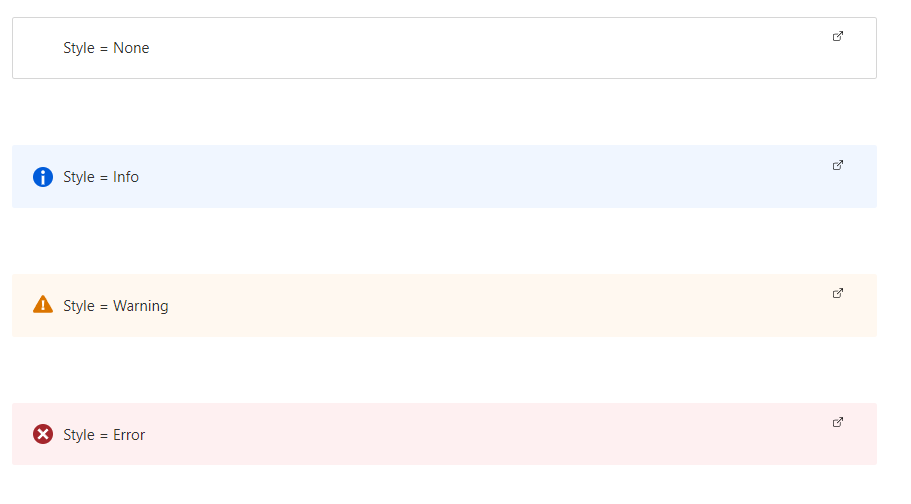

<a name="microsoft-common-infobox"></a>
# Microsoft.Common.InfoBox
* [Microsoft.Common.InfoBox](#microsoft-common-infobox)
    * [Description](#microsoft-common-infobox-description)
    * [Definitions:](#microsoft-common-infobox-definitions)
    * [UI Sample](#microsoft-common-infobox-ui-sample)
    * [Sample Snippet](#microsoft-common-infobox-sample-snippet)
    * [Sample output](#microsoft-common-infobox-sample-output)

<a name="microsoft-common-infobox-description"></a>
## Description
A control that adds an information box. The box contains important text or warnings that help users understand the values they're providing. It can also link to a URI for more information.

<a name="microsoft-common-infobox-definitions"></a>
## Definitions:
<a name="microsoft-common-infobox-definitions-an-object-with-the-following-properties"></a>
##### An object with the following properties
| Name | Required | Description
| ---|:--:|:--:|
|name|True|The name of the instance
|type|True|Enum permitting the value: "Microsoft.Common.InfoBox"
|options|True|The options object has three properties: <code>style</code>, <code>text</code>, and <code>uri</code>. <code>options.style</code> and <code>options.text</code> are required values, while <code>options.uri</code> is not required. <br><br>1) <code>options.style</code> defines the style of the control. Allowed values are **Info**, **Warning**, **Error**, or **None**. See **UI Sample** below for an example of each style. <br><br>2) <code>options.text</code> defines the display text for the control. <br><br>3) <code>options.uri</code> defines the resource to link to when the InfoBox is clicked. 
|visible|False|If **true** the control will display, otherwise it will be hidden.
|fx.feature|False|
<a name="microsoft-common-infobox-ui-sample"></a>
## UI Sample
  
<a name="microsoft-common-infobox-sample-snippet"></a>
## Sample Snippet
How to specify an InfoBox
```json

{
"name": "text1",
"type": "Microsoft.Common.InfoBox",
"visible": true,
"options": {
  "style": "None",
  "text": "Style: None",
  "uri": "https://www.microsoft.com"
}
}

```
<a name="microsoft-common-infobox-sample-output"></a>
## Sample output
Sample output of the InfoBox example defined in the code snippet above
```json

"Style: None"

```
