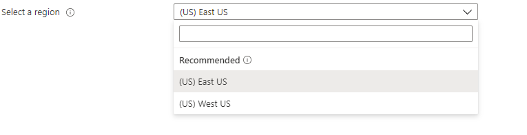

<a name="microsoft-common-locationselector"></a>
# Microsoft.Common.LocationSelector
* [Microsoft.Common.LocationSelector](#microsoft-common-locationselector)
    * [Description](#microsoft-common-locationselector-description)
    * [Guidance](#microsoft-common-locationselector-guidance)
    * [Definitions:](#microsoft-common-locationselector-definitions)
    * [UI Sample](#microsoft-common-locationselector-ui-sample)
    * [Sample Snippet](#microsoft-common-locationselector-sample-snippet)
    * [Sample output](#microsoft-common-locationselector-sample-output)

<a name="microsoft-common-locationselector-description"></a>
## Description
The location selector should be used to select a Azure region. However, in the basics tab, for the primary region for a resource, use the resource scope control instead.
<a name="microsoft-common-locationselector-guidance"></a>
## Guidance
Use it only for advanced scenarios. For a consistent experience, use the [Resource scope control](dx-control-Microsoft.Common.ResourceScope.md) wherever possible instead.
<a name="microsoft-common-locationselector-definitions"></a>
## Definitions:
<a name="microsoft-common-locationselector-definitions-an-object-with-the-following-properties"></a>
##### An object with the following properties
| Name | Required | Description
| ---|:--:|:--:|
|name|True|Name of the instance.
|visible|False|When visible is evaluated to *true* then the control will be displayed, otherwise it will be hidden.  Default value is **true**.
|fx.feature|False|
|label|True|Specifies the label that would be shown.
|toolTip|False|Specifies the toolTip that would be shown.
|scope|True|Scope is defined using the subscriptionId property.
|type|True|Enum permitting the value: "Microsoft.Common.LocationSelector".
|resourceTypes|False|Array of resource types. If no resourceType is specified, the Microsoft.Compute/virtualMachine resource type is used by default.
|allowedValues|False|Specifies allowed locations. Accepts an array of values or a single string.
<a name="microsoft-common-locationselector-ui-sample"></a>
## UI Sample
  
<a name="microsoft-common-locationselector-sample-snippet"></a>
## Sample Snippet

```json
// Assuming the name of the first step is 'basics'; and the name of ResourceScope control is 'resourceScope' 
{
    "type": "Microsoft.Common.LocationSelector",
    "name": "location",
    "label": "Select a region",
    "resourceTypes": [
        "Microsoft.BotService/botServices",
        "Microsoft.KeyVault/vaults"
    ],
    "scope": {
        "subscriptionId": "[steps('basics').resourceScope.subscription.subscriptionId]"
    },
	"allowedValues": ["eastus", "westus"]
}
```
<a name="microsoft-common-locationselector-sample-output"></a>
## Sample output
  ```json
{
        "displayName": "East US",
        /**
         * The normalized name of the location.
         */
        "name": "eastus",
        /**
         * The fully qualified ID of the location.
         */
        "id": "/subscriptions/{subscription-ID}/locations/eastus",
        /**
         * The display name with the Region included
         */
        "regionalDisplayName": "(US) East US",
        /**
         * The type of the location, can be "Region" or "EdgeZone".
         */
        "type": "Region",
        /**
         * Metadata about the location
         * 'type' will determine which interface is returned from ARM
         * If 'type' is "Region", then 'metadata can be casted to type 'RegionLocationMetadata'.
         * If 'type' is "EdgeZone", then 'metadata can be casted to type 'EdgeZoneLocationMetadata'.
         */
        "metadata": {
                "geographyGroup": "US",
                "latitude": "37.3719",
                "longitude": "-79.8164",
                "pairedRegion": [
                        {
                                "name": "westus", 
                                "id": "/subscriptions/{subscription-ID}/locations/westus"
                        }
                ],
                "physicalLocation": "Virginia",
                "regionCategory": "Recommended",
                "regionType": "Physical"
        }
}     
```
