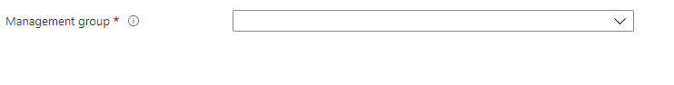

<a name="microsoft-common-managementgroupselector"></a>
# Microsoft.Common.ManagementGroupSelector
* [Microsoft.Common.ManagementGroupSelector](#microsoft-common-managementgroupselector)
    * [Description](#microsoft-common-managementgroupselector-description)
    * [Guidance](#microsoft-common-managementgroupselector-guidance)
    * [Definitions:](#microsoft-common-managementgroupselector-definitions)
    * [UI Sample](#microsoft-common-managementgroupselector-ui-sample)
    * [Sample Snippet](#microsoft-common-managementgroupselector-sample-snippet)
    * [Sample output](#microsoft-common-managementgroupselector-sample-output)

<a name="microsoft-common-managementgroupselector-description"></a>
## Description
Individual control for selecting management group
<a name="microsoft-common-managementgroupselector-guidance"></a>
## Guidance
Use it only for advanced scenarios. For a consistent experience, use the [Resource scope control](dx-control-Microsoft.Common.ResourceScope.md) wherever possible instead. <p/> To deploy to management group scope, note that the ARM template must be defined with the managementscope schema type - [Deploy resources to management group - Azure Resource Manager | Microsoft Docs](https://docs.microsoft.com/en-us/azure/azure-resource-manager/templates/deploy-to-management-group?tabs=azure-cli#schema)
<a name="microsoft-common-managementgroupselector-definitions"></a>
## Definitions:
<a name="microsoft-common-managementgroupselector-definitions-an-object-with-the-following-properties"></a>
##### An object with the following properties
| Name | Required | Description
| ---|:--:|:--:|
|name|True|Name of the instance.
|visible|False|When visible is evaluated to *true* then the control will be displayed, otherwise it will be hidden.  Default value is **true**.
|fx.feature|False|
|type|True|Enum permitting the value: "Microsoft.Common.ManagementGroupSelector"
|constraints|False|<code>constraints</code> accepts an array of items where each item defines: <br>1) <code>isValid</code>: Value can be a boolean or string(for function expressions). <br>2) <code>message</code>: Message to be shown on validation failure.
<a name="microsoft-common-managementgroupselector-ui-sample"></a>
## UI Sample
  
<a name="microsoft-common-managementgroupselector-sample-snippet"></a>
## Sample Snippet

```json
{
    "name": "managementGroup",
    "type": "Microsoft.Common.ManagementGroupSelector"
}

```
<a name="microsoft-common-managementgroupselector-sample-output"></a>
## Sample output
  The ManagementGroupSelector control returns an object with the following properties as the output:

```typescript
{
    displayName: string;
    managementGroupId: string;
}
```

