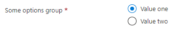

<a name="microsoft-common-optionsgroup"></a>
# Microsoft.Common.OptionsGroup
* [Microsoft.Common.OptionsGroup](#microsoft-common-optionsgroup)
    * [Description](#microsoft-common-optionsgroup-description)
    * [Guidance](#microsoft-common-optionsgroup-guidance)
    * [Definitions:](#microsoft-common-optionsgroup-definitions)
    * [UI Sample](#microsoft-common-optionsgroup-ui-sample)
    * [Sample Snippet](#microsoft-common-optionsgroup-sample-snippet)
    * [Sample output](#microsoft-common-optionsgroup-sample-output)

<a name="microsoft-common-optionsgroup-description"></a>
## Description
The OptionsGroup control lets users select one option from two or more choices. A user can select only one option.
<a name="microsoft-common-optionsgroup-guidance"></a>
## Guidance
- The label for `constraints.allowedValues` is the display text for an item, and its value is the output value of the element when selected.
- If specified, the default value must be a label present in `constraints.allowedValues`. If not specified, the first item in `constraints.allowedValues` is selected by default. The default value is **null**.
- `constraints.allowedValues` must have at least one item.
 
<a name="microsoft-common-optionsgroup-definitions"></a>
## Definitions:
<a name="microsoft-common-optionsgroup-definitions-an-object-with-the-following-properties"></a>
##### An object with the following properties
| Name | Required | Description
| ---|:--:|:--:|
|name|True|The name of the instance
|type|True|Enum permitting the value: "Microsoft.Common.OptionsGroup"
|label|True|Display label text for the control
|defaultValue|False|Default value can be defined as a static value or dynamic (functions) that maps to the `constraints.allowedValues`. Default value also supports re-setting the default value if `defaultValue.resetTrigger` is evaluated as **true**.
|toolTip|False|Displays tooltip for the control
|constraints|True|`constraints.allowedValues` must have at least one item. To emulate a value not being required, add an item with a label and value of "" (empty string) to `constraints.allowedValues`. See [here](dx-optionsgroupConstraints-allowedValues.md) for more on constraints.
|visible|False|If **true** the control will display, otherwise it will be hidden.
|fx.feature|False|
<a name="microsoft-common-optionsgroup-ui-sample"></a>
## UI Sample
  
<a name="microsoft-common-optionsgroup-sample-snippet"></a>
## Sample Snippet

```json
// Enclosing comment
{
  "name": "element1",
  "type": "Microsoft.Common.OptionsGroup",
  "label": "Some options group",
  "defaultValue": "Value two",
  "toolTip": "",
  "constraints": {
    "allowedValues": [
      {
        "label": "Value one",
        "value": "one"
      },
      {
        "label": "Value two",
        "value": "two"
      }
    ],
    "required": true
  },
  "visible": true
}
// Enclosing comment

```
<a name="microsoft-common-optionsgroup-sample-output"></a>
## Sample output
  ```json
"two"
```

