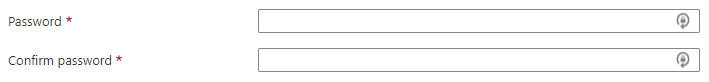

<a name="microsoft-common-passwordbox"></a>
# Microsoft.Common.PasswordBox
* [Microsoft.Common.PasswordBox](#microsoft-common-passwordbox)
    * [Description](#microsoft-common-passwordbox-description)
    * [Guidance](#microsoft-common-passwordbox-guidance)
    * [Definitions:](#microsoft-common-passwordbox-definitions)
    * [UI Sample](#microsoft-common-passwordbox-ui-sample)
    * [Sample Snippet](#microsoft-common-passwordbox-sample-snippet)
    * [Sample output](#microsoft-common-passwordbox-sample-output)

<a name="microsoft-common-passwordbox-description"></a>
## Description
A control that can be used to provide and confirm a password.
<a name="microsoft-common-passwordbox-guidance"></a>
## Guidance
This element doesn't support the `defaultValue` property.

It's possible to specify a value for `constraints.regex` when `constraints.required` is set to **false**. In this scenario, a value isn't required for the text box to validate successfully. If one is specified, it must match the regular expression pattern.

<a name="microsoft-common-passwordbox-definitions"></a>
## Definitions:
<a name="microsoft-common-passwordbox-definitions-an-object-with-the-following-properties"></a>
##### An object with the following properties
| Name | Required | Description
| ---|:--:|:--:|
|name|True|The name of the instance
|type|True|Enum permitting the value: "Microsoft.Common.PasswordBox"
|label|True|The label object defines the display text for the control and has two properties: <code>password</code> and <code>confirmPassword</code>. <br><br>1) <code>label.password</code> defines the text for the first box <br><br>2) <code>label.confirmPassword</code> defines the text for the second box.
|toolTip|False|Text to display when hovering over the tooltip icon. Tooltip icon will only be displayed if text is a non-empty value.
|constraints|False|The constraints object has three properties: <code>required</code>, <code>regex</code>, and <code>validationMessage</code>. <br><br>1) If <code>constraints.required</code> is set to **true**, then the text box must have a value that validate successfully. The default value is **false**. <br><br>2) The <code>constraints.regex</code> property is a JavaScript regular expression pattern. If specified, the text box's value must match the pattern to validate successfully. The default value is **null**. <br> For more information about regex syntax, see [Regular expression quick reference](https://learn.microsoft.com/dotnet/standard/base-types/regular-expression-language-quick-reference). <br><br> 3) <code>constraints.validationMessage</code> defines the string to display when the text box's value fails validation.
|options|False|The options object has one property: <code>hideConfirmation</code>. If <code>options.hideConfirmation</code> is set to **true**, the second text box for confirming the user's password is hidden. The default value is **false**.
|visible|False|If **true** the control will display, otherwise it will be hidden.
|fx.feature|False|
<a name="microsoft-common-passwordbox-ui-sample"></a>
## UI Sample
  
<a name="microsoft-common-passwordbox-sample-snippet"></a>
## Sample Snippet
How to specify a PasswordBox
```json

{
"name": "element1",
"type": "Microsoft.Common.PasswordBox",
"label": {
  "password": "Password",
  "confirmPassword": "Confirm password"
},
"toolTip": "",
"constraints": {
  "required": true,
  "regex": "^[a-zA-Z0-9]{8,}$",
  "validationMessage": "Password must be at least 8 characters long, contain only numbers and letters"
},
"options": {
  "hideConfirmation": false
},
"visible": true
  }

```
<a name="microsoft-common-passwordbox-sample-output"></a>
## Sample output
Sample output of the PasswordBox example defined in the code snippet above
```json

"p4ssw0rd"

```
