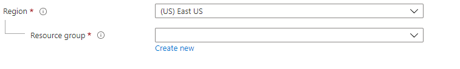

<a name="microsoft-common-resourcegroupselector"></a>
# Microsoft.Common.ResourceGroupSelector
* [Microsoft.Common.ResourceGroupSelector](#microsoft-common-resourcegroupselector)
    * [Description](#microsoft-common-resourcegroupselector-description)
    * [Guidance](#microsoft-common-resourcegroupselector-guidance)
    * [Definitions:](#microsoft-common-resourcegroupselector-definitions)
    * [UI Sample](#microsoft-common-resourcegroupselector-ui-sample)
    * [Sample Snippet](#microsoft-common-resourcegroupselector-sample-snippet)
    * [Sample output](#microsoft-common-resourcegroupselector-sample-output)

<a name="microsoft-common-resourcegroupselector-description"></a>
## Description
Individual scope picker for resource groups, supports creating a new resource group, using an existing one or both
<a name="microsoft-common-resourcegroupselector-guidance"></a>
## Guidance
Use it only for advanced scenarios. For a consistent experience, use the [Resource scope control](dx-control-Microsoft.Common.ResourceScope.md) wherever possible instead. <p/> To deploy to resourcegroup scope, note that the ARM template must be defined with the resource group schema type - [Deploy resources to resource groups - Azure Resource Manager | Microsoft Docs](https://docs.microsoft.com/en-us/azure/azure-resource-manager/templates/deploy-to-resource-group?tabs=azure-cli#schema)
<a name="microsoft-common-resourcegroupselector-definitions"></a>
## Definitions:
<a name="microsoft-common-resourcegroupselector-definitions-an-object-with-the-following-properties"></a>
##### An object with the following properties
| Name | Required | Description
| ---|:--:|:--:|
|name|True|Name of the instance.
|visible|False|When visible is evaluated to *true* then the control will be displayed, otherwise it will be hidden.  Default value is **true**.
|fx.feature|False|
<<<<<<< HEAD
|scope|True|Scope is defined using the subscriptionId property.
|type|True|Enum permitting the value: "Microsoft.Common.ResourceGroupSelector"
|allowedMode|False|Can be "CreateNew", "UseExisting" or "Both"."UseExisting" mode hides "Create new" for resource group and removes region in the basics tab.
|allowExisting|False|Specifies whether using an existing resource group would be allowed. If set to false, a new resource group would need to be created.
|constraints|False|See [here](dx-resourceConstraints-validations.md) for more on constraints.
<a name="microsoft-common-resourcegroupselector-ui-sample"></a>
## UI Sample
  
<a name="microsoft-common-resourcegroupselector-sample-snippet"></a>
## Sample Snippet

```json
{
    "type":"Microsoft.Common.ResourceGroupSelector",
    "name": "resourceGroup",
    "allowedMode": "Both",
    "scope": {
        "subscriptionId": "[steps('basics').subscription.subscriptionId]"
    }
}

```
<a name="microsoft-common-resourcegroupselector-sample-output"></a>
## Sample output
  The ResourceGroupSelector returns an object with the following properties as the output:

```typescript
    /**
    * The mode of the dropdown, create new or use existing.
    */
    mode: SelectedMode;
    /**
    * The ARM value for the resource group.
    */
    value: ResourceGroup;
```

The modes possible(defined by the <code>SelectedMode</code>interface) is as follows:
```typescript
            /**
             * The modes possible for the dropdown.
             */
            const enum Mode {
                UseExisting = 0,
                CreateNew = 1,
            }
```

The <code>ResourceGroup</code> interface is defined as:
```typescript
interface ResourceGroup {
        /**
         * Resource group location.
         */
        location: string;
        /**
         * Resource group name.
         */
        name: string;
        /**
         * Resource group provisioning state.
         */
        provisioningState?: string;
        /**
         * The resource id of the resource group. e.g. /subscriptions/123/resourceGroups/${this.name}
         * Available with the fx resource group dropdown.
         */
        resourceId?: string;
    }
```

=======
|scope|True|
|type|True|
|allowedMode|False|
|allowExisting|False|
|constraints|False|
>>>>>>> dev
