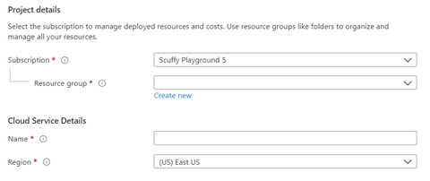

<a name="microsoft-common-resourcescope"></a>
# Microsoft.Common.ResourceScope
* [Microsoft.Common.ResourceScope](#microsoft-common-resourcescope)
    * [Description](#microsoft-common-resourcescope-description)
    * [Guidance](#microsoft-common-resourcescope-guidance)
    * [Definitions:](#microsoft-common-resourcescope-definitions)
    * [UI Sample](#microsoft-common-resourcescope-ui-sample)
    * [Sample Snippet](#microsoft-common-resourcescope-sample-snippet)
        * [ResourceScope control with all possible customizations](#microsoft-common-resourcescope-sample-snippet-resourcescope-control-with-all-possible-customizations)
    * [Sample output](#microsoft-common-resourcescope-sample-output)

<a name="microsoft-common-resourcescope-description"></a>
## Description
ResourceScope control provides resource scope selectors and resource name field as one control.
<a name="microsoft-common-resourcescope-guidance"></a>
## Guidance
Applicable to **deployment scenario only**.

Microsoft.Common.ResourceScope control **has to be included** into your Form view if you are implementing top level resource deployment scenario. This control should be included as a **first element** in your **first step** in steps section.

ResourceScope control provides resource scope selectors and resource name field as one control. ResourceScope will parse your deployment template and show the proper scope selectors along with the resource name textbox. Resource name is included in all scenarios.

| Level of the deployment | Selectors included |
| --- | --- |
| Resource group | subscription/resourceGroup/location |
| Subscription | subscription and location |
| Management group | managementGroup and location |
| Tenant | location picker only, deployment will be run within current tenant |

The ResourceScope control will change based on the scope schema defined in the ARM template - these are supported scopes:
- [Resource Group - Deploy resources to resource groups - Azure Resource Manager | Microsoft Docs](https://docs.microsoft.com/en-us/azure/azure-resource-manager/templates/deploy-to-resource-group?tabs=azure-cli#schema)
- [Subscription - Deploy resources to subscription - Azure Resource Manager | Microsoft Docs](https://docs.microsoft.com/en-us/azure/azure-resource-manager/templates/deploy-to-subscription?tabs=azure-cli#schema)
- [Management Group - Deploy resources to management group - Azure Resource Manager | Microsoft Docs](https://docs.microsoft.com/en-us/azure/azure-resource-manager/templates/deploy-to-management-group?tabs=azure-cli#schema)
- [Tenant - Deploy resources to tenant - Azure Resource Manager | Microsoft Docs](https://docs.microsoft.com/en-us/azure/azure-resource-manager/templates/deploy-to-tenant?tabs=azure-cli#schema)
 
<a name="microsoft-common-resourcescope-definitions"></a>
## Definitions:
<a name="microsoft-common-resourcescope-definitions-an-object-with-the-following-properties"></a>
##### An object with the following properties
| Name | Required | Description
| ---|:--:|:--:|
|name|True|Name of the instance.
|type|True|Enum permitting the  value: "Microsoft.Common.ResourceScope".
|kind|False|enum "ResourceGroup", "Subscription", "ManagementGroup", "Tenant"
|globalResource|False|Region to show `Global` if set to `true` and shown in a textbox.  Default is `false`.
|instanceDetailsLabel|False|Customized text for the instance details section label
|subscription|False|See [here](dx-resourceScopeControl-resourceScopeSubscription.md) for more on the subscription property
|resourceGroup|False|See [here](dx-resourceScopeControl-resourceScopeResourceGroup.md) for more on the resourceGroup property
|resourceName|False|See [here](dx-resourceScopeControl-resourceScopeResourceName.md) for more on the resourceName property
|location|False|See [here](dx-resourceScopeControl-resourceScopeLocation.md) for more on the location property
|fx.feature|False|
<a name="microsoft-common-resourcescope-ui-sample"></a>
## UI Sample
  
<a name="microsoft-common-resourcescope-sample-snippet"></a>
## Sample Snippet
  ### Default ResourceScope control
```json
{
  "name": "resourceScope",
  "type": "Microsoft.Common.ResourceScope"
}
```

 
<a name="microsoft-common-resourcescope-sample-snippet-resourcescope-control-with-all-possible-customizations"></a>
### ResourceScope control with all possible customizations
```json
{
  "name": "resourceScope",
  "type": "Microsoft.Common.ResourceScope",
  "instanceDetailsLabel": "Cloud Service Details",
  "subscription": {
     "constraints": {
        "validations": [
           {
             "isValid": "[equals(1,1)]",
             "message": "invalid subscription selection"
           },
           {
             "permission": "Microsoft.Network/applicationGateways/read",
             "message": "User does not have permission on this Subscription"
           }
        ]
      },
      "resourceProviders": [
         "Microsoft.Compute"
      ]
  },
  "resourceGroup": {
     "constraints": {
        "validations": [
           {
              "isValid": "[equals(1,1)]",
              "message": "invalid resource group selection"
           }
        ]
     },
     "allowExisting": true
  },
  "resourceName": {
     "label": "Name",
     "toolTip": "Use only allowed characters",
     "constraints": {
        "validations": [
           {
              "isValid": "[equals(1,1)]",
              "message": "invalid resource group selection"
           },
           {
              "regex": "^[a-z0-9A-Z]{1,30}$",
              "validationMessage": "invalid resource name"
           }
        ]
     }
  },
  "location": {
     "label": "Name",
     "toolTip": "Use only allowed characters",
     "resourceTypes": [
        "Microsoft.Compute/virtualMachines"
     ],
     "allowedValues": [
        "eastus",
        "westus2"
     ]
  }
}
```

<a name="microsoft-common-resourcescope-sample-output"></a>
## Sample output
  ResourceScope control exposes the following outputs that could be used across your Form view.

| Assuming your Form view contains steps where the name of the first step is &quot;step1&quot; and the name of ResourceScope control is &quot;resourceScope&quot; | Sample Value |
| --- | --- |
| [steps(&#39;step1&#39;).resourceScope.resourceGroup.id] | /subscriptions/12345678-100d-43cf-8dc4-1ce6ba8efa7d/resourceGroups/testrg |
| [steps(&#39;step1&#39;).resourceScope.resourceGroup.name] | testrg |
| [steps(&#39;step1&#39;).resourceScope.resourceGroup.location] | eastus |
| [steps(&#39;step1&#39;).resourceScope.resourceGroup.mode] | New or Existing |
| [steps(&#39;step1&#39;).resourceScope.subscription.id] | /subscriptions/12345678-100d-43cf-8dc4-1ce6ba8efa7d |
| [steps(&#39;step1&#39;).resourceScope.subscription.subscriptionId] | 12345678-100d-43cf-8dc4-1ce6ba8efa7d |
| [steps(&#39;step1&#39;).resourceScope.subscription.displayName] | Scuffy Playground 1 |
| [steps(&#39;step1&#39;).resourceScope.subscription.tenantId] | 12345678-100d-43cf-8dc4-1ce6ba8efa7d
 |
| [steps(&#39;step1&#39;).resourceScope.managementGroup.id] | /providers/Microsoft.Management/managementGroups/testmg |
| [steps(&#39;step1&#39;).resourceScope.managementGroup.name] | testmg |
| [steps(&#39;step1&#39;).resourceScope.managementGroup. displayName] | Test management group |
| [steps(&#39;step1&#39;).resourceScope.location.name] | eastus |
| [steps(&#39;step1&#39;).resourceScope.location.displayName] | (US) East US |
| [steps(&#39;step1&#39;).resourceScope.resourceName] | testResource |

For ResourceScopeDataModel.ResourceGroupOutput, the 'modeName' property maps numeric 'mode' value to string literal 'Existing' | 'New'. Example snippet:
```json
{
    "location": {
        "label": "New resource group location",
        "visible": "[equals('New', steps('basics').resourceScope.resourceGroup.modeName)]",
    },
}
```

