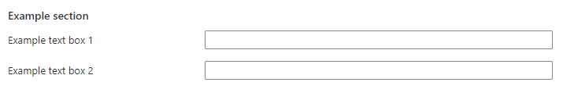

<a name="microsoft-common-section"></a>
# Microsoft.Common.Section
* [Microsoft.Common.Section](#microsoft-common-section)
    * [Description](#microsoft-common-section-description)
    * [Guidance](#microsoft-common-section-guidance)
    * [Definitions:](#microsoft-common-section-definitions)
    * [UI Sample](#microsoft-common-section-ui-sample)
    * [Sample Snippet](#microsoft-common-section-sample-snippet)
    * [Sample output](#microsoft-common-section-sample-output)

<a name="microsoft-common-section-description"></a>
## Description
The Section component enables a user to group other controls into a section.
<a name="microsoft-common-section-guidance"></a>
## Guidance
- `elements` must have at least one element, and can have all element types except `Microsoft.Common.Section`.
This element doesn't support the `toolTip` property.
 
<a name="microsoft-common-section-definitions"></a>
## Definitions:
<a name="microsoft-common-section-definitions-an-object-with-the-following-properties"></a>
##### An object with the following properties
| Name | Required | Description
| ---|:--:|:--:|
|name|True|Name of the section.
|type|True|Enum permitting the value: "Microsoft.Common.Section"
|label|True|Display name of the section.
|elements|True|Array of other supported controls except for the Microsoft.Common.Section control
|visible|False|Specify the visibility of the element. Value can be a boolean or an expression(string)
|fx.feature|False|
<a name="microsoft-common-section-ui-sample"></a>
## UI Sample
  
<a name="microsoft-common-section-sample-snippet"></a>
## Sample Snippet

```json
// Enclosing comment
{
    "name": "section1",
    "type": "Microsoft.Common.Section",
    "label": "Example section",
    "elements": [
      {
        "name": "text1",
        "type": "Microsoft.Common.TextBox",
        "label": "Example text box 1"
      },
      {
        "name": "text2",
        "type": "Microsoft.Common.TextBox",
        "label": "Example text box 2"
      }
    ],
    "visible": true
}
// Enclosing comment

```
<a name="microsoft-common-section-sample-output"></a>
## Sample output
  # output

The section control has no output. You can reference any controls configured within the section control as shown in the example below -

```json
steps('configuration').section1.text1
```

