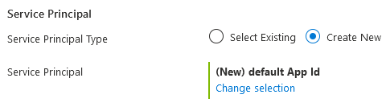
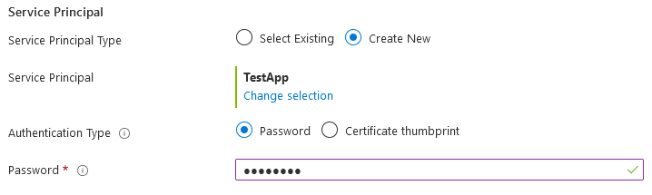
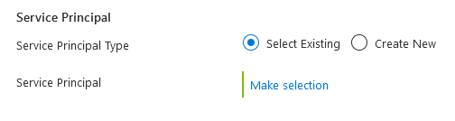

You can use a default application, create a new application, or use an existing application.

### Use default application or create new

The default view is determined by the values in the `defaultValue` property and the **Service Principal Type** is set to **Create New**. If the `principalId` property contains a valid globally unique identifier (GUID), the control searches for the application's `objectId`. The default value applies if the user doesn't make a selection from the control.

If you want to register a new application, select **Change selection** and the **Register an application dialog box** is displayed. Enter **Name**, **Supported account type**, and select the **Register** button.

After you register a new application, use the **Authentication Type** to enter a password or certificate thumbprint.

### Use existing application

To use an existing application, choose **Select Existing** and then select **Make selection**. Use the **Select an application** dialog box to search for the application's name. From the results, select the the application and then the **Select** button. After you select an application, the control displays the **Authentication Type** to enter a password or certificate thumbprint.

