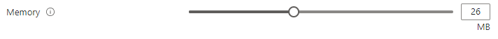
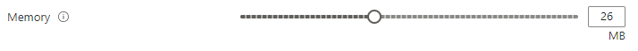

<a name="microsoft-common-slider"></a>
# Microsoft.Common.Slider
* [Microsoft.Common.Slider](#microsoft-common-slider)
    * [Description](#microsoft-common-slider-description)
    * [Definitions:](#microsoft-common-slider-definitions)
    * [UI Sample](#microsoft-common-slider-ui-sample)
    * [Sample Snippet](#microsoft-common-slider-sample-snippet)

<a name="microsoft-common-slider-description"></a>
## Description
The Slider control lets users select from a range of allowed values.
<a name="microsoft-common-slider-definitions"></a>
## Definitions:
<a name="microsoft-common-slider-definitions-an-object-with-the-following-properties"></a>
##### An object with the following properties
| Name | Required | Description
| ---|:--:|:--:|
|name|True|The name of the instance
|type|True|Enum permitting the value: "Microsoft.Common.Slider"
|label|True|Display text for the control
|subLabel|False|Defines the text to be displayed under the label that is showing the current value of the slider
|defaultValue|False|The initial value to set the slider to before any selection or toggling has occurred
|toolTip|False|Text to display when hovering over the tooltip icon. Tooltip icon will only be displayed if text is a non-empty value.
|showStepMarkers|False|Specifies whether to display step markers on the slider control. The <code>showStepMarkers</code> property defaults to true. The step markers are only shown when the range from min to max is 100 or less. See below for a UI example of this property.
|min|True|Sets the start point for the slider
|max|True|Sets the end point for the slider
|constraints|False|Specifies whether there are constraints on this object. There are no customizable constraints for the Slider control, thus the value set for the <code>constraints</code> property is inconsequential
|visible|False|If **true** the control will display, otherwise it will be hidden.
|fx.feature|False|
<a name="microsoft-common-slider-ui-sample"></a>
## UI Sample
  
  
<a name="microsoft-common-slider-sample-snippet"></a>
## Sample Snippet
How to specify a Slider
```json

{
"name": "memorySize",
"type": "Microsoft.Common.Slider",
"min": 1,
"max": 64,
"label": "Memory",
"subLabel": "MB",
"defaultValue": 26,
"showStepMarkers": false,
"toolTip": "Pick the size in MB",
"constraints": {
  "required": false
},
"visible": true
}

```
