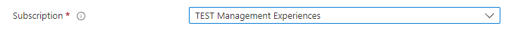

<a name="microsoft-common-subscriptionselector"></a>
# Microsoft.Common.SubscriptionSelector
* [Microsoft.Common.SubscriptionSelector](#microsoft-common-subscriptionselector)
    * [Description](#microsoft-common-subscriptionselector-description)
    * [Definitions:](#microsoft-common-subscriptionselector-definitions)
    * [UI Sample](#microsoft-common-subscriptionselector-ui-sample)
    * [Sample Snippet](#microsoft-common-subscriptionselector-sample-snippet)

<a name="microsoft-common-subscriptionselector-description"></a>
## Description
The subscription selector element lets user to select subscription from subscriptions list
<a name="microsoft-common-subscriptionselector-definitions"></a>
## Definitions:
<a name="microsoft-common-subscriptionselector-definitions-an-object-with-the-following-properties"></a>
##### An object with the following properties
| Name | Required | Description
| ---|:--:|:--:|
|name|True|Name of the instance.
|visible|False|When visible is evaluated to *true* then the control will be displayed, otherwise it will be hidden.  Default value is **true**.
|fx.feature|False|
|type|True|Enum permitting the value: "Microsoft.Common.SubscriptionSelector".
|resourceProviders|False|Array of resource providers items such as "Microsoft.Compute". A check is performed to ensure the resource provider is registered for the selected subscription.
|constraints|False|See [here](dx-resourceConstraints-validations.md) for more on constraints.
<a name="microsoft-common-subscriptionselector-ui-sample"></a>
## UI Sample
  
<a name="microsoft-common-subscriptionselector-sample-snippet"></a>
## Sample Snippet
  ```json
{
    "type": "Microsoft.Common.SubscriptionSelector",
    "name": "subscription",
    "resourceProviders": [
        "Microsoft.BotService",
        "Microsoft.KeyVault"
    ]
}
```

