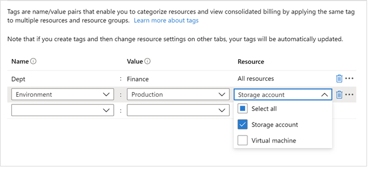

<a name="microsoft-common-tagsbyresource"></a>
# Microsoft.Common.TagsByResource
* [Microsoft.Common.TagsByResource](#microsoft-common-tagsbyresource)
    * [Description](#microsoft-common-tagsbyresource-description)
    * [Guidance](#microsoft-common-tagsbyresource-guidance)
        * [Example Usage](#microsoft-common-tagsbyresource-guidance-example-usage)
    * [Definitions:](#microsoft-common-tagsbyresource-definitions)
    * [UI Sample](#microsoft-common-tagsbyresource-ui-sample)
    * [Sample Snippet](#microsoft-common-tagsbyresource-sample-snippet)
    * [Sample output](#microsoft-common-tagsbyresource-sample-output)

<a name="microsoft-common-tagsbyresource-description"></a>
## Description
A control for associating [tags](https://learn.microsoft.com/azure/azure-resource-manager/management/tag-resources?tabs=json) with the resources in a deployment.
<a name="microsoft-common-tagsbyresource-guidance"></a>
## Guidance
It is recommended that the TagsByResource be used in its own `Tags` tab and that the `Tags` tab be the final tab of the Create form. This recommendation is to ensure consistency with the Create pattern for Azure Portal.

<a name="microsoft-common-tagsbyresource-guidance-example-usage"></a>
### Example Usage

- The output of the control is formatted for easy assignment of tag values in an Azure Resource Manager template. To receive the control's output in a template, include a parameter in your template as shown in the following example:

```json
"parameters": {
  "tagsByResource": { "type": "object", "defaultValue": {} }
}
```

For each resource that can be tagged, assign the tags property to the parameter value for that resource type:

```json
{
  "name": "saName1",
  "type": "Microsoft.Storage/storageAccounts",
  "tags": "[ if(contains(parameters('tagsByResource'), 'Microsoft.Storage/storageAccounts'), parameters('tagsByResource')['Microsoft.Storage/storageAccounts'], json('{}')) ]",
  ...
```

- Use the [if](https://learn.microsoft.com/azure/azure-resource-manager/templates/template-functions-logical#if) function when accessing the tagsByResource parameter. It enables you to assign an empty object when no tags are assigned to the given resource type.

<a name="microsoft-common-tagsbyresource-definitions"></a>
## Definitions:
<a name="microsoft-common-tagsbyresource-definitions-an-object-with-the-following-properties"></a>
##### An object with the following properties
| Name | Required | Description
| ---|:--:|:--:|
|name|True|The name of the instance
|type|True|Enum permitting the value: "Microsoft.Common.TagsByResource"
|label|False|Display text for the control
|resources|True|Each element in <code>resources</code> must be a fully qualified resource type. These elements appear in the **Resource** dropdown, and are taggable by the user. At least one item must be specified in the <code>resources</code> array. For more about <code>resources</code> see the **Guidance** section.
|constraints|False|Specifies whether there are constraints on this object. There are no customizable constraints for the TagsByResource control, thus the value set for the <code>constraints</code> property is inconsequential
|visible|False|If **true** the control will display, otherwise it will be hidden.
|fx.feature|False|
<a name="microsoft-common-tagsbyresource-ui-sample"></a>
## UI Sample
  
<a name="microsoft-common-tagsbyresource-sample-snippet"></a>
## Sample Snippet
How to specify a TagsByResource
```json

{
"name": "element1",
"type": "Microsoft.Common.TagsByResource",
"resources": [
  "Microsoft.Storage/storageAccounts",
  "Microsoft.Compute/virtualMachines"
]
}

```
<a name="microsoft-common-tagsbyresource-sample-output"></a>
## Sample output
Sample output of the TagsByResource example defined in the code snippet above
```json

{
"Microsoft.Storage/storageAccounts": {
  "Dept": "Finance",
  "Environment": "Production"
},
"Microsoft.Compute/virtualMachines": {
  "Dept": "Finance"
}
}

```
