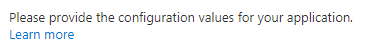

<a name="microsoft-common-textblock"></a>
# Microsoft.Common.TextBlock
* [Microsoft.Common.TextBlock](#microsoft-common-textblock)
    * [Description](#microsoft-common-textblock-description)
    * [Definitions:](#microsoft-common-textblock-definitions)
    * [UI Sample](#microsoft-common-textblock-ui-sample)
    * [Sample Snippet](#microsoft-common-textblock-sample-snippet)

<a name="microsoft-common-textblock-description"></a>
## Description
A control that can be used to add text to the portal interface. This control is a read only control that does not take any input and renders text.
<a name="microsoft-common-textblock-definitions"></a>
## Definitions:
<a name="microsoft-common-textblock-definitions-an-object-with-the-following-properties"></a>
##### An object with the following properties
| Name | Required | Description
| ---|:--:|:--:|
|name|True|Name of the instance.
|type|True|Enum permitting the value: "Microsoft.Common.TextBlock".
|options|True|See [here](dx-control-Microsoft.Common.TextBlock-options.md) for more on options.
|visible|False|When visible is evaluated to *true* then the control will be displayed, otherwise it will be hidden.  Default value is **true**.
|fx.feature|False|
<a name="microsoft-common-textblock-ui-sample"></a>
## UI Sample
  
<a name="microsoft-common-textblock-sample-snippet"></a>
## Sample Snippet
  ```json
{
    "name": "text1",
    "type": "Microsoft.Common.TextBlock",
    "visible": true,
    "options": {
        "text": "Please provide the configuration values for your application.",
        "link": {
            "label": "Learn more",
            "uri": "https://www.microsoft.com"
        }
    }
}
```

## Sample output
  ```json
"Please provide the configuration values for your application. Learn more"
```

