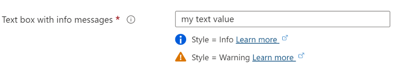

<a name="microsoft-common-textbox"></a>
# Microsoft.Common.TextBox
* [Microsoft.Common.TextBox](#microsoft-common-textbox)
    * [Description](#microsoft-common-textbox-description)
    * [Guidance](#microsoft-common-textbox-guidance)
* [Microsoft.Common.TextBox Guidance](#microsoft-common-textbox-guidance)
    * [Basics](#microsoft-common-textbox-guidance-basics)
    * [When to use](#microsoft-common-textbox-guidance-when-to-use)
    * [Best practices](#microsoft-common-textbox-guidance-best-practices)
    * [Do](#microsoft-common-textbox-guidance-do)
    * [Don't](#microsoft-common-textbox-guidance-don-t)
    * [Developer tips and tricks](#microsoft-common-textbox-guidance-developer-tips-and-tricks)
    * [Related info](#microsoft-common-textbox-guidance-related-info)
    * [Definitions:](#microsoft-common-textbox-guidance-definitions)
    * [UI Sample](#microsoft-common-textbox-guidance-ui-sample)
    * [Sample Snippet](#microsoft-common-textbox-guidance-sample-snippet)
        * [Example 1](#microsoft-common-textbox-guidance-sample-snippet-example-1)
        * [Example 2](#microsoft-common-textbox-guidance-sample-snippet-example-2)
    * [Sample output](#microsoft-common-textbox-guidance-sample-output)
    * [When defaultValue is ""](#microsoft-common-textbox-guidance-when-defaultvalue-is)
    * [When typed "example" into Microsoft.Common.TextBox](#microsoft-common-textbox-guidance-when-typed-example-into-microsoft-common-textbox)

<a name="microsoft-common-textbox-description"></a>
## Description
The TextBox component enables a user to type text into an app. It's typically used to capture a single line of text, but can be configured to capture multiple lines of text. The text displays on the screen in a simple, uniform format.
<a name="microsoft-common-textbox-guidance"></a>
## Guidance

<a name="microsoft-common-textbox-guidance"></a>
# Microsoft.Common.TextBox Guidance

<a name="microsoft-common-textbox-guidance-basics"></a>
### Basics
The TextBox component enables a user to type text into an app. It's typically used to capture a single line of text, but can be configured to capture multiple lines of text. The text displays on the screen in a simple, uniform format.

<a name="microsoft-common-textbox-guidance-when-to-use"></a>
### When to use
Gathering text input is available via multiple controls, choose the one most suited to your needs

**CopyableLabel** - multi-line text input with built-in support for infoBalloonContent and an easy way for user to copy value.

**NumericTextBox** - restricts input to numbers only and built-in support for validations, infoBalloonContent and placeHolderText

**PasswordBox** - text input that uses a * character instead of echoing user input with built-in support for validations, infoBalloonContent and placeHolderText. Use PasswordBox for security sensitive fields.

**TextBox** - single-line text input with built-in support for validations, infoBalloonContent and placeHolderText

**MultilineTextBox** - multi-line text input with built-in support for validations, infoBalloonContent and placeHolderText

<a name="microsoft-common-textbox-guidance-best-practices"></a>
### Best practices
Use the TextBox so the user can enter a line of text

<a name="microsoft-common-textbox-guidance-do"></a>
### Do

* Set the infoBalloonContent to concise, helpful text with a link to learn
* Use placeHolderText for examples of field values
* Use the validations option to help the user input the correct text if a specific format is required
* Use the TextBox to accept data input on a form or page.
* Use the label option to provide a helpful name for the control.
* When part of a form, provide clear designations for which fields are required vs. optional.
* Whenever possible, format TextBox relative to the expected entry (4-digit PIN, 10-digit phone number (3 separate fields), etc).
* When long entries are expected, provide a mechanism for overflow or expansion of the control itself.

<a name="microsoft-common-textbox-guidance-don-t"></a>
### Don&#39;t

* Don’t use a TextBox to render basic copy as part of a body element of a page, put the text on the page or consider the TextBlock instead
* Don’t provide an unlabeled TextBox and expect that users will know what to do with it.

<a name="microsoft-common-textbox-guidance-developer-tips-and-tricks"></a>
### Developer tips and tricks

* To display HTML in the infoBalloonContent use this code

```
  infoBalloonContent: {
      htmlTemplate:"<b>Sample label</b><br>infoBalloonContent should explain concepts and <br>can include a link to learn more.<a>Learn
      more about infoBalloon</a>",
      viewModel: {},
  }
```

<a name="microsoft-common-textbox-guidance-related-info"></a>
### Related info

* [TextBox in Azure Portal Toolkit (Figma)](https://www.figma.com/file/Bwn8rmUOYtnPRwA3JoQTBn/Azure-Portal-Toolkit?node-id=3025%3A378138)
* [Azure design guidance](http://aka.ms/portalfx/design)
 
<a name="microsoft-common-textbox-guidance-definitions"></a>
## Definitions:
<a name="microsoft-common-textbox-guidance-definitions-an-object-with-the-following-properties"></a>
##### An object with the following properties
| Name | Required | Description
| ---|:--:|:--:|
|name|True|Name of the instance.
|type|True|Enum permitting the value: "Microsoft.Common.TextBox"
|label|True|Display name for an instance
|subLabel|False|Display text below the textbox.  This text is right-aligned with the textbox.
|infoMessages|False|The infoMessages are displayed below the control as inline messages. The infoMessages object has three properties: <code>style</code>, <code>text</code>, and <code>uri</code>. <code>infoMessages.style</code> and <code>infoMessages.text</code> are required values, while <code>infoMessages.uri</code> is not required. <br><br>1) <code>infoMessages.style</code> defines the style of the info message. Allowed values are **Info**, and **Warning**. <br><br>2) <code>infoMessages.text</code> defines the display text for the info message. <br><br>3) <code>infoMessages.uri</code> defines the resource to link to. 
|defaultValue|False|Default value shown in the TextBox. Default value also supports re-setting the default value if `defaultValue.resetTrigger` is evaluated as **true**.
|placeholder|False|A help text that disappears when the user begins editing. If the placeholder and defaultValue are both defined, the defaultValue takes precedence and is shown.
|toolTip|False|To display text about the element when the mouse cursor is hovered over the information symbol.
|constraints|False|See [here](dx-textBoxConstraints.md) for more on constraints.
|visible|False|Specify the visibility of the element. Value can be a boolean or an expression(string)
|multiLine|False|boolean, true or false. To use a multi-line text box, set the property to true. If a multi-line text-box isn't needed, set the property to false or exclude the property. For new lines, JSON output shows \n for the line feed. The multi-line text box accepts \r for a carriage return (CR) and \n for a line feed (LF). For example, a default value can include \r\n to specify CRLF.
|readOnly|False|boolean, true or false. If 'true' user cannot edit content of TextBox. Does not apply if multi-line is enabled.
|fx.feature|False|
<a name="microsoft-common-textbox-guidance-ui-sample"></a>
## UI Sample
  
  
  
<a name="microsoft-common-textbox-guidance-sample-snippet"></a>
## Sample Snippet
  
<a name="microsoft-common-textbox-guidance-sample-snippet-example-1"></a>
### Example 1

```json
{
    "name": "vmName",
    "type": "Microsoft.Common.TextBox",
    "label": "Application name",
    "toolTip": "Assign a name to your Azure application",
    "defaultValue": "",
    "constraints": {
        "required": true,
        "regex": "[a-z][a-z0-9-]{2,5}[a-z0-9]$",
        "validationMessage": "Must be 3-5 characters."
    }
}
```

<a name="microsoft-common-textbox-guidance-sample-snippet-example-2"></a>
### Example 2

```json
{
  "name": "nameInstance",
  "type": "Microsoft.Common.TextBox",
  "label": "Name",
  "defaultValue": "contoso123",
  "toolTip": "Use only allowed characters",
  "placeholder": "",
  "multiLine": false,
  "constraints": {
    "required": true,
    "validations": [
      {
        "regex": "^[a-z0-9A-Z]{1,30}$",
        "message": "Only alphanumeric characters are allowed, and the value must be 1-30 characters long."
      },
      {
        "isValid": "[startsWith(steps('resourceConfig').nameInstance, 'contoso')]",
        "message": "Must start with 'contoso'."
      }
    ]
  },
  "visible": true
}
```

<a name="microsoft-common-textbox-guidance-sample-output"></a>
## Sample output
  
<a name="microsoft-common-textbox-guidance-when-defaultvalue-is"></a>
## When defaultValue is &quot;&quot;

```json
""
```

<a name="microsoft-common-textbox-guidance-when-typed-example-into-microsoft-common-textbox"></a>
## When typed &quot;example&quot; into Microsoft.Common.TextBox

```json
"example"
```

