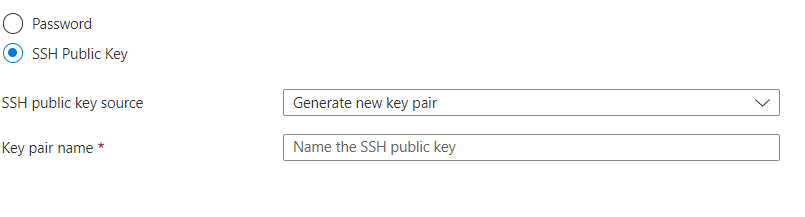
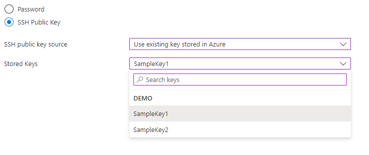
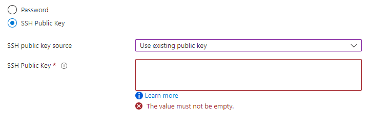
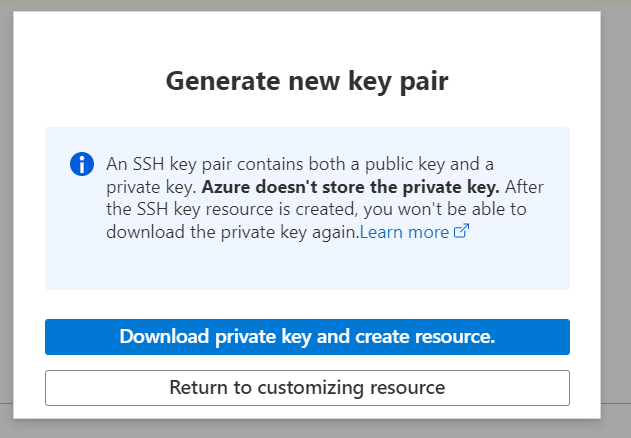

<a name="supported-scenarios-for-ssh-key-pair-generation"></a>
#### Supported Scenarios for SSH Key-Pair Generation

1.	Generate new key-pair
    <figure>
        
    </figure>
2.	Use existing key stored in Azure.
    <figure>
        
    </figure>
3.	Use existing public key.
    <figure>
        
    </figure>

Users will be able to inject the SSH public key into an ARM Template at the end of each of these scenarios. Assuming the name of the CredentialsCombo control is <code>credentialsCombo</code> and the name of the step the control is in is <code>sshKeys</code>, the SSH public key parameter to be injected should be mapped as:
```json
    {
    "$schema": "<relative-path-to-Dx-Schema>",
    "view": {
        "kind": "Form",
        "properties": {
            "title": "Sample Form for SSH Key-Pair Generation",
            "steps": [
                {
                    "name": "basics",
                    "label": "Basics",
                    "elements": [
                        {
                            "name": "resourceScope",
                            "type": "Microsoft.Common.ResourceScope"
                        }
                    ]
                },
                {
                    "name": "sshKeys",
                    "label": "SSH Keys",
                    "elements": [
                        {
                            "name": "credentialsCombo",
                            "type": "Microsoft.Compute.CredentialsCombo",
                            "label": {
                                "password": "Password",
                                "confirmPassword": "Confirm password",
                                "sshPublicKey": "Ssh public key",
                                "authenticationType": "Authentication Type"
                            },
                            "toolTip": {
                                "password": ""
                            },
                            "constraints": {
                                "required": true,
                                "customPasswordRegex": "^(?=.*[A-Za-z])(?=.*\\d)[A-Za-z\\d]{12,}$",
                                "customValidationMessage": "The password must be alphanumeric, contain at least 12 characters, and have at least 1 letter and 1 number."
                            },
                            "options": {
                                "hideConfirmation": false,
                                "hidePassword": true
                            },
                            "osPlatform": "Linux",
                            "visible": true
                        }
                    ]
                }
            ],
            "deployment": {
                "parameters": {
                    "sshPublicKey": "[steps('sshKeys').credentialsCombo.sshPublicKey]"
                },
                "template": {
                    "file": "<path-to-ARM-Template>"
                }
            }
        }
    }
}
```

For the 'Generate new key-pair' scenario, when the user clicks on the 'Create' button at the end, a modal dialog(as shown below) will pop-up, that will allow the user to download the private key and kick-off deployment once the key has been successfully downloaded.

<figure>
    
</figure>
