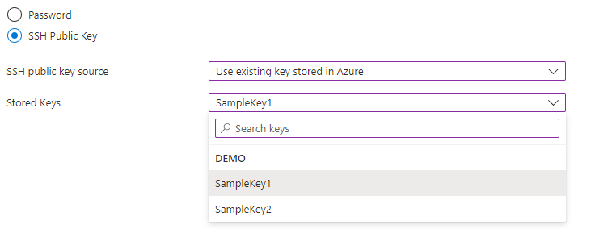

<a name="microsoft-compute-credentialscombo-linux"></a>
# Microsoft.Compute.CredentialsCombo-Linux
* [Microsoft.Compute.CredentialsCombo-Linux](#microsoft-compute-credentialscombo-linux)
    * [Description](#microsoft-compute-credentialscombo-linux-description)
    * [Guidance](#microsoft-compute-credentialscombo-linux-guidance)
    * [Definitions:](#microsoft-compute-credentialscombo-linux-definitions)
    * [UI Sample](#microsoft-compute-credentialscombo-linux-ui-sample)
    * [Sample Snippet](#microsoft-compute-credentialscombo-linux-sample-snippet)
    * [Sample output](#microsoft-compute-credentialscombo-linux-sample-output)

<a name="microsoft-compute-credentialscombo-linux-description"></a>
## Description
A group of controls with built-in validation for passwords and SSH public keys.
<a name="microsoft-compute-credentialscombo-linux-guidance"></a>
## Guidance
<a name="microsoft-compute-credentialscombo-linux-guidance-supported-scenarios-for-ssh-key-pair-generation"></a>
#### Supported Scenarios for SSH Key-Pair Generation

1.	Generate new key-pair
    <figure>
        
    </figure>
2.	Use existing key stored in Azure.
    <figure>
        
    </figure>
3.	Use existing public key.
    <figure>
        
    </figure>

Users will be able to inject the SSH public key into an ARM Template at the end of each of these scenarios. Assuming the name of the CredentialsCombo control is <code>credentialsCombo</code> and the name of the step the control is in is <code>sshKeys</code>, the SSH public key parameter to be injected should be mapped as:
```json
    {
    "$schema": "<relative-path-to-Dx-Schema>",
    "view": {
        "kind": "Form",
        "properties": {
            "title": "Sample Form for SSH Key-Pair Generation",
            "steps": [
                {
                    "name": "basics",
                    "label": "Basics",
                    "elements": [
                        {
                            "name": "resourceScope",
                            "type": "Microsoft.Common.ResourceScope"
                        }
                    ]
                },
                {
                    "name": "sshKeys",
                    "label": "SSH Keys",
                    "elements": [
                        {
                            "name": "credentialsCombo",
                            "type": "Microsoft.Compute.CredentialsCombo",
                            "label": {
                                "password": "Password",
                                "confirmPassword": "Confirm password",
                                "sshPublicKey": "Ssh public key",
                                "authenticationType": "Authentication Type"
                            },
                            "toolTip": {
                                "password": ""
                            },
                            "constraints": {
                                "required": true,
                                "customPasswordRegex": "^(?=.*[A-Za-z])(?=.*\\d)[A-Za-z\\d]{12,}$",
                                "customValidationMessage": "The password must be alphanumeric, contain at least 12 characters, and have at least 1 letter and 1 number."
                            },
                            "options": {
                                "hideConfirmation": false,
                                "hidePassword": true
                            },
                            "osPlatform": "Linux",
                            "visible": true
                        }
                    ]
                }
            ],
            "deployment": {
                "parameters": {
                    "sshPublicKey": "[steps('sshKeys').credentialsCombo.sshPublicKey]"
                },
                "template": {
                    "file": "<path-to-ARM-Template>"
                }
            }
        }
    }
}
```

For the 'Generate new key-pair' scenario, when the user clicks on the 'Create' button at the end, a modal dialog(as shown below) will pop-up, that will allow the user to download the private key and kick-off deployment once the key has been successfully downloaded.

<figure>
    
</figure>

<a name="microsoft-compute-credentialscombo-linux-definitions"></a>
## Definitions:
<a name="microsoft-compute-credentialscombo-linux-definitions-an-object-with-the-following-properties"></a>
##### An object with the following properties
| Name | Required | Description
| ---|:--:|:--:|
<<<<<<< HEAD
|name|True|Name of the instance
|type|True|Enum permitting the value "Microsoft.Compute.CredentialsCombo"
|label|True|Specifies label for the authenticaionType option picker, password textbox as well as the SSH public key textbox (refer to the UI sample section below).
|toolTip|False|Specifies the tooltip properties for the authenticaionType option picker, password textbox as well as teh SSH public key textbox (refer to the UI sample section below).
|constraints|False|
|options|False|<br>1) If <code>options.hideConfirmation</code> is set to true, then the second text box for confirming the user's password is hidden. The default value is false.<br>2) If <code>options.hidePassword</code> is set to true, then the option to use password authentication is hidden. The default value is false.
|osPlatform|True|Must be "Linux"
|visible|False|When visible is evaluated to *true* then the control will be displayed, otherwise it will be hidden.  Default value is **true**.
=======
|name|True|
|type|True|
|label|True|
|toolTip|False|
|defaultValue|False|
|constraints|False|
|options|False|
|osPlatform|True|
|visible|False|
|scope|False|Use scope to define the Subscription, Resource Group name and location that will be applied to control used.
>>>>>>> dev
|fx.feature|False|
<a name="microsoft-compute-credentialscombo-linux-ui-sample"></a>
## UI Sample


<a name="microsoft-compute-credentialscombo-linux-sample-snippet"></a>
## Sample Snippet

```json
{
  "name": "element1",
  "type": "Microsoft.Compute.CredentialsCombo",
  "label": {
    "authenticationType": "Authentication type",
    "password": "Password",
    "confirmPassword": "Confirm password",
    "sshPublicKey": "SSH public key"
  },
  "toolTip": {
    "authenticationType": "",
    "password": "",
    "sshPublicKey": ""
  },
  "constraints": {
    "required": true,
    "customPasswordRegex": "^(?=.*[A-Za-z])(?=.*\\d)[A-Za-z\\d]{12,}$",
    "customValidationMessage": "The password must be alphanumeric, contain at least 12 characters, and have at least 1 letter and 1 number."
  },
  "options": {
    "hideConfirmation": false,
    "hidePassword": false
  },
  "osPlatform": "Linux",
  "visible": true
}
```
<a name="microsoft-compute-credentialscombo-linux-sample-output"></a>
## Sample output
  ##### If the user provided a password instead of an SSH public key, the control returns the following output:

```json
{
  "authenticationType": "password",
  "password": "passwordValue",
}
```
<a name="microsoft-compute-credentialscombo-linux-sample-output-if-the-user-provided-an-ssh-public-key-the-control-returns-the-following-output"></a>
##### If the user provided an SSH public key, the control returns the following output:

```json
{
  "authenticationType": "sshPublicKey",
  /**
   * Set to true if the user opts to generate a new SSH key pair. False for all other scenarios.
   */
  "generateNewSshKey" : false,
   /**
    * The SSH Public key. Set to an empty string if the user opts to generate a new key pair.
    */
  "sshPublicKey": "<ssh-public-key>",
  /**
   * The name of the SSH key pair to be generated if the user opts to generate a new key pair.
   * Set to an empty string for all other scenarios.
   */
  "sshKeyName": "<ssh-key-name>",
}
```

