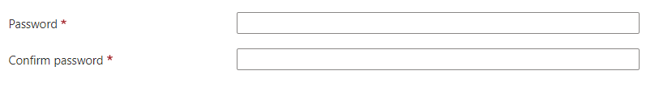

<a name="microsoft-compute-credentialscombo-windows"></a>
# Microsoft.Compute.CredentialsCombo-Windows
* [Microsoft.Compute.CredentialsCombo-Windows](#microsoft-compute-credentialscombo-windows)
    * [Description](#microsoft-compute-credentialscombo-windows-description)
    * [Definitions:](#microsoft-compute-credentialscombo-windows-definitions)
    * [UI Sample](#microsoft-compute-credentialscombo-windows-ui-sample)
    * [Sample Snippet](#microsoft-compute-credentialscombo-windows-sample-snippet)
    * [Sample output](#microsoft-compute-credentialscombo-windows-sample-output)

<a name="microsoft-compute-credentialscombo-windows-description"></a>
## Description
A  controls with built-in validation for passwords.
<a name="microsoft-compute-credentialscombo-windows-definitions"></a>
## Definitions:
<a name="microsoft-compute-credentialscombo-windows-definitions-an-object-with-the-following-properties"></a>
##### An object with the following properties
| Name | Required | Description
| ---|:--:|:--:|
|name|True|Name of the instance.
|type|True|Enum permitting the value "Microsoft.Compute.CredentialsCombo".
|label|True|Specifies labels for the  password and cofirm password textbox  (refer to the UI sample section below).
|toolTip|False|Specifies the tooltip for the  password textbox  (refer to the UI sample section below).
|constraints|False|constraints property object has three properties: required, customPasswordRegex and customValidationMessage. <br>1) If <code>constraints.required</code> is set to true, then the password or SSH public key text boxes must have values to validate successfully. <br>2) <code>constraints.customPasswordRegex</code> specifiesAdditional constraints on the allowed passwords. Default value is null. <br>3) The string in <code>constraints.customValidationMessage</code> is displayed when a password fails custom validation. Default value is null.
|options|False|If <code>options.hideConfirmation</code> is set to true, then the second text box for confirming the user's password is hidden. The default value is false.
|osPlatform|True|Must be "Windows".
|visible|False|When visible is evaluated to *true* then the control will be displayed, otherwise it will be hidden.  Default value is **true**.
|fx.feature|False|
<a name="microsoft-compute-credentialscombo-windows-ui-sample"></a>
## UI Sample
  
<a name="microsoft-compute-credentialscombo-windows-sample-snippet"></a>
## Sample Snippet

```json
{
  "name": "element1",
  "type": "Microsoft.Compute.CredentialsCombo",
  "label": {
    "password": "Password",
    "confirmPassword": "Confirm password"
  },
  "toolTip": {
    "password": ""
  },
  "constraints": {
    "required": true,
    "customPasswordRegex": "^(?=.*[A-Za-z])(?=.*\\d)[A-Za-z\\d]{12,}$",
    "customValidationMessage": "The password must be alphanumeric, contain at least 12 characters, and have at least 1 letter and 1 number."
  },
  "options": {
    "hideConfirmation": false
  },
  "osPlatform": "Windows",
  "visible": true
}
```
<a name="microsoft-compute-credentialscombo-windows-sample-output"></a>
## Sample output
  ##### If the OS Platform is Windows, the control returns the following output:

```json
{
  "authenticationType": "password",
  "password": "passwordValue",
}
```

