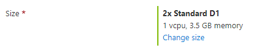
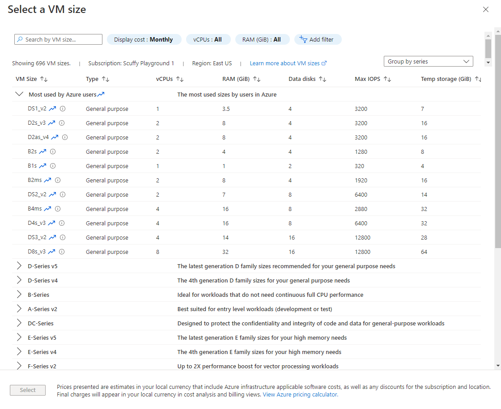

<a name="microsoft-compute-sizeselector"></a>
# Microsoft.Compute.SizeSelector
* [Microsoft.Compute.SizeSelector](#microsoft-compute-sizeselector)
    * [Description](#microsoft-compute-sizeselector-description)
    * [Guidance](#microsoft-compute-sizeselector-guidance)
    * [Definitions:](#microsoft-compute-sizeselector-definitions)
    * [UI Sample](#microsoft-compute-sizeselector-ui-sample)
    * [Sample Snippet](#microsoft-compute-sizeselector-sample-snippet)
    * [Sample output](#microsoft-compute-sizeselector-sample-output)

<a name="microsoft-compute-sizeselector-description"></a>
## Description
A control for selecting a size for one or more virtual machine instances.
<a name="microsoft-compute-sizeselector-guidance"></a>
## Guidance
- `recommendedSizes` should have at least one size. The first recommended size is used as the default. The list of available sizes isn't sorted by the recommended state. The user can select that column to sort by recommended state.
- If a recommended size isn't available in the selected location, the size is automatically skipped. Instead, the next recommended size is used.
- `constraints.allowedSizes` and `constraints.excludedSizes` are both optional, but can't be used simultaneously. The list of available sizes can be determined by calling [List available virtual machine sizes for a subscription](https://docs.microsoft.com/en-us/rest/api/compute/virtualmachines/virtualmachines-list-sizes-region). Any size not specified in the `constraints.allowedSizes` is hidden, and any size not specified in constraints.excludedSizes is shown.
- `osPlatform` must be specified, and can be either **Windows** or **Linux**. It's used to determine the hardware costs of the virtual machines.
- `imageReference` is omitted for first-party images, but provided for third-party images. It's used to determine the software costs of the virtual machines.
- `count` is used to set the appropriate multiplier for the element. It supports a static value, like **2**, or a dynamic value from another element, like `[steps('step1').vmCount]`. The default value is **1**.
- The `numAvailabilityZonesRequired` can be 1, 2, or 3.
- By default, `hideDiskTypeFilter` is **false**. The disk type filter enables the user to see all disk types or only SSD.
 
<a name="microsoft-compute-sizeselector-definitions"></a>
## Definitions:
<a name="microsoft-compute-sizeselector-definitions-an-object-with-the-following-properties"></a>
##### An object with the following properties
| Name | Required | Description
| ---|:--:|:--:|
|name|True|The name of the instance
|type|True|Enum permitting the value: "Microsoft.Common.SizeSelector"
|label|True|Display text for the control
|toolTip|False|Text to display when hovering over the tooltip icon. Tooltip icon will only be displayed if text is a non-empty value.
|recommendedSizes|True|Should have at least one size. The first recommended size is used as the default.
|constraints|False|Define `allowedSizes` or `excludedSizes` filtering
|options|False|The disk type filter enables the user to see all disk types or only SSD. Default is `false`
|osPlatform|True|Can be either `Windows` or `Linux`. It's used to determine the hardware costs of the virtual machines.
|imageReference|False|Omitted for first-party images, but provided for third-party images. It's used to determine the software costs of the virtual machines.
|count|False|Used to set the appropriate multiplier for the element. It supports a static value, like `2`, or a dynamic value from another element, like `[steps('step1').vmCount]`. The default value is `1`.
|visible|False|If **true** the control will display, otherwise it will be hidden.
|scope|True|
|fx.feature|False|
<a name="microsoft-compute-sizeselector-ui-sample"></a>
## UI Sample
  
  
<a name="microsoft-compute-sizeselector-sample-snippet"></a>
## Sample Snippet

```json
// Enclosing comment
{
    "name": "element1",
    "type": "Microsoft.Compute.SizeSelector",
    "label": "Size",
    "toolTip": "",
    "recommendedSizes": [
      "Standard_D1",
      "Standard_D2",
      "Standard_D3"
    ],
    "constraints": {
      "allowedSizes": [],
      "excludedSizes": [],
      "numAvailabilityZonesRequired": 3,
      "zone": "3"
    },
    "options": {
      "hideDiskTypeFilter": false
    },
    "osPlatform": "Windows",
    "imageReference": {
      "publisher": "MicrosoftWindowsServer",
      "offer": "WindowsServer",
      "sku": "2012-R2-Datacenter"
    },
    "count": 2,
    "visible": true
  }
// Enclosing comment

```
<a name="microsoft-compute-sizeselector-sample-output"></a>
## Sample output
  # output

"Standard_D1"

