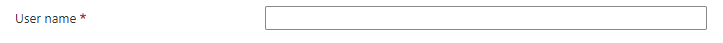

<a name="microsoft-compute-usernametextbox"></a>
# Microsoft.Compute.UserNameTextBox
* [Microsoft.Compute.UserNameTextBox](#microsoft-compute-usernametextbox)
    * [Description](#microsoft-compute-usernametextbox-description)
    * [Guidance](#microsoft-compute-usernametextbox-guidance)
    * [Definitions:](#microsoft-compute-usernametextbox-definitions)
    * [UI Sample](#microsoft-compute-usernametextbox-ui-sample)
    * [Sample Snippet](#microsoft-compute-usernametextbox-sample-snippet)
    * [Sample output](#microsoft-compute-usernametextbox-sample-output)

<a name="microsoft-compute-usernametextbox-description"></a>
## Description
A text box control with built-in validation for Windows and Linux user names.
<a name="microsoft-compute-usernametextbox-guidance"></a>
## Guidance
- If `constraints.required` is set to **true**, then the text box must have a value to validate successfully. The default value is **true**.
- `osPlatform` must be specified, and can be either **Windows** or **Linux**.
- `constraints.regex` is a JavaScript regular expression pattern. If specified, then the text box's value must match the pattern to validate successfully. The default value is **null**.
- `constraints.validationMessage` is a string to display when the text box's value fails the validation specified by `constraints.regex`. If not specified, then the text box's built-in validation messages are used. The default value is **null**.
- This element has built-in validation that is based on the value specified for `osPlatform`. The built-in validation can be used along with a custom regular expression. If a value for `constraints.regex` is specified, then both the built-in and custom validations are triggered.
 
<a name="microsoft-compute-usernametextbox-definitions"></a>
## Definitions:
<a name="microsoft-compute-usernametextbox-definitions-an-object-with-the-following-properties"></a>
##### An object with the following properties
| Name | Required | Description
| ---|:--:|:--:|
|name|True|The name of the instance
|type|True|Enum permitting the value: "Microsoft.Common.UserNameTextBox"
|label|True|Display text for the control
|defaultValue|False|Default text for the control when initially loaded
|toolTip|False|Text to display when hovering over the tooltip icon. Tooltip icon will only be displayed if text is a non-empty value.
|constraints|False|Set `required` indicator and/or configure `regex` validation
|osPlatform|True|Can be either `Windows` or `Linux`
|visible|False|If **true** the control will display, otherwise it will be hidden.
|fx.feature|False|
<a name="microsoft-compute-usernametextbox-ui-sample"></a>
## UI Sample
  
<a name="microsoft-compute-usernametextbox-sample-snippet"></a>
## Sample Snippet

```json
// Enclosing comment
{
    "name": "element1",
    "type": "Microsoft.Compute.UserNameTextBox",
    "label": "User name",
    "defaultValue": "",
    "toolTip": "",
    "constraints": {
      "required": true,
      "regex": "^[a-z0-9A-Z]{1,30}$",
      "validationMessage": "Only alphanumeric characters are allowed, and the value must be 1-30 characters long."
    },
    "osPlatform": "Windows",
    "visible": true
  }
// Enclosing comment

```
<a name="microsoft-compute-usernametextbox-sample-output"></a>
## Sample output
  # output

"Example name"

