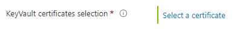
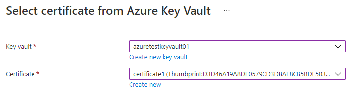
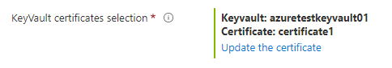

<a name="microsoft-keyvault-keyvaultcertificateselector"></a>
# Microsoft.KeyVault.KeyVaultCertificateSelector
* [Microsoft.KeyVault.KeyVaultCertificateSelector](#microsoft-keyvault-keyvaultcertificateselector)
    * [Description](#microsoft-keyvault-keyvaultcertificateselector-description)
    * [Guidance](#microsoft-keyvault-keyvaultcertificateselector-guidance)
    * [Definitions:](#microsoft-keyvault-keyvaultcertificateselector-definitions)
    * [UI Sample](#microsoft-keyvault-keyvaultcertificateselector-ui-sample)
    * [Sample Snippet](#microsoft-keyvault-keyvaultcertificateselector-sample-snippet)

<a name="microsoft-keyvault-keyvaultcertificateselector-description"></a>
## Description
A control for selecting a key vault certificate.
<a name="microsoft-keyvault-keyvaultcertificateselector-guidance"></a>
## Guidance
Support selecting an existing or new key vault certificate. The `scope.subscriptionId` and `scope.location` are used to filter when selecting an existing key vault certificate.
<a name="microsoft-keyvault-keyvaultcertificateselector-definitions"></a>
## Definitions:
<a name="microsoft-keyvault-keyvaultcertificateselector-definitions-an-object-with-the-following-properties"></a>
##### An object with the following properties
| Name | Required | Description
| ---|:--:|:--:|
|name|True|Name of the instance.
|type|True|Enum permitting the value: "Microsoft.KeyVault.KeyVaultCertificateSelector".
|label|True|Display text for the control
|toolTip|False|Display text when hovered over the tooltip icon
|scope|True|Use `scope` to filter certificates displayed in Select Certificate by `scope.subscriptionId` and `scope.location`
|visible|False|When visible is evaluated to *true* then the control will be displayed, otherwise it will be hidden.  Default value is **true**.
|fx.feature|False|
<a name="microsoft-keyvault-keyvaultcertificateselector-ui-sample"></a>
## UI Sample
  
  
  
<a name="microsoft-keyvault-keyvaultcertificateselector-sample-snippet"></a>
## Sample Snippet
  ```json
{
    "name": "keyVaultCertificateSelection",
    "type": "Microsoft.KeyVault.KeyVaultCertificateSelector",
    "visible": true,
    "toolTip": "Select certificate",
    "scope": {
        "subscriptionId": "[steps('basics').resourceScope.subscription.subscriptionId]",
        "location": "[steps('basics').resourceScope.location.name]"
    },
    "label": "KeyVault certificates selection"
}
```

## Sample output
  ```json
{
    "keyVaultName": "azuretestkeyvault01",
    "keyVaultId": "/subscriptions/0c99b4dc-9110-4f49-add2-35d6edcb9564/resourceGroups/keyvaultrg/providers/Microsoft.KeyVault/vaults/azuretestkeyvault01",
    "certificateName": "certificate1",
    "certificateUrl": "https://azuretestkeyvault01.vault.azure.net/secrets/certificate1/0a52462b834f4fd8938dff5f05d18826",
    "certificateThumbprint": "D3D46A19A8DE0579CD3D8AF8CB5BDF503479E69D"
}
```

