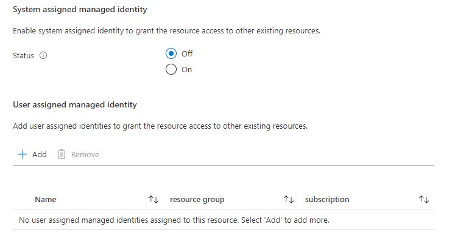
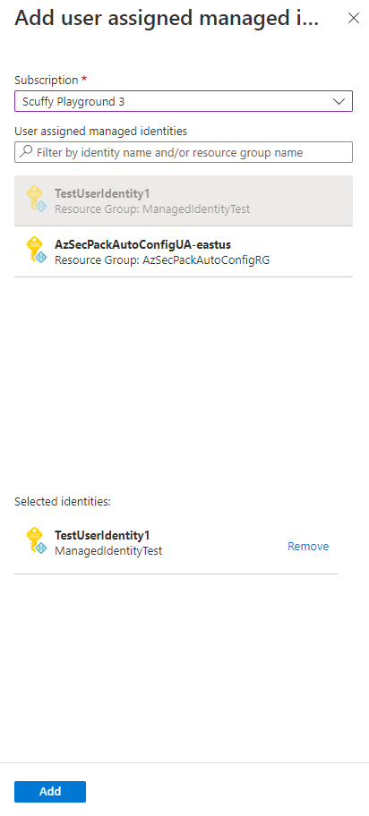
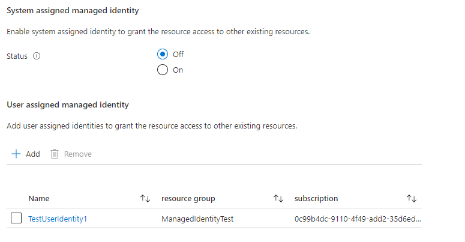

<a name="microsoft-managedidentity-identityselector"></a>
# Microsoft.ManagedIdentity.IdentitySelector
* [Microsoft.ManagedIdentity.IdentitySelector](#microsoft-managedidentity-identityselector)
    * [Description](#microsoft-managedidentity-identityselector-description)
    * [Guidance](#microsoft-managedidentity-identityselector-guidance)
    * [Definitions:](#microsoft-managedidentity-identityselector-definitions)
    * [UI Sample](#microsoft-managedidentity-identityselector-ui-sample)
    * [Sample Snippet](#microsoft-managedidentity-identityselector-sample-snippet)

<a name="microsoft-managedidentity-identityselector-description"></a>
## Description
A control for assigning [managed identities](https://learn.microsoft.com/azure/active-directory/managed-identities-azure-resources/overview) for a resource in a deployment.
<a name="microsoft-managedidentity-identityselector-guidance"></a>
## Guidance
- Use **defaultValue.systemAssignedIdentity** to set an initial value for the system assigned identity options control. The default value is **Off**. The following values are allowed:
    - **On** – A system assigned identity is assigned to the resource.
    - **Off** – A system assigned identity isn't assigned to the resource.
    - **OnOnly** – A system assigned identity is assigned to the resource. Users can't edit this value during deployment.
    - **OffOnly** – A system assigned identity isn't assigned to the resource. Users can't edit this value during deployment.
- If **options.hideSystemAssignedIdentity** is set to **true**, the UI to configure the system assigned identity isn't displayed. The default value for this option is **false**.
- If **options.hideUserAssignedIdentity** is set to **true**, the UI to configure the user assigned identity isn't displayed. The resource isn't assigned a user assigned identity. The default value for this option is **false**.
 
<a name="microsoft-managedidentity-identityselector-definitions"></a>
## Definitions:
<a name="microsoft-managedidentity-identityselector-definitions-an-object-with-the-following-properties"></a>
##### An object with the following properties
| Name | Required | Description
| ---|:--:|:--:|
|name|True|Name of the instance.
|type|True|Enum permitting the value: "Microsoft.ManagedIdentity.IdentitySelector".
|label|True|Display text for the control
|toolTip|False|Display text when hovered over the tooltip icon.  Applicable to `toolTip.systemAssignedIdentity` and `toolTip.userAssignedIdentity`.
|defaultValue|False|Enum permitting the values for [systemAssignedIdentity](./dx-enum-control-IdentitySelector-defaultValue.md) property.
|options|False|See `Guidance` section for details
|visible|False|When visible is evaluated to *true* then the control will be displayed, otherwise it will be hidden.  Default value is **true**.
|fx.feature|False|
<a name="microsoft-managedidentity-identityselector-ui-sample"></a>
## UI Sample
  
  
  
<a name="microsoft-managedidentity-identityselector-sample-snippet"></a>
## Sample Snippet
  ```json
{
    "name": "identity",
    "type": "Microsoft.ManagedIdentity.IdentitySelector",
    "label": "Managed Identity Configuration",
    "toolTip": {
      "systemAssignedIdentity": "Enable system assigned identity to grant the resource access to other existing resources.",
      "userAssignedIdentity": "Add user assigned identities to grant the resource access to other existing resources."
    },
    "defaultValue": {
      "systemAssignedIdentity": "Off"
    },
    "options": {
      "hideSystemAssignedIdentity": false,
      "hideUserAssignedIdentity": false
    },
    "visible": true
}
```

## Sample output
  ```json
{
    "type": "UserAssigned",
    "userAssignedIdentities": {
        "/subscriptions/xxxx/resourceGroups/ManagedIdentityTest/providers/Microsoft.ManagedIdentity/userAssignedIdentities/TestUserIdentity1": {}
    }
}
```

