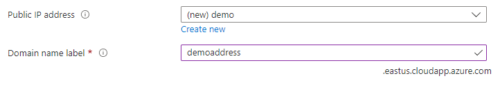

<a name="microsoft-network-publicipaddresscombo"></a>
# Microsoft.Network.PublicIpAddressCombo
* [Microsoft.Network.PublicIpAddressCombo](#microsoft-network-publicipaddresscombo)
    * [Description](#microsoft-network-publicipaddresscombo-description)
    * [Guidance](#microsoft-network-publicipaddresscombo-guidance)
        * [Control UI](#microsoft-network-publicipaddresscombo-guidance-control-ui)
        * [Control output](#microsoft-network-publicipaddresscombo-guidance-control-output)
    * [Definitions:](#microsoft-network-publicipaddresscombo-definitions)
    * [UI Sample](#microsoft-network-publicipaddresscombo-ui-sample)
    * [Sample Snippet](#microsoft-network-publicipaddresscombo-sample-snippet)

<a name="microsoft-network-publicipaddresscombo-description"></a>
## Description
A control that can be used for selecting an existing public IP address or creating a new one.
<a name="microsoft-network-publicipaddresscombo-guidance"></a>
## Guidance
<a name="microsoft-network-publicipaddresscombo-guidance-control-ui"></a>
### Control UI
- If the user selects 'None' for public IP address, the domain name label text box is hidden.
- If the user selects an existing public IP address, the domain name label text box is disabled. Its value is the domain name label of the selected IP address.
- The domain name suffix (for example, westus.cloudapp.azure.com) updates automatically based on the selected location.
<a name="microsoft-network-publicipaddresscombo-guidance-control-output"></a>
### Control output
- When `options.hideNone` is specified as **true**, `newOrExistingOrNone` will only have a value of **new** or **existing**.
- When `options.hideDomainNameLabel` is specified as **true**, `domainNameLabel` is undeclared.
 
<a name="microsoft-network-publicipaddresscombo-definitions"></a>
## Definitions:
<a name="microsoft-network-publicipaddresscombo-definitions-an-object-with-the-following-properties"></a>
##### An object with the following properties
| Name | Required | Description
| ---|:--:|:--:|
|name|True|Name of the instance.
|type|True|Enum permitting the value: "Microsoft.Network.PublicIpAddressCombo".
|label|True|Display text for `label.publicIpAddress` and `label.domainNameLabel`
|toolTip|False|Display text when hovered over the tooltip icon for `publicIpAddress` and `domainNameLabel`.
|defaultValue|False|Default value for `publicIpAddressName` and `domainNameLabel`.
|constraints|False|If `constraints.required.domainNameLabel` is set to **true**, the user must provide a domain name label when creating a new public IP address. Existing public IP addresses without a label aren't available for selection.
|options|False|See [here](dx-control-Microsoft.Network.PublicIpAddressCombo-options.md) for more on options.
|visible|False|When visible is evaluated to *true* then the control will be displayed, otherwise it will be hidden.  Default value is **true**.
|scope|True|See [here](dx-control-formControlScope.md) for more on scope.
|fx.feature|False|
<a name="microsoft-network-publicipaddresscombo-ui-sample"></a>
## UI Sample
  
<a name="microsoft-network-publicipaddresscombo-sample-snippet"></a>
## Sample Snippet
  ```json
{
    "name": "element1",
    "type": "Microsoft.Network.PublicIpAddressCombo",
    "label": {
      "publicIpAddress": "Public IP address",
      "domainNameLabel": "Domain name label"
    },
    "toolTip": {
      "publicIpAddress": "",
      "domainNameLabel": ""
    },
    "defaultValue": {
      "publicIpAddressName": "ip01",
      "domainNameLabel": "mydomain"
    },
    "constraints": {
      "required": {
        "domainNameLabel": true
      }
    },
    "scope": {
        "subscriptionId": "[steps('basics').resourceScope.subscription.subscriptionId]",
        "resourceGroupName": "[steps('basics').resourceScope.resourceGroup.name]",
        "location": "[steps('basics').resourceScope.location.name]"
    },
    "options": {
      "hideNone": false,
      "hideDomainNameLabel": false,
      "hideExisting": false,
      "zone": 3
    },
    "visible": true
}
```

## Sample output
  ```json
{
    "name": "demo",
    "resourceGroup": "TestRG",
    "domainNameLabel": "demoaddress",
    "newOrExistingOrNone": "new",
    "publicIPAllocationMethod": "Dynamic",
    "sku": "Basic"
}
```

