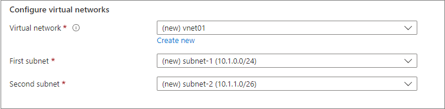
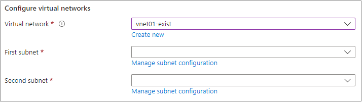

<a name="microsoft-network-virtualnetworkcombo"></a>
# Microsoft.Network.VirtualNetworkCombo
* [Microsoft.Network.VirtualNetworkCombo](#microsoft-network-virtualnetworkcombo)
    * [Description](#microsoft-network-virtualnetworkcombo-description)
    * [Guidance](#microsoft-network-virtualnetworkcombo-guidance)
    * [Definitions:](#microsoft-network-virtualnetworkcombo-definitions)
    * [UI Sample](#microsoft-network-virtualnetworkcombo-ui-sample)
    * [Sample Snippet](#microsoft-network-virtualnetworkcombo-sample-snippet)

<a name="microsoft-network-virtualnetworkcombo-description"></a>
## Description
A group of controls for selecting a new or existing virtual network.
<a name="microsoft-network-virtualnetworkcombo-guidance"></a>
## Guidance
- If specified, the first non-overlapping address prefix of size `defaultValue.addressPrefixSize` is determined automatically based on the existing virtual networks in the user's subscription.
- The default value for `defaultValue.name` and `defaultValue.addressPrefixSize` is **null**.
- `constraints.minAddressPrefixSize` must be specified. Any existing virtual networks with an address space smaller than the specified value are unavailable for selection.
- `subnets` must be specified, and `constraints.minAddressPrefixSize` must be specified for each subnet.
- When creating a new virtual network, each subnet's address prefix is calculated automatically based on the virtual network's address prefix and the respective `addressPrefixSize`.
- When using an existing virtual network, any subnets smaller than the respective `constraints.minAddressPrefixSize` are unavailable for selection. Additionally, if specified, subnets that don't have at least `minAddressCount` available addresses are unavailable for selection. The default value is **0**. To ensure that the available addresses are contiguous, specify **true** for `requireContiguousAddresses`. The default value is **true**.
- Creating subnets in an existing virtual network isn't supported.
- If `options.hideExisting` is **true**, the user can't choose an existing virtual network. The default value is **false**.
 
<a name="microsoft-network-virtualnetworkcombo-definitions"></a>
## Definitions:
<a name="microsoft-network-virtualnetworkcombo-definitions-an-object-with-the-following-properties"></a>
##### An object with the following properties
| Name | Required | Description
| ---|:--:|:--:|
|name|True|Name of the instance.
|type|True|Enum permitting the value: "Microsoft.Network.VirtualNetworkCombo".
|label|True|See [here](dx-control-Microsoft.Network.VirtualNetworkCombo-label.md) for more on labels.
|toolTip|False|Display text when hovered over the tooltip icon.
|defaultValue|False|See [here](dx-control-Microsoft.Network.VirtualNetworkCombo-defaultvalue.md) for more on default values.
|constraints|True|See [here](dx-control-Microsoft.Network.VirtualNetworkCombo-constraints.md) for more on constraints.
|options|False|See [here](dx-control-Microsoft.Network.VirtualNetworkCombo-options.md) for more on options.
|subnets|True|See [here](dx-control-Microsoft.Network.VirtualNetworkCombo-subnets.md) for more on subnets.
|visible|False|When visible is evaluated to *true* then the control will be displayed, otherwise it will be hidden.  Default value is **true**.
|scope|True|See [here](dx-control-formControlScope.md) for more on scope.
|fx.feature|False|
<a name="microsoft-network-virtualnetworkcombo-ui-sample"></a>
## UI Sample
  
  
<a name="microsoft-network-virtualnetworkcombo-sample-snippet"></a>
## Sample Snippet
  ```json
{
    "name": "element1",
    "type": "Microsoft.Network.VirtualNetworkCombo",
    "label": {
      "virtualNetwork": "Virtual network",
      "subnets": "Subnets"
    },
    "toolTip": {
      "virtualNetwork": "",
      "subnets": ""
    },
    "defaultValue": {
      "name": "vnet01",
      "addressPrefixSize": "/16"
    },
    "constraints": {
      "minAddressPrefixSize": "/16"
    },
    "options": {
      "hideExisting": false
    },
    "scope": {
        "subscriptionId": "[steps('basics').resourceScope.subscription.subscriptionId]",
        "resourceGroupName": "[steps('basics').resourceScope.resourceGroup.name]",
        "location": "[steps('basics').resourceScope.location.name]"
    },
    "subnets": {
      "subnet1": {
        "label": "First subnet",
        "defaultValue": {
          "name": "subnet-1",
          "addressPrefixSize": "/24"
        },
        "constraints": {
          "minAddressPrefixSize": "/24",
          "minAddressCount": 12,
          "requireContiguousAddresses": true
        }
      },
      "subnet2": {
        "label": "Second subnet",
        "defaultValue": {
          "name": "subnet-2",
          "addressPrefixSize": "/26"
        },
        "constraints": {
          "minAddressPrefixSize": "/26",
          "minAddressCount": 8,
          "requireContiguousAddresses": true
        }
      }
    },
    "visible": true
  }
```

## Sample output
  ```json
{
    "name": "vnet01",
    "resourceGroup": "ManagedIdentityTest",
    "addressPrefixes": [
        "10.0.0.0/16"
    ],
    "addressPrefix": "10.0.0.0/16",
    "newOrExisting": "new",
    "subnets": {
        "subnet1": {
            "name": "subnet-1",
            "addressPrefix": "10.0.0.0/24",
            "startAddress": "10.0.0.4"
        },
        "subnet2": {
            "name": "subnet-2",
            "addressPrefix": "10.0.1.0/26",
            "startAddress": "10.0.1.4"
        }
    }
}
```

