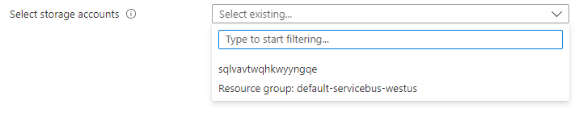

<a name="microsoft-solutions-resourceselector"></a>
# Microsoft.Solutions.ResourceSelector
* [Microsoft.Solutions.ResourceSelector](#microsoft-solutions-resourceselector)
    * [Description](#microsoft-solutions-resourceselector-description)
    * [Guidance](#microsoft-solutions-resourceselector-guidance)
    * [Definitions:](#microsoft-solutions-resourceselector-definitions)
    * [UI Sample](#microsoft-solutions-resourceselector-ui-sample)
    * [Sample Snippet](#microsoft-solutions-resourceselector-sample-snippet)

<a name="microsoft-solutions-resourceselector-description"></a>
## Description
ResourceSelector lets users select an existing resource from a subscription.
<a name="microsoft-solutions-resourceselector-guidance"></a>
## Guidance
- In the `resourceType` property, provide the resource provider namespace and resource type name for the resource you wish to show in the list.
- The `scope` property restricts the available options for the resources. You can restrict the results by location or subscription. To show only resources that match the selection in basics, define the `scope.subscriptionId` and/or `scope.location`. To show all resource, omit `scope` property.
 
<a name="microsoft-solutions-resourceselector-definitions"></a>
## Definitions:
<a name="microsoft-solutions-resourceselector-definitions-an-object-with-the-following-properties"></a>
##### An object with the following properties
| Name | Required | Description
| ---|:--:|:--:|
|name|True|Name of the instance.
|type|True|Enum permitting the value: "Microsoft.Solutions.ResourceSelector".
|label|True|Display text for the control
|toolTip|False|Display text when hovered over the tooltip icon
|resourceType|True|Provide the resource provider namespace and resource type name for the resources you wish to show in the list.
|constraints|False|If `constraints.required` is evaluated to `true`, then it requires user to select at least one item to validate successfully. The default value is `false`.
|visible|False|When visible is evaluated to *true* then the control will be displayed, otherwise it will be hidden.  Default value is **true**.
|scope|False|The `scope` property restricts the available options for the resources. You can restrict the results by location or subscription. To show only resources that match the selection in basics, define the `scope.subscriptionId` and/or `scope.location`. To show all resource, omit `scope` property.
|fx.feature|False|
<a name="microsoft-solutions-resourceselector-ui-sample"></a>
## UI Sample
  
<a name="microsoft-solutions-resourceselector-sample-snippet"></a>
## Sample Snippet
  ```json
{
    "name": "storageSelector",
    "type": "Microsoft.Solutions.ResourceSelector",
    "label": "Select storage accounts",
    "resourceType": "Microsoft.Storage/storageAccounts",
    "toolTip": "Select a storage account",
    "scope": {
        "subscriptionId": "[steps('basics').resourceScope.subscription.subscriptionId]",
        "location": "[steps('basics').resourceScope.location.name]"
    },
    "constraints": {
        "required": true
    },
    "visible": true
}
```

## Sample output
  ```json
{
    "name": "{resource-name}",
    "id": "/subscriptions/{subscription-id}/resourceGroups/{resource-group}/providers/{resource-provider-namespace}/{resource-type}/{resource-name}",
    "location": "{deployed-location}",
    "subscriptionName": "{subscription-name}"
}
```

