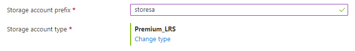

<a name="microsoft-storage-multistorageaccountcombo"></a>
# Microsoft.Storage.MultiStorageAccountCombo
* [Microsoft.Storage.MultiStorageAccountCombo](#microsoft-storage-multistorageaccountcombo)
    * [Description](#microsoft-storage-multistorageaccountcombo-description)
    * [Guidance](#microsoft-storage-multistorageaccountcombo-guidance)
    * [Definitions:](#microsoft-storage-multistorageaccountcombo-definitions)
    * [UI Sample](#microsoft-storage-multistorageaccountcombo-ui-sample)
    * [Sample Snippet](#microsoft-storage-multistorageaccountcombo-sample-snippet)
    * [Sample output](#microsoft-storage-multistorageaccountcombo-sample-output)

<a name="microsoft-storage-multistorageaccountcombo-description"></a>
## Description
A group of controls for creating several storage accounts with names that start with a common prefix.
<a name="microsoft-storage-multistorageaccountcombo-guidance"></a>
## Guidance
- The value for `defaultValue.prefix` is concatenated with one or more integers to generate the sequence of storage account names. For example, if `defaultValue.prefix` is **sa** and `count` is **2**, then storage account names **sa1** and **sa2** are generated. Generated storage account names are validated for uniqueness automatically.
- The storage account names are generated lexicographically based on `count`. For example, if `count` is 10, then the storage account names end with two-digit integers (01, 02, 03).
- The default value for `defaultValue.prefix` is **null**, and for `defaultValue.type` is **Premium_LRS**.
- Any type not specified in `constraints.allowedTypes` is hidden, and any type not specified in `constraints.excludedTypes` is shown. `constraints.allowedTypes` and `constraints.excludedTypes` are both optional, but can't be used simultaneously.
- In addition to generating storage account names, `count` is used to set the appropriate multiplier for the element. It supports a static value, like **2**, or a dynamic value from another element, like `[steps('step1').storageAccountCount]`. The default value is **1**.
 
<a name="microsoft-storage-multistorageaccountcombo-definitions"></a>
## Definitions:
<a name="microsoft-storage-multistorageaccountcombo-definitions-an-object-with-the-following-properties"></a>
##### An object with the following properties
| Name | Required | Description
| ---|:--:|:--:|
|name|True|The name of the instance
|type|True|Enum permitting the value: "Microsoft.Common.MultiStorageAccountCombo"
|label|True|Display text for the control
|toolTip|False|Text to display when hovering over the tooltip icon. Tooltip icon will only be displayed if text is a non-empty value.
|defaultValue|False|Define default value for `prefix` and `type`
|constraints|False|Define `allowedTypes` and `excludedTypes`. Any type not specified in `allowedTypes` is hidden, and any type not specified in `excludedTypes` is shown. `allowedTypes` and `excludedTypes` are both optional, but can't be used simultaneously.
|count|True|Defined the number of storage account to create
|visible|False|If **true** the control will display, otherwise it will be hidden.
|scope|True|Use scope to define the Subscription, Resource Group name and location that will be applied to control used.
|fx.feature|False|
<a name="microsoft-storage-multistorageaccountcombo-ui-sample"></a>
## UI Sample
  
<a name="microsoft-storage-multistorageaccountcombo-sample-snippet"></a>
## Sample Snippet

```json
// Enclosing comment
{
    "name": "element1",
    "type": "Microsoft.Storage.MultiStorageAccountCombo",
    "label": {
      "prefix": "Storage account prefix",
      "type": "Storage account type"
    },
    "toolTip": {
      "prefix": "",
      "type": ""
    },
    "defaultValue": {
      "prefix": "sa",
      "type": "Premium_LRS"
    },
    "constraints": {
      "allowedTypes": [],
      "excludedTypes": []
    },
    "count": 2,
    "visible": true
  }
  // Enclosing comment

```
<a name="microsoft-storage-multistorageaccountcombo-sample-output"></a>
## Sample output

```json
{
    "prefix": "sa",
    "count": 2,
    "resourceGroup": "rg01",
    "type": "Premium_LRS"
  }

```
