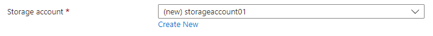
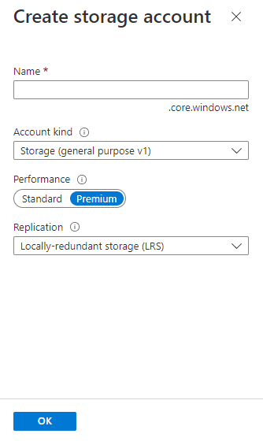

<a name="microsoft-storage-storageaccountselector"></a>
# Microsoft.Storage.StorageAccountSelector
* [Microsoft.Storage.StorageAccountSelector](#microsoft-storage-storageaccountselector)
    * [Description](#microsoft-storage-storageaccountselector-description)
    * [Guidance](#microsoft-storage-storageaccountselector-guidance)
    * [Definitions:](#microsoft-storage-storageaccountselector-definitions)
    * [UI Sample](#microsoft-storage-storageaccountselector-ui-sample)
    * [Sample Snippet](#microsoft-storage-storageaccountselector-sample-snippet)
    * [Sample output](#microsoft-storage-storageaccountselector-sample-output)

<a name="microsoft-storage-storageaccountselector-description"></a>
## Description
The control enables the user to create a new storage account or select an existing storage account.
<a name="microsoft-storage-storageaccountselector-guidance"></a>
## Guidance
- If specified, `defaultValue.name` is automatically validated for uniqueness. If the storage account name isn't unique, the user must specify a different name or choose an existing storage account.
- The default value for `defaultValue.type` is **Premium_LRS**.
- Any type not specified in `constraints.allowedTypes` is hidden, and any type not specified in `constraints.excludedTypes` is shown. `constraints.allowedTypes` and `constraints.excludedTypes` are both optional, but can't be used simultaneously.
If `options.hideExisting` is **true**, the user can't choose an existing storage account. The default value is **false**.
 
<a name="microsoft-storage-storageaccountselector-definitions"></a>
## Definitions:
<a name="microsoft-storage-storageaccountselector-definitions-an-object-with-the-following-properties"></a>
##### An object with the following properties
| Name | Required | Description
| ---|:--:|:--:|
|name|True|The name of the instance
|type|True|Enum permitting the value: "Microsoft.Common.StorageAccountSelector"
|label|True|Display text for the control
|toolTip|False|Text to display when hovering over the tooltip icon. Tooltip icon will only be displayed if text is a non-empty value.
|defaultValue|False|Define default value for `name` and `type`
|constraints|False|Define `allowedTypes` and `excludedTypes`. Any type not specified in `allowedTypes` is hidden, and any type not specified in `excludedTypes` is shown. `allowedTypes` and `excludedTypes` are both optional, but can't be used simultaneously.
|options|False|If `hideExisting` is **true**, the user can't choose an existing storage account. The default value is **false**.
|visible|False|If **true** the control will display, otherwise it will be hidden.
|scope|True|Use scope to define the Subscription, Resource Group name and location that will be applied to control used.
|fx.feature|False|
<a name="microsoft-storage-storageaccountselector-ui-sample"></a>
## UI Sample
  
  
<a name="microsoft-storage-storageaccountselector-sample-snippet"></a>
## Sample Snippet

```json
// Enclosing comment
{
    "name": "element1",
    "type": "Microsoft.Storage.StorageAccountSelector",
    "label": "Storage account",
    "toolTip": "",
    "defaultValue": {
      "name": "storageaccount01",
      "type": "Premium_LRS"
    },
    "constraints": {
      "allowedTypes": [],
      "excludedTypes": []
    },
    "options": {
      "hideExisting": false
    },
    "visible": true
  }
  // Enclosing comment

```
<a name="microsoft-storage-storageaccountselector-sample-output"></a>
## Sample output

```json
{
    "name": "storageaccount01",
    "resourceGroup": "rg01",
    "type": "Premium_LRS",
    "newOrExisting": "new"
  }

```
